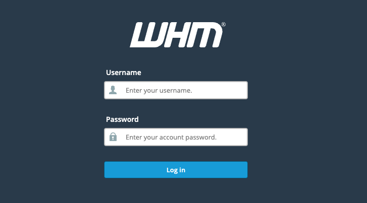
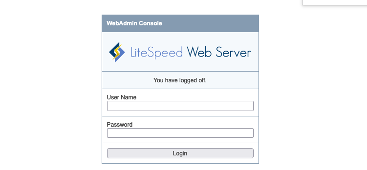
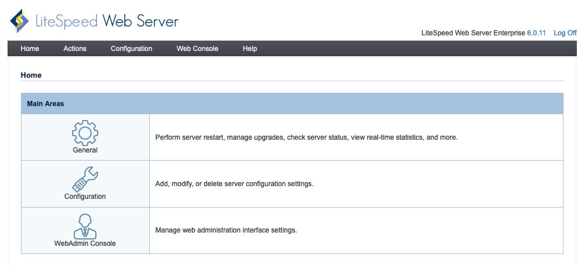

The LiteSpeed cPanel App automatically installs [cPanel](https://cpanel.net/), [LiteSpeed Web Server](https://www.litespeedtech.com/products/litespeed-web-server), and the[WHM/cPanel LiteSpeed Plugin](https://www.litespeedtech.com/products/litespeed-web-server/control-panel-plugins/cpanel).

- **LiteSpeed Web Server Features:** HTTP/2, QUIC, HTTP/3, event driven architecture, Apache drop-in replacement, LSCache Engine with ESI, server-level reCAPTCHA, one-click cache acceleration

- **WHM LiteSpeed Plugin Features:** Version management, one-click switch between Apache and LiteSpeed Web Server, build PHP with LSAPI, quick PHP suExec and LiteSpeed cache setups, license management

- **Auto configuration:** Enable PHP_SUEXEC, enable EasyApache integration, switch to LiteSpeed Web Server, cache root setup, disable Apache mod_ruid2, Apache port offset 0


cPanel requires a valid license to use the software beyond the initial 15 day [free trial](https://cpanel.net/products/trial/) period. To purchase a license, visit [cPanel’s website](https://cpanel.net/pricing/) and select a plan that fits your needs. Licenses are not available directly through Linode.

LiteSpeed offers both free and paid plans. Visit [LiteSpeed's website](https://www.litespeedtech.com/products/litespeed-web-server/lsws-pricing) to view available plans and pricing information.


## Deploying a Marketplace App






**Estimated deployment time:** LiteSpeed cPanel should be fully installed within 10-20 minutes after the Compute Instance has finished provisioning.


## Configuration Options

- **Supported distributions:** CentOS 7, AlmaLinux 8
- **Recommended plan:** All plan types and sizes can be used.

## Verify Installation

To determine if the installation has completed successfully, log in to your instance through [SSH](/docs/guides/connect-to-server-over-ssh/) or [Lish](/docs/products/compute/compute-instances/guides/lish/) and run:

```command
tail -3 /var/log/stackscript.log
```

This output should be similar to the following. While this does provide instructions to access the LiteSpeed WebAdmin panel, you must reset the password before accessing it. See [Accessing the LiteSpeed WebAdmin Interface](#accessing-the-litespeed-webadmin-interface).

```output
**LITESPEED AUTOINSTALLER COMPLETE**
Install finished! Your randomly generated admin password for the LiteSpeed WebAdmin interface on port 7080 is [password]
Please make sure to save this password.
```

## Getting Started after Deployment

### Accessing WHM/cPanel

1.  Open your web browser and navigate to `http://[ip-address]:2087`, replacing *[ip-address]* with your Compute Instance's IPv4 address. See the [Managing IP Addresses](/docs/products/compute/compute-instances/guides/manage-ip-addresses/) guide for information on viewing your IP address.

1.  The WHM login page appears. Enter `root` as the username and the root password you created when deploying your instance. Click the **Log In** button to continue.

    

1.  You are presented with cPanel and WHM's terms. Read through the terms and click on **Agree to All** if you agree and would like to continue.

    

1.  You are then prompted to log in to cPanel's website and obtain a license or activate a free 15-day trial license.

    
    Your instance is eligible for free 15-day trial licenses of both [WHM/cPanel](https://cpanel.net/products/trial/) and the [LiteSpeed plugin](https://docs.litespeedtech.com/licenses/trial/). If you wish to continue using these applications beyond this period, you must purchase licenses before the end of this trial.
    

1.  In the next screen, enter in an email address to receive status and error notifications.

    You are also prompted to provide nameserver's for your cPanel instance. By default, cPanel will fill in the values for you. Update the values with the nameservers you would like to use. If you are managing your own nameservers, enter them into the form or, if you will be using [Linode's DNS manager](/docs/products/networking/dns-manager/), enter in Linode's nameservers into the form. Click **Finish** to complete the initial login process.

    
    Linode's nameservers are the following:

        ns1.linode.com.
        ns2.linode.com.
        ns3.linode.com.
        ns4.linode.com.
        ns5.linode.com.

    See our [How do I set up DNS on cPanel?](https://www.linode.com/community/questions/19216/how-do-i-set-up-dns-on-cpanel) community question and answer for details related to cPanel and Linode nameservers.
    

    

4. You are then brought to your WHM's home page where you can continue to configure your cPanel instance.

    

Now that you’ve accessed your LiteSpeed instance, check out [the official LiteSpeed documentation](https://www.litespeedtech.com/support/wiki/doku.php/litespeed_wiki) to learn how to further utilize your LiteSpeed instance.

### Accessing the LiteSpeed WebAdmin Interface

1. Log in to your instance through [SSH](/docs/guides/connect-to-server-over-ssh/) or [Lish](/docs/products/compute/compute-instances/guides/lish/).

1. Run the following script to reset the password:

    ```command
    /usr/local/lsws/admin/misc/admpass.sh
    ```

1. When requested, enter *admin* as the username and then enter your desired password.

1. Once finished, open your web browser and navigate to `http://[ip-address]:7080`, replacing *[ip-address]* with your Compute Instance's IPv4 address. See the [Managing IP Addresses](/docs/products/compute/compute-instances/guides/manage-ip-addresses/) guide for information on viewing your IP address.

1. The LiteSpeed WebAdmin Console login prompt appears. Enter *admin* as the username and use the password you just set in the previous steps.

    

1. After logging in, the LiteSpeed WebAdmin Console appears.

    

