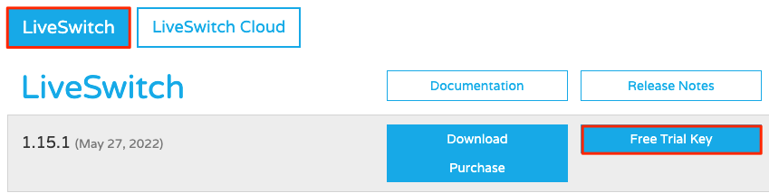
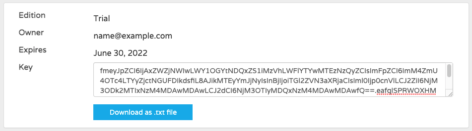

---
author:
  name: Linode
  email: docs@linode.com
description: "Learn how to deploy LiveSwitch Server, an enterprise video streaming service, through the Linode Marketplace."
keywords: ['liveswitch','streaming','video']
tags: ["marketplace", "linode platform", "cloud manager"]
license: '[CC BY-ND 4.0](https://creativecommons.org/licenses/by-nd/4.0)'
published: 2022-05-31
title: "Deploying LiveSwitch through the Linode Marketplace"
contributor:
  name: Holden Morris
  link: https://github.com/hmorris3293
external_resources:
- '[LiveSwitch](https://www.liveswitch.io/)'
---

[LiveSwitch Server](https://www.liveswitch.io/products/liveswitch-server) is a self-hosted enterprise video streaming service. It provides high quality and reliable audio and video streaming and is backed by the top experts in the industry.


LiveSwitch Server requires a valid license to use the software. A free 30 day trial license is available. To obtain a trial license or purchase a paid license, see the instructions within the [Obtaining a License](#obtaining-a-license) section. Licenses are not available directly through Linode.


## Deploying a Marketplace App






**Estimated deployment time:** LiveSwitch should be fully installed within 5-10 minutes after the Compute Instance has finished provisioning.


## Configuration Options

- **Supported distributions:** Ubuntu 20.04 LTS
- **Recommended plan:** All plan types and sizes can be used.

## Getting Started after Deployment

After deploying your application using, the server will reboot once the installation is complete.

### Obtaining a License

LiveSwitch Server requires a license to use the software. A free 30 day trial license is available, in addition to paid licenses. The instructions in this section walk you through the process of obtaining a trial license. To learn more about the other license options that are available to you, [contact LiveSwitch](https://www.liveswitch.io/get-started?hsLang=en) directly.

1. Navigate to the [LiveSwitch Cloud free trial webpage](https://www.liveswitch.io/build-webrtc-apps-free-trial?hsLang=en) and complete the trial form. While you will not utilize the free trial for the Cloud product, this enables you to create an account which will be used in the next step.

1. Navigate to [Frozen Mountain's account page](https://www.frozenmountain.com/account) and sign in using the credentials you created in the previous step. Note that Frozen Mountain was the prior name of the company before it was renamed to LiveSwitch in 2021.

1. Click the **Downloads** link on the top right.

    

1. Within the Downloads page, select **LiveSwitch** and click **Free Trial Key**. Alternatively, you can click **Purchase** to start the purchasing process.

    

1. Once a free trial license is generated, it is immediately displayed on the Downloads page (see the screenshot below). Retain a copy of this license key for the [Accessing the LiveSwitch App](#accessing-the-liveswitch-app) section. The license key is also visible on the main **My Account** page.

    

### Accessing the LiveSwitch App

1. Open your web browser and navigate to `http://[ip-address]:9090/admin`, replacing *[ip-address]* with your Compute Instance's IP address or rDNS domain (such as `192-0-2-1.ip.linodeusercontent.com`). See the [Managing IP Addresses](/docs/guides/managing-ip-addresses/) guide for information on viewing IP addresses and rDNS.

1. The *Welcome* setup wizard is displayed. Follow the prompts in this wizard to input your license key and create your user.

1. After completing the setup wizard, you should see the main Configuration Console for your installation. To learn more about how to manage your instance, see the [Configuration Console documentation](https://developer.liveswitch.io/liveswitch-server/server/configuration/configuration-console.html).

Now that you’ve accessed your LiveSwitch instance, check out [the official LiveSwitch quick start documentation](https://developer.liveswitch.io/liveswitch-server/get-started/js-server/quickstart-js.html) to learn how to further utilize your LiveSwitch instance.

