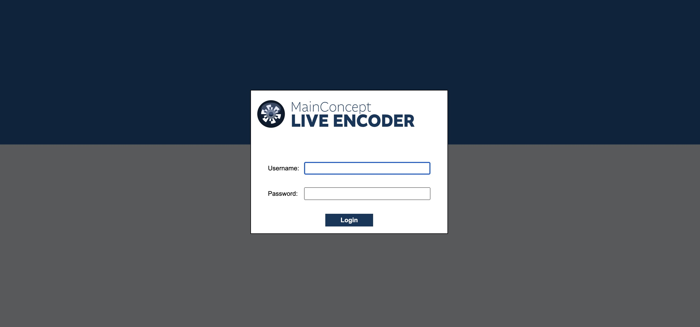

The [MainConcept Live Encoder](https://www.mainconcept.com/live-encoder) is a powerful all-in-one encoding engine designed to simplify common broadcast and OTT video workflows. With renowned MainConcept software HEVC and AVC codecs with optional GPU decoding as well as encoding powered by NVIDIA and Intel Quick Sync Video built in, the intuitive user interface or the flexible REST API allows you to package content for multiscreen delivery, using common input sources, in real-time. 

You can set up a live workflow to ingest, prepare, and stream audio-visual content that is compatible with every type of consumer device. It doesn’t matter if you are delivering video directly to a CDN, to an online video platform via RTMP or with low-latency protocols Zixi and SRT, the Live Encoder ensures your live video is delivered reliably and in the highest possible quality. 

Besides MPEG-H 3D Audio creation, the software features many output streaming protocols like RTMP, RTSP, Zixi, SRT, TS over UDP/HTTP, MPEG-DASH, HLS and MP4 archiving files. The Live Encoder can be used in both contribution and distribution encoding workflows. 

This version of the MainConcept Live Encoder is a free demo version. It adds a watermark to the processed video and mutes audio from time to time. If you are interested in deploying the full version of the Live Encoder, please contact [sales@mainconcept.com](mailto:sales@mainconcept.com).

## Deploying a Marketplace App






**Estimated deployment time:** MainConcept Live Encoder should be fully installed within 5-10 minutes after the Compute Instance has finished provisioning.


## Configuration Options

- **Supported distributions:** CentOS Stream 9
- **Recommended plan:** We recommend a 16GB Dedicated CPU or Shared CPU Compute Instance for MainConcept Live Encoder.

### MainConcept Live Encoder Options

- **Email address for SSL Generation (Required):** This is the contact email address used for communication regarding the SSL certificate created during deployment. This should be the email address of your web server administrator.




## Getting Started after Deployment

Once your MainConcept Live Encoder Marketplace App is deployed, you can log into the MainConcept Live Encoder Dashboard in your browser.

1. Open a browser and navigate to the domain you created in the beginning of your deployment. If you did not use a domain, you can use your Compute Instance's rDNS, which may look like the example below:

    ```
    203-0-113-1.ip.linodeusercontent.com
    ```

    See the [Managing IP Addresses](/docs/guides/managing-ip-addresses/#configuring-rdns) guide for information on viewing and configuring your rDNS.

2. Once the login prompt loads, enter `admin` as the *Username* and `admin` as the *Password*.

    

    
    Please ensure you change the default password after logging into your MainConcept Live Encoder instance. To change your password, select the **Users** tab, find your user named "admin", and click the **Op** option.
    

## Next Steps

Please see [the official documentation for MainConcept Live Encoder](https://www.mainconcept.com/live-encoder) for more information on usage and resources. For support regarding the tool or software itself, use the information in the sidebar to contact their support or search the [MainConcept community forum](https://forum.mainconcept.com/).

