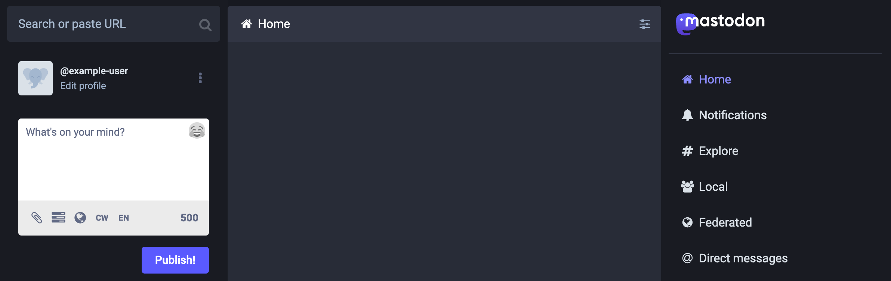
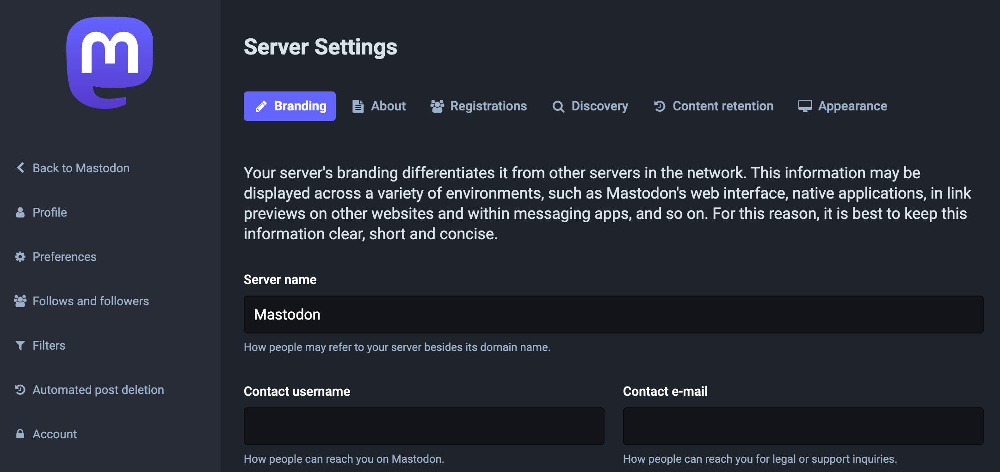

[Mastodon](https://docs.joinmastodon.org/) is an open-source and decentralized micro-blogging platform used to create a social network based on open web standards and principles. Like Twitter, it lets users follow other users and post text, photos, and video content. Unlike Twitter, Mastodon is decentralized, meaning that its content is not maintained by a central authority.

The Mastodon platform takes a federated approach to social networking. Each Mastodon instance operates independently — anyone can create an instance and build their community. Users from different instances can still follow each other, share content, and communicate. Mastodon participates in the [Fediverse](https://en.wikipedia.org/wiki/Fediverse), a collection of social networks and other websites that communicate using the [ActivityPub](https://en.wikipedia.org/wiki/ActivityPub) protocol. That allows different Mastodon instances to communicate and also allows other platforms in the Fediverse to communicate with Mastodon.

Mastodon servers range in size from small private instances to massive public instances and typically center on specific interests or shared principles. The biggest Mastodon server is [Mastodon.social](https://mastodon.social/about), a general-interest server created by the developers of the Mastodon platform. It has over 540,000 users and boasts a thorough [Code of Conduct](https://mastodon.social/about/more).




The Mastodon Marketplace App *requires* a custom domain. After deploying Mastodon, see the instructions within the [Configure Your Domain's Name Servers](#configure-your-domains-name-servers) section.


## Deploying a Marketplace App






**Estimated deployment time:** Mastodon should be fully installed within 10-15 minutes after the Compute Instance has finished provisioning.


- **Supported distributions:** Debian 11
- **Recommended minimum plan:** 2GB Shared CPU Compute Instance or higher

### Configuration Options

- **Domain** (*required*): The domain name you wish to use for the mastodon server, such as *example.com*.
- **Linode API Token** (*required*): A personal access token for your account. The Linode API is used to create DNS records for your custom domain through the [DNS Manager](/docs/products/networking/dns-manager/). See [Get an API Access Token](/docs/products/tools/api/guides/manage-api-tokens/).
- **Email for the Let's Encrypt certificate** (*required*): The email you wish to use when creating your TLS/SSL certificate through Let's Encrypt. This email address receives notifications when the certificate needs to be renewed.
- **Username for the Mastodon Owner** (*required*): The username for the Owner user that will be created for the Mastodon server.
- **Email Address for the Mastodon Owner** (*required*): The contact email for the Mastodon server's owner.
- **Single-user mode** (*required*): Enabling Single User Mode prevents other users from joining the Mastodon Server.

## Getting Started after Deployment

### Configure Your Domain's Name Servers

To use Mastodon with the custom domain you specified during deployment, you must configure the domain to use Linode's name servers. This is typically accomplished directly through your registrar. See [Use Linode’s Name Servers with Your Domain](/docs/products/networking/dns-manager/guides/authoritative-name-servers/).

### View the Mastodon Site

Open a web browser and navigate to the custom domain you entered when deploying Mastodon. This opens the Explore page in Mastodon, which displays public information about your site, public posts, and links to login or create an account.

### Access Your Mastodon Account and Settings

1. **Obtain and save passwords** that were generated on your behalf during deployment, including your Mastodon user's password.

    1. Log in to your new Compute Instance through [Lish](/docs/products/compute/compute-instances/guides/lish/) or [SSH](/docs/guides/connect-to-server-over-ssh/) using the `root` user and the associated password you entered when creating the instance.

    1. The passwords have been saved in the /root/.deployment-secrets.txt file. You can view this file in your preferred text editor or through the `cat` command:

        ```command
        cat /root/.deployment-secrets.txt
        ```

        The file contains your PSQL password and user's (owner's) password.

        ```file {title="/root/.deployment-secrets.txt"}
        # BEGIN ANSIBLE MANAGED BLOCK
        # PSQL password
        password: WiLjKhJSZE01TW3AoqViN3Kglu2bidWt
        # Owner password
        password: 3c4a675311ee52c0c1d7173d5169a10d
        # END ANSIBLE MANAGED BLOCK
        ```

1. **Log in to Mastodon.** Within a web browser, navigate to `https://[domain.tld]/auth/sign_in`, replacing *[domain.tld]* with the custom domain you entered when deploying Mastodon. This opens the login page. Enter the owner's email address you created and the password that you obtained in the previous step. Once logged in, your user's home page is opened, which displays your own timeline, the post creation form, and links to navigate around.

    

1. **Access admin settings**. Navigate to `https://[domain.tld]/admin/settings/` to view your site's administration settings. The administration page allows you to alter the look, feel, and behavior of your site. Consider configuring each of these settings, including the site name, contact username, contact email, server description, and fields within other tabs.

    

1. The Mastodon instance also includes [Sidekiq](https://github.com/mperham/sidekiq) (background processing) and [PgHero](https://github.com/ankane/pghero) (a performance dashboard for Postgres). Both of these can be accessed through Mastodon Preferences page or by navigating to the following URLs:

    - **Sidekiq:** `https://[domain.tld]/sidekiq`
    - **PgHero:** `https://[domain.tld]/pghero`

1. The Mastodon server is configured to send emails for actions such as new users signing up or resetting a password. The installation includes only minimal DNS records and there may be limited deliverability without further configuration. Review the guide to [Sending Email on Linode](/docs/guides/running-a-mail-server/#sending-email-on-linode) for more information on DNS configurations and email best practices.

To learn more about Mastodon, check out the [official documentation](https://docs.joinmastodon.org/) and [Mastodon blog](https://blog.joinmastodon.org/) with news and articles related to Mastodon. You can engage with the Mastodon administrative community on [Mastodon’s discussion forum](https://discourse.joinmastodon.org/), where you can peruse conversations about technical issues and community governance. When you are ready to make your instance known to the world, you can add it to the list over at [Instances.social](https://instances.social/admin) by filling out the admin form.

