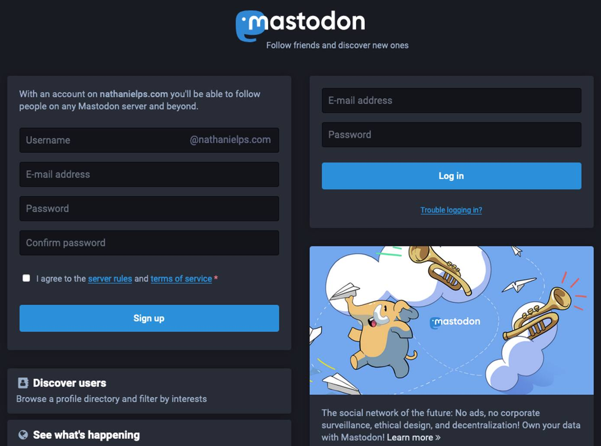
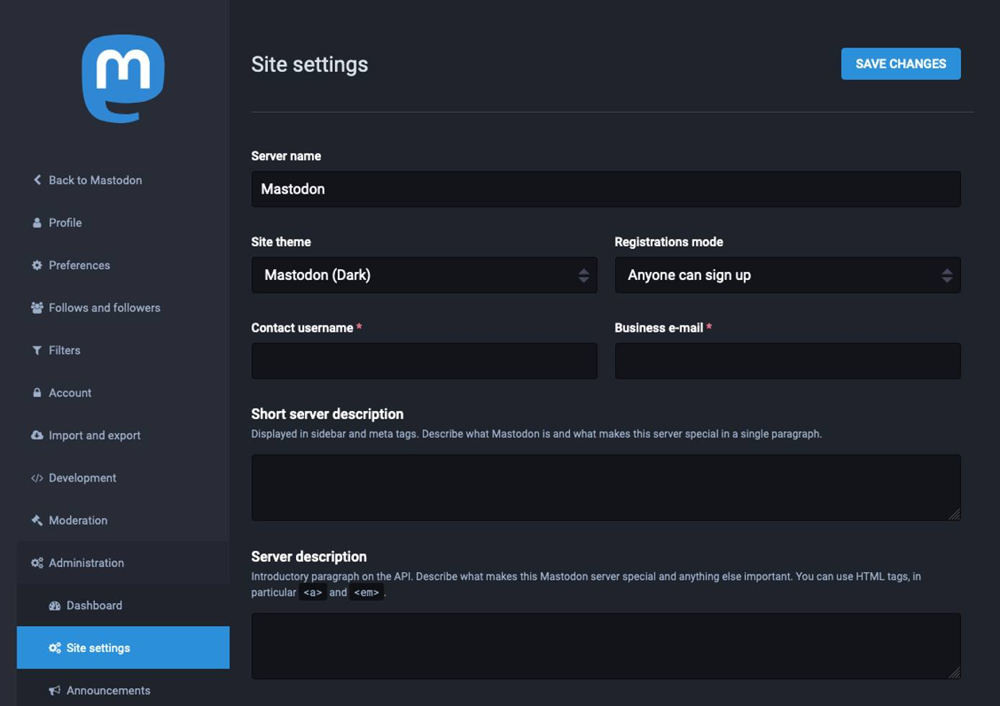
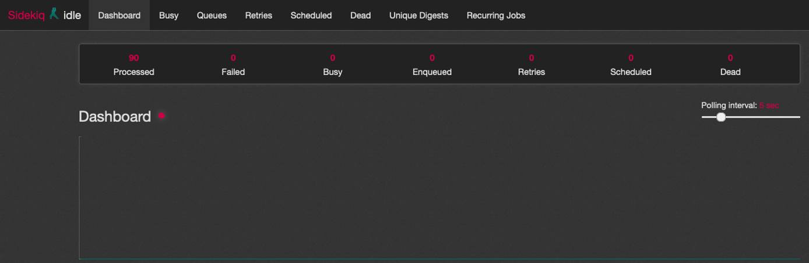

---
author:
  name: Linode Staff
  email: docs@linode.com
description: "Self-hosted Mastodon server."
keywords: ['social’, ‘messaging’, ‘mastodon’,]
tags: ["linode platform","mastodon","marketplace","cloud-manager",]
license: '[CC BY-ND 4.0](https://creativecommons.org/licenses/by-nd/4.0)'
published:
modified:
modified_by:
  name: Linode
title: "Deploying a Mastodon through the Linode Marketplace"
external_resources:
 - ''
 - ''
 - ‘[Mastodon Deployment Github Repository](https://github.com/linode-solutions/docker_mastodon_ansible)’
aliases: []
---

[Mastodon](https://docs.joinmastodon.org/) is an open-source and decentralized micro-blogging platform. Like Twitter, it lets users follow other users and post text, photos, and video content. Mastodon also allows you to create a non-profit social network based on open web standards and principles. Unlike Twitter, Mastodon is decentralized, meaning that its content is not maintained by a central authority.

What sets the Mastodon platform apart is its federated approach to social networking. Each Mastodon instance operates independently — anyone can create an instance and build their community. But users from different instances can still follow each other, share content, and communicate.

Mastodon participates in the [Fediverse](https://en.wikipedia.org/wiki/Fediverse), a collection of social networks and other websites that communicate using the [ActivityPub](https://en.wikipedia.org/wiki/ActivityPub) protocol. That allows different Mastodon instances to communicate, and also allows other platforms in the Fediverse to communicate with Mastodon.

Mastodon servers range in size from small private instances to massive public instances and typically center on specific interests or shared principles. The biggest Mastodon server is [Mastodon.social](https://mastodon.social/about), a general-interest server created by the developers of the Mastodon platform. It has over 540,000 users and boasts a thorough [Code of Conduct](https://mastodon.social/about/more).

## Deploying a Marketplace App






**Estimated deployment time:** Mastodon should be fully installed within 5-10 minutes after the Compute Instance has finished provisioning.


- **Supported distributions:** Debian 11
- **Recommended minimum plan:** All plan types and sizes can be used.

### Mastodon Options

| **Field** | **Description** |
|:--------------|:------------|
| **API Token** | [Generate an API Token](https://www.linode.com/docs/products/tools/linode-api/guides/get-access-token) with Read/Write access on Domains. *Required*. |
|**Domain** | The domain name where you wish to host your Mastodon server. The installer creates a DNS record for this domain during setup. |
| **SOA Email** | An email address you control to be the Source of Authority for the generated DNS zone. |
| **Limited Sudo User** | Create a Sudo User that will exist on each cluster node. *Required*. |
| **Mastodon Admin User** | The username for the Admin user that will be created for the Mastodon server. |
| ** Single User Mode** | Enabling Single User Mode prevents other users from joining the Mastodon Server, while disabling it allows it. |

## Getting Started after Deployment

### Accessing your Mastodon Server

1. In a web browser, navigate to your Mastodon site’s domain. You should see the Mastodon login page, where you can log in as the admin user you created earlier or create a new user.

  

2. You can navigate to your instance’s administration page by navigating to *example.com/admin/settings/edit*. The administration page allows you to alter the look, feel, and behavior of your instance.

  

3. If your instance is running but having issues, you can troubleshoot them from the Sidekiq dashboard. Either select **Sidekiq** from the administration menu or navigate to *example.com/sidekiq* to see the dashboard.

  

To learn more about Mastodon, check out the official [Mastodon blog](https://blog.joinmastodon.org/) with news and articles related to Mastodon. You can engage with the Mastodon administrative community on [Mastodon’s discussion forum](https://discourse.joinmastodon.org/), where you can peruse conversations about technical issues and community governance.

When you are ready to make your instance known to the world, you can add it to the list over at [Instances.social](https://instances.social/admin) by filling out the admin form.


