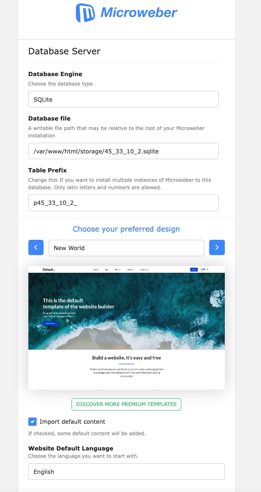
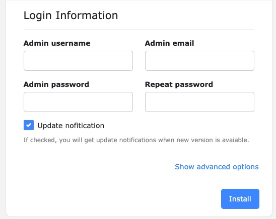
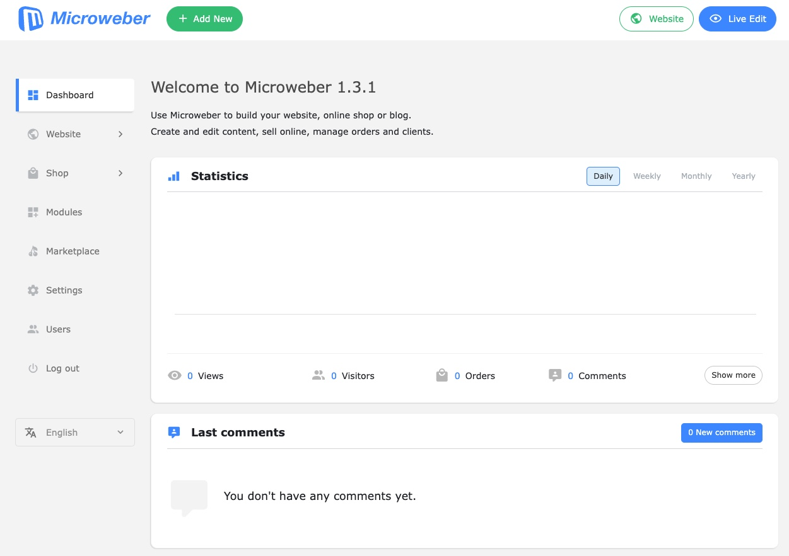

---
author:
  name: Linode
  email: docs@linode.com
description: "Deploy Microweber, an open-source, drag and drop website builder and CMS on a Linode Compute Instance."
keywords: ['Microweber','website builder','cms']
tags: ["marketplace", "linode platform", "cloud manager"]
license: '[CC BY-ND 4.0](https://creativecommons.org/licenses/by-nd/4.0)'
published: 2022-09-01
modified_by:
  name: Linode
title: "Deploying Microweber through the Linode Marketplace"
---

[Microweber](https://microweber.org/) is an open-source, drag and drop website builder and CMS, based on the Laravel PHP Framework. It includes features for E-commerce, live editing, file management, design customization and plugins for cPanel and Plesk.


When self-hosting Microweber, you are responsible for the security of your server. Follow best practices for securing, updating, and backing the software on your Compute Instance. See [Setting Up and Securing a Compute Instance](https://www.linode.com/docs/guides/set-up-and-secure/).


## Deploying a Marketplace App






**Estimated deployment time:** Microweber should be fully installed within 5-10 minutes after the Compute Instance has finished provisioning.


## Configuration Options

- **Supported distributions:** Ubuntu 20.04
- **Recommended plan:** All plan types can be used.

## Getting Started after Deployment

### Accessing the Microweber Application

1. Open your web browser and navigate to `http://[ip-address]`, where *[ip-address]* can be replaced with your Compute Instance's IP address or rDNS domain. See the [Managing IP Addresses](/docs/guides/managing-ip-addresses/) guide for information on viewing IP addresses and rDNS.

2. From the web UI you can complete the Microweber installation by selecting the database engine, database files and table prefix. You will also set the Admin login credentials on this page.

    
    

3. After the installation is complete you will be redirected to the Microweber dashboard.

    

4. From the dashboard you can start designing and building your new webpage. For more information on using Microweber for development, see the [Microweber tutorials](https://microweber.org/academy#322001230).


