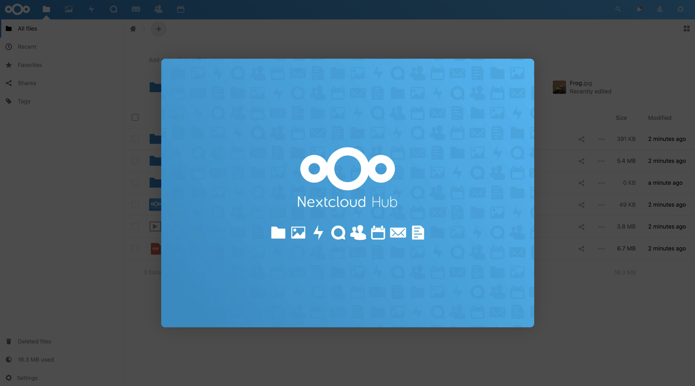

---
author:
  name: Linode Community
  email: docs@linode.com
description: "This guide shows how you can deploy a NextCloud server to store important documents, images, and more in one location by using the NextCloud One-Click Marketplace App."
keywords: ['Nextcloud','omarketplace','file sharing']
license: '[CC BY-ND 4.0](https://creativecommons.org/licenses/by-nd/4.0)'
published: 2020-06-11
modified: 2022-03-08
modified_by:
  name: Linode
title: "Deploying Nextcloud through the Linode Marketplace"
contributor:
  name: Linode
external_resources:
- '[Nextcloud Documentation Overview](https://docs.nextcloud.com/)'
tags: ["linode platform","marketplace","cloud-manager"]
aliases: ['/platform/marketplace/how-to-deploy-nextcloud-with-marketplace-apps/', '/platform/one-click/how-to-deploy-nextcloud-with-one-click-apps/','/guides/how-to-deploy-nextcloud-with-one-click-apps/','/guides/how-to-deploy-nextcloud-with-marketplace-apps/','/guides/nextcloud-marketplace-app/']
image: deploying_nextcloud_oca.png
---

[Nextcloud](https://nextcloud.com/) is an open source solution to file hosting and sharing. With Nextcloud, you can synchronize files from a local computer to the Linode server and share them with collaborators. Nextcloud’s customizable security features and intuitive user interface help to keep files safe and easy to manage.

## Deploying a Marketplace App






**Estimated deployment time:** Nextcloud should be fully installed within 5-7 minutes after the Compute Instance has finished provisioning.


## Configuration Options

- **Supported distributions:** Debian 10
- **Recommended minimum plan:** All plan types and sizes can be used.

### NextCloud Options

- **The name of the admin user for NextCloud** *(required)*: The administrator username for nextcloud. This will be used to log in to the application.
- **The password for NextCloud's admin user** *(required)*: The administrator password. This will be used to log in to the application.
- **MySQL database root password** *(required)*: The root user's password for the Nextcloud database.
- **MySQL user password** *(required)*: Your new MySQL user's password.
- **The name of the MySQL database:** The name to assign to the Nextcloud instance's MySQL database. If no value is provided, the database is named `nextcloud`.
- **The name of the MySQL user to create:** The name of a new MySQL user to create. If no value is provided, the user is named `nextcloud`.
- **Admin email for the NextCLoud server:** The email address to use for the Nextcloud instance's admin user.
- **Would you like to use a free Let's Encrypt SSL certificate? (Requires domain):** Enable a free [HTTPS CertBot SSL certificate](https://certbot.eff.org/) on the Nextcloud domain. If you do not provide a value, `no` is set by default.





## Getting Started after Deployment

### Log Into Your Nextcloud Instance

1. Open a browser window and navigate to the NextCloud instance's domain. For example, enter `nextcloud.example.com` into the browser, replacing `example.com` with the value of your own domain. If you do not install the App with a domain name, the domain is the public IP address of the Linode appended with a forward slash and "nextcloud. For example, `192.168.17.43/nextcloud/`.

1. Enter the administrator username and password set during initial app creation in the presented form.

      

1. Once you have successfully logged in, the Nextcloud Hub page appears where you can upload files to the Nextcloud server.

      

## Next Steps



- [Configure Nextcloud to use Linode Object Storage as an External Storage Mount](/docs/platform/object-storage/how-to-configure-nextcloud-to-use-linode-object-storage-as-an-external-storage-mount/).  You can use Object Storage as a secondary place to store your Nextcloud files. Using Linode Object Storage to store files prevents you from running out of storage space that is limited by your Linode's plan size.
- Install the [Nextcloud desktop synchronization client](https://docs.nextcloud.com/desktop/2.3/installing.html) on a local computer to easily synchronize the desktop files to the Nextcloud server.

