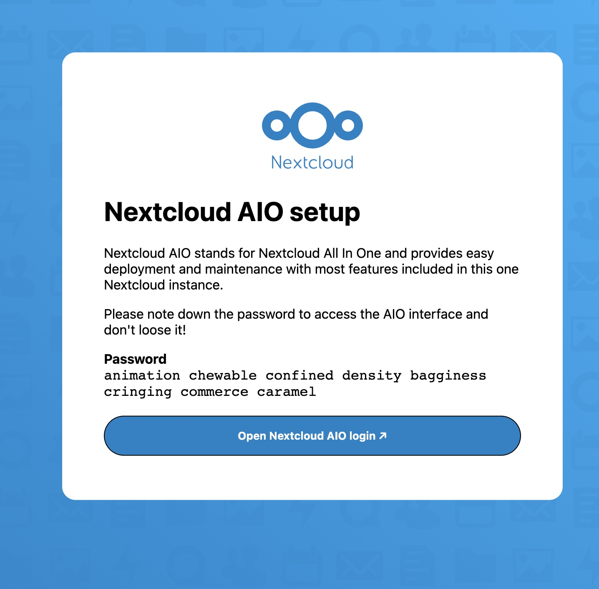
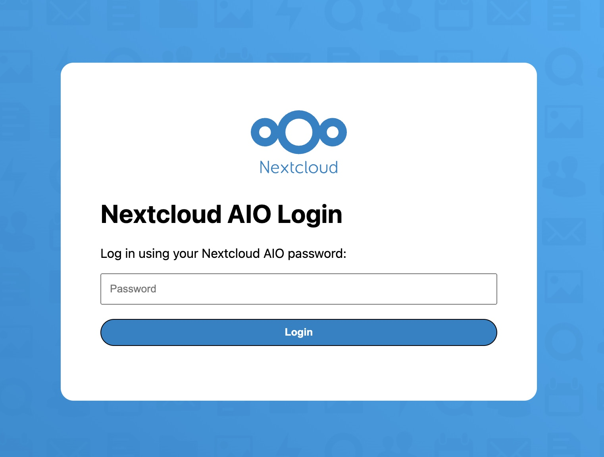
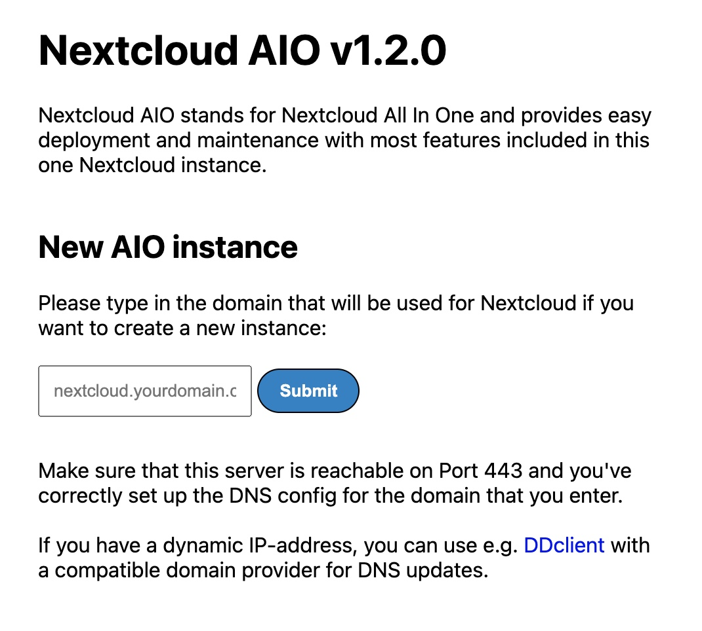
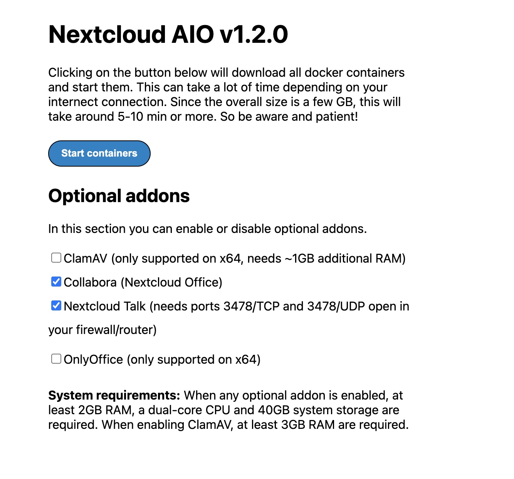
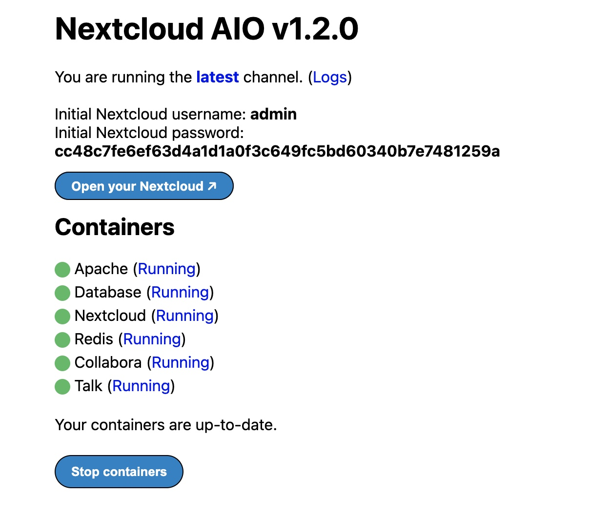

---
author:
  name: Linode Community
  email: docs@linode.com
description: "This guide shows how you can deploy a NextCloud server to store important documents, images, and more in one location by using the NextCloud Marketplace App."
keywords: ['Nextcloud','marketplace','file sharing']
license: '[CC BY-ND 4.0](https://creativecommons.org/licenses/by-nd/4.0)'
published: 2020-06-11
modified: 2022-05-27
modified_by:
  name: Linode
title: "Deploying Nextcloud through the Linode Marketplace"
contributor:
  name: Linode
external_resources:
- '[Nextcloud Documentation Overview](https://docs.nextcloud.com/)'
- '[Nextcloud AIO github](https://github.com/nextcloud/all-in-one)'
tags: ["linode platform","marketplace","cloud-manager"]
aliases: ['/platform/marketplace/how-to-deploy-nextcloud-with-marketplace-apps/', '/platform/one-click/how-to-deploy-nextcloud-with-one-click-apps/','/guides/how-to-deploy-nextcloud-with-one-click-apps/','/guides/how-to-deploy-nextcloud-with-marketplace-apps/','/guides/nextcloud-marketplace-app/']
image: deploying_nextcloud_oca.png
---

[Nextcloud](https://nextcloud.com/) is an open source solution to file hosting and sharing. With Nextcloud, you can synchronize files from a local computer to the Linode server and share them with collaborators. Nextcloud’s customizable security features and intuitive user interface help to keep files safe and easy to manage.

## Deploying a Marketplace App






**Estimated deployment time:** Nextcloud should be fully installed within 5-7 minutes after the Compute Instance has finished provisioning.


## Configuration Options

- **Supported distributions:** Ubuntu 22.04 LTS
- **Recommended minimum plan:** All plan types and sizes can be used.

### NextCloud Options





## Getting Started after Deployment

### Log Into Your Nextcloud Instance

1. Open a browser window and navigate to the NextCloud instance's domain using port 8443. For example, enter `https://example.com:8443` into the browser, replacing `example.com` with the value of your own domain. If you did not install the App with a domain name, you can use the [Linode's RDNS domain](/docs/guides/managing-ip-addresses/#viewing-ip-addresses) (such as `https://203-0-113-0.ip.linodeusercontent.com:8443`).

1. The initial Nextcloud setup screen is displayed, which includes an automatically generated password. Save the password and click the **Open Nextcloud AIO login** button.

      

1. In the login page that appears, enter the password from the previous screen and click **Login**.

      

1. Once you have successfully logged in, you are prompted to configure your domain. Enter the domain you specified when deployed the Marketplace App or use your [rDNS](/docs/guides/managing-ip-addresses/#viewing-ip-addresses) value if no domain was specified.

      

1. Now that you've entered the domain, you are ready to start the Nextcloud containers. Select any additional add-ons you'd like to enable for this instance, specify the time zone, and then click **Start Containers**. This may take a few minutes to complete.

      

1. Once all of the Nextcloud Containers are in a *running* state, you will see the initial Nextcloud username and password as shown in the image below. Please ensure that save the generated password as you will need that to login to your Nextcloud instance. You can click **Open Your Nextcloud** or visit `https://example.com/login`, replacing `example.com` with the domain used in previous steps.

      

## Next Steps



- [Configure Nextcloud to use Linode Object Storage as an External Storage Mount](/docs/guides/how-to-configure-nextcloud-to-use-linode-object-storage-as-an-external-storage-mount/).  You can use Object Storage as a secondary place to store your Nextcloud files. Using Linode Object Storage to store files prevents you from running out of storage space that is limited by your Linode's plan size.
- Install the [Nextcloud desktop synchronization client](https://docs.nextcloud.com/desktop/2.3/installing.html) on a local computer to easily synchronize the desktop files to the Nextcloud server.

