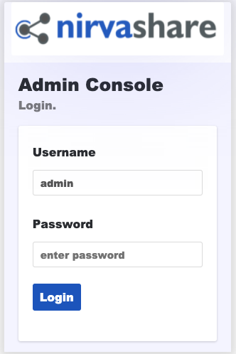

---
author:
  name: Linode
  email: docs@linode.com
description: "This guide shows you how to deploy NirvaShare, a simplified and secure enterprise file sharing solution by using the Linode One-Click Marketplace App."
keywords: ['storage','file sharing', 'backups']
tags: ["marketplace", "linode platform", "cloud manager"]
license: '[CC BY-ND 4.0](https://creativecommons.org/licenses/by-nd/4.0)'
published: 2021-08-13
modified: 2022-03-08
modified_by:
  name: Linode
title: "Deploying NirvaShare through the Linode Marketplace"
aliases: ['/guides/deploying-nirvashare-marketplace-app/','/guides/nirvashare-marketplace-app/']
external_resources:
- '[NirvaShare](https://nirvashare.com/)'
---

NirvaShare is a simplified and secure enterprise file sharing solution built on top of your existing file storage. Use NirvaShare with SFTP, local storage, or even S3-compatible storage like Linode's [Object Storage](https://www.linode.com/products/object-storage/). Collaborate with your internal or external users such as customers, partners, and vendors. NirvaShare provides fine-tuned access control in a very simplified manner. NirvaShare integrates with multiple many external identity providers such as Active Directory, GSuite, AWS SSO, KeyClock, and others.

## Deploying a Marketplace App






**Estimated deployment time:** NirvaShare should be fully installed within 5-10 minutes after the Compute Instance has finished provisioning.


## Configuration Options

- **Supported distributions:** Ubuntu 20.04 LTS
- **Recommended minimum plan:** All plan types and sizes can be used.

### NirvaShare Configuration Options

- **Database Password** *(required)*: Enter a *strong* password for NirvaShare database.

## Getting Started after Deployment

After NirvaShare has finished installing, you can access your NirvaShare instance by visiting your [Linode's IP address](/docs/guides/find-your-linodes-ip-address/) at port 8080. (for example, `http://192.0.2.0:8080`)

Once you visit the NirvaShare IP address you will be prompted with a Login page, you can enter `admin` as the *username* and `admin` as the *password*.

From here, you will want to change the default admin password, you can do so clicking the icon at the top right of the dashboard and select *Change Password* option as shown in the image below:

Now that you’ve accessed your dashboard, checkout [the official NirvaShare documentation](https://nirvashare.com/setup-guide/) to learn how to further configure your instance.

