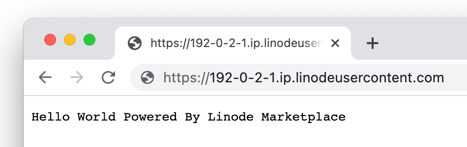

[Node.js](https://nodejs.org/en/) is a lightweight development platform for building fast and scalable applications using Javascript. Since it's based on Javascript, it's relatively easy to learn and has a large community with lots of resources. Node.js can be used for almost any time of web application, including websites, but its asynchronous nature shines when used to develop real-time data-intensive applications

## Deploying a Marketplace App






**Estimated deployment time:** Node.js should be fully installed within 10-15 minutes after the Compute Instance has finished provisioning.


## Configuration Options

- **Supported distributions:** Ubuntu 20.04 LTS
- **Recommended plan:** All plan types and sizes can be used.

### Node.js Options

- **Email address** *(required)*: Enter the email address to use for generating the SSL certificates.







## Getting Started after Deployment

The Node.js Marketplace App is running [Nginx](https://www.nginx.com/), [Node.js](https://nodejs.org/en/), [NPM](https://www.npmjs.com/), and [PM2](https://pm2.keymetrics.io/). Once deployed, a "Hello World" sample application should be running on `http://localhost:3000`. An Nginx reverse proxy then serves the application through your custom domain or rDNS domain over ports 80 and 443

### Accessing the Node.js App through the Command Line

The Node.js sample application is stored in the `hello.js` file within `/opt/nodejs/`. To access it within the command line, follow the instructions below.

1.  Log in to your Compute Instance via [SSH](/docs/guides/connect-to-server-over-ssh/) or [Lish](/docs/products/compute/compute-instances/guides/lish/).

1.  Navigate to the directory in which the application is stored:

        cd /opt/nodejs/

1.  Open the sample application with your preferred command line text editor, such as [nano](/docs/guides/use-nano-to-edit-files-in-linux/) or [vim](/docs/guides/what-is-vi/).

        nano hello.js

### Viewing the Node.js App through a Web Browser

Open your web browser and navigate to `http://[domain]/`, where *[domain]* can be replaced with the custom domain you entered during deployment or your Compute Instance's rDNS domain (such as `192-0-2-1.ip.linodeusercontent.com`). See the [Managing IP Addresses](/docs/products/compute/compute-instances/guides/manage-ip-addresses/) guide for information on viewing rDNS.

