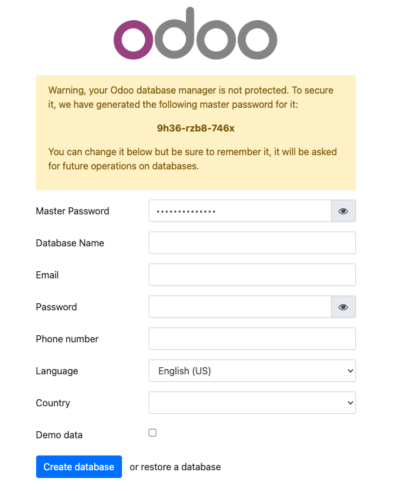

[Odoo](https://www.odoo.com/) (formerly known as OpenERP) is a self-hosted suite of over 10,000 open source applications for a variety of business needs, including CRM, eCommerce, accounting, inventory, point of sale, and project management. These applications are all fully integrated and can be installed and accessed through a web interface, making it easy to automate and manage your company’s processes.

## Deploying a Marketplace App






**Estimated deployment time:** Odoo should be fully installed within 5-10 minutes after the Compute Instance has finished provisioning.


## Configuration Options

- **Supported distributions:** Ubuntu 20.04 LTS
- **Recommended plan:** All plan types and sizes can be used.

### Odoo Options

- **Email address** *(required)*: Enter the email address to use for generating the SSL certificates.
- **Postgres Password for the Odoo user** *(required)*: Enter a *strong* password for the Odoo user account.
- **MySQL User Password** *(required)*: Enter a *strong* password for the MySQL user.







## Getting Started after Deployment

### Accessing the Odoo App

1.  Open your web browser and navigate to the custom domain you entered during deployment or your Compute Instance's rDNS domain (such as `192-0-2-1.ip.linodeusercontent.com`). See the [Managing IP Addresses](/docs/products/compute/compute-instances/guides/manage-ip-addresses/#configuring-rdns) guide for information on viewing the rDNS value.

1.  Within the Odoo setup page that appears, save the automatically generated admin password (also called the *master password*), enter *odoo* as the **Database Name**, and fill out the remaining details for your account.

    

Now that you’ve accessed your dashboard, check out [the official Odoo documentation](https://www.odoo.com/page/docs) to learn how to further utilize your Odoo instance.

