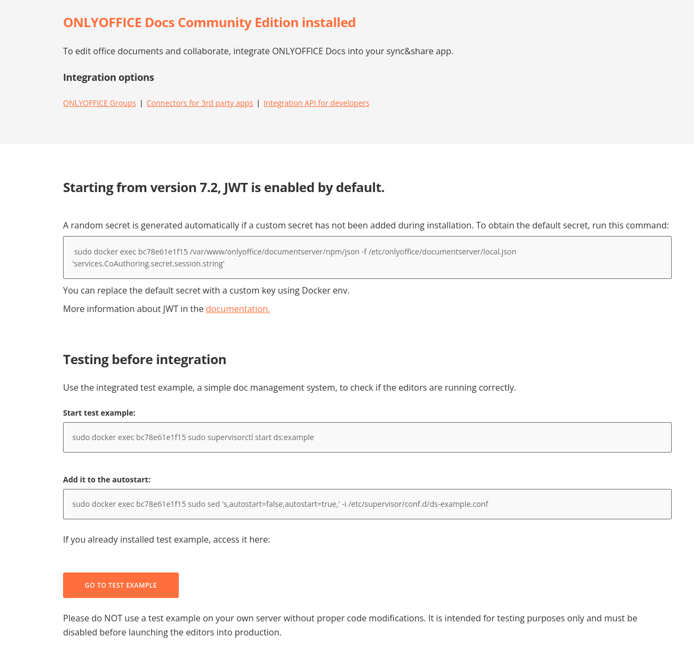

[ONLYOFFICE Docs](https://github.com/ONLYOFFICE/Docker-DocumentServer) is an open-source office suite that comprises web-based viewers and collaborative editors for text documents, spreadsheets, and presentations providing high compatibility with OOXML files (.docx, .xlsx, .pptx). Other popular formats such as .doc, .odt, .rtf, .txt, .pdf, .xls, .ods, .csv, .ppt, .odp, etc. are also supported.

## Deploying a Marketplace App






**Estimated deployment time:** ONLYOFFICE Docs should be fully installed within 10-15 minutes after the Compute Instance has finished provisioning.


## Configuration Options

- **Supported distributions:** Ubuntu 22.04 LTS
- **Recommended plan:** All plan types and sizes can be used.

### ONLYOFFICE Docs Options

- **JSON Web Token Validation**: Enables the JSON Web Token validation. This value set to true by default
- **JSON Web Token Secret Key**: Defines the secret key to validate the JSON Web Token in the request to the ONLYOFFICE Docs. The default is a random value.
- **ONLYOFFICE Docs Version**: Specifies the ONLYOFFICE Docs version. Check available versions on hub.docker onlyoffice/documentserver. Keep empty to install the latest.
- **SSL Certificates**: If set to 'true', TLS/SSL certificates are generated automatically.
- **Domain**: The Domain name for which TLS/SSL certificates are generated. If no value is entered, the Compute Instance's default rDNS value is used.
- **Sub Domain**: The sub domain for which TLS/SSL certificates are generated. Optional.

## Getting Started after Deployment

### Accessing ONLYOFFICE Docs

1.  Open your web browser and navigate to the custom domain you entered during deployment, your Compute Instance's rDNS domain (such as `192-0-2-1.ip.linodeusercontent.com`), or the IP address. See the [Managing IP Addresses](/docs/products/compute/compute-instances/guides/manage-ip-addresses/#configuring-rdns) guide for information on viewing the rDNS value.

1. The ONLYOFFICE Docs welcome page includes a command to retrieve the randomly generated JSON validation token and an example document management system to test the application.

    

For more information on ONLYOFFICE configurations please see the [documentation](https://helpcenter.onlyoffice.com/userguides/docs-index.aspx).

