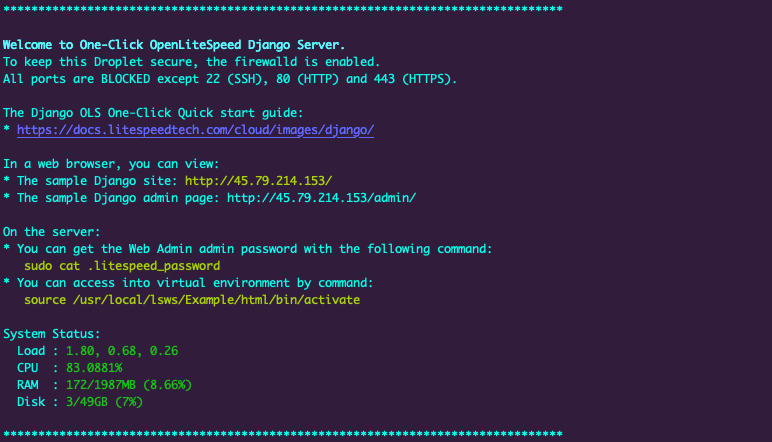

The OpenLiteSpeed Django app automatically installs Linux, the performance web server OpenLiteSpeed, Python LSAPI, and CertBot. OpenLiteSpeed Django features HTTP/3 support and easy setup for SSL and RewriteRules. It’s flexible enough to host multiple Django apps and supports many other apps including Node.js, Ruby, and CMS software like WordPress.

## Deploying a Marketplace App






**Estimated deployment time:** OpenLiteSpeed Django should be fully installed within 10-15 minutes after the Compute Instance has finished provisioning.


## Configuration Options

- **Supported distributions:** CentOS 7, Ubuntu 20.04 LTS
- **Recommended plan:** All plan types and sizes can be used.

## Getting Started after Deployment

### Accessing the OpenLiteSpeed Django App

1.  Log in to your Compute Instance over SSH. See [Connecting to a Remote Server Over SSH
](/docs/guides/connect-to-server-over-ssh/) for assistance. You should see output similar to the following:

    

1. You are then prompted to enter the domain you'd like to use for this instance. You can optionally use a custom domain provided you've already configured the *A Records* to point to this server's IPv4 and IPv6 addresses. Otherwise, you can skip this by pressing *CTRL+C* which will use the IP address or default RDNS of the Compute Instance.

    
    For more documentation on how to assign a domain to your Linode, please review the [DNS Manager](/docs/products/networking/dns-manager/) guide for instructions on setting up your DNS records in the Cloud Manager, and read through [DNS Records: An Introduction](/docs/guides/dns-overview/) for general information about how DNS works.
    

Now that you’ve accessed your OpenLiteSpeed Django instance, check out [the official OpenLiteSpeed Django documentation](https://docs.litespeedtech.com/cloud/images/django/) to learn how to further configure your OpenLiteSpeed Django instance.

