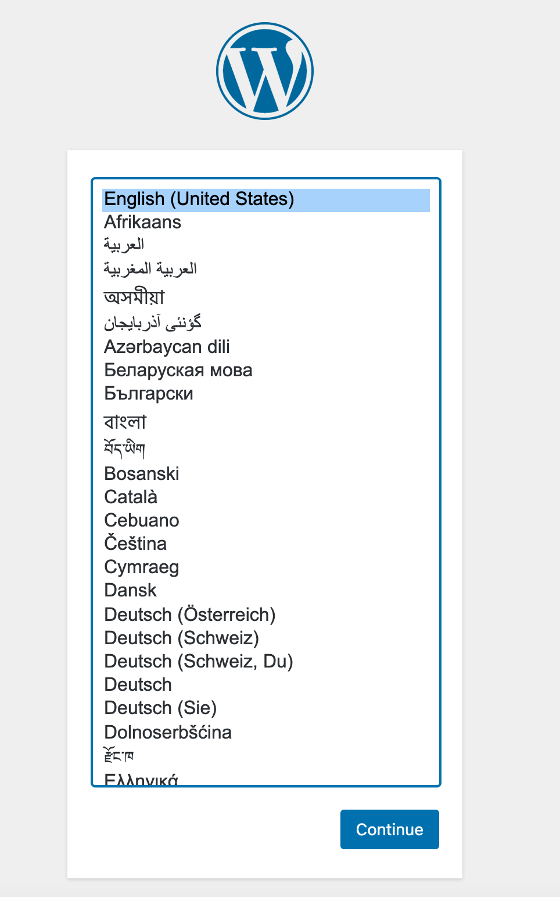
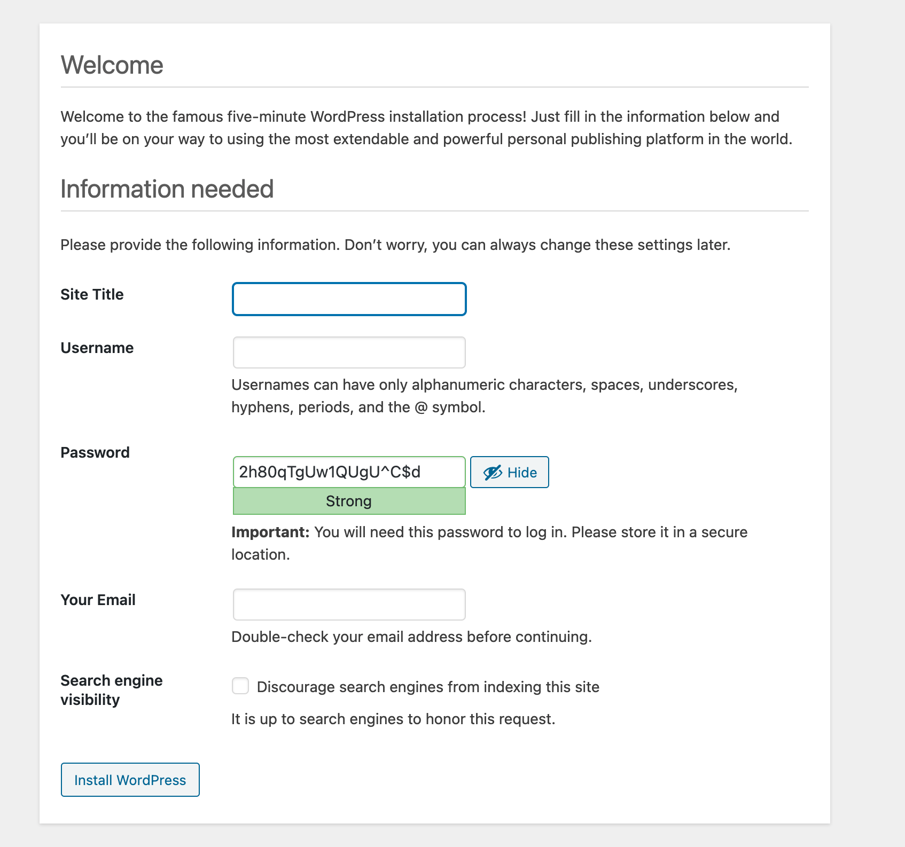

This Marketplace App installs the OpenLiteSpeed web server, WordPress, the LiteSpeed caching plugin for Wordpress, as well as other necessary software. Together, these applications provide an accelerated hosting platform for WordPress. [OpenLiteSpeed](https://openlitespeed.org/) is the open source edition of the LiteSpeed web server. It combines speed, security, scalability, optimization, and simplicity in one friendly open-source package.

## Deploying a Marketplace App






**Estimated deployment time:** OpenLiteSpeed WordPress should be fully installed within 2-5 minutes after the Compute Instance has finished provisioning.


## Configuration Options

- **Supported distributions:** Ubuntu 22.04 LTS, Debian 11, Debian 10, Ubuntu 20.04 LTS, CentOS 7
- **Recommended minimum plan:** All plan types and sizes can be used.

## Getting Started After Deployment

1.  Log in to your Compute Instance over SSH. See [Connecting to a Remote Server Over SSH
](/docs/guides/connect-to-server-over-ssh/) for assistance. Once logged in, you should see output that contains links to your new site, phpmyadmin, and details about the software configuration (and location) on your server.

1. You are then prompted to enter the domain you'd like to use for this instance. You can optionally use a custom domain provided you've already configured the *A Records* to point to this server's IPv4 and IPv6 addresses. Otherwise, you can skip this by pressing *CTRL+C* which will use the IP address or default RDNS of the Compute Instance.

    
    For more documentation on how to assign a domain to your Linode, please review the [DNS Manager](/docs/products/networking/dns-manager/) guide for instructions on setting up your DNS records in the Cloud Manager, and read through [DNS Records: An Introduction](/docs/guides/dns-overview/) for general information about how DNS works.
    

1.  Apply the Let's Encrypt SSL if your domain is pointed to the server already. Enter `y` and type your email address.

    A message that reads `Certificate has been successfully installed.....` appears. If you'd like to force HTTPS rewrites, enter `y` again at the prompt.

1.  Proceed through any remaining prompts, using whichever options you wish.

### Configure WordPress

1.  Open a web browser and navigate to your Compute Instance's IPv4 address or the custom domain you are using. The following page appears:

    

1.  Select your preferred language and click the **Continue** button.

1.  The next page should be the **Welcome** page. Type the required details to complete the installation, save the password in a secure location and click the **Install WordPress** button.

    

### Software Included

The OpenLiteSpeed WordPress Marketplace App installs the following required software on your Linode:

| **Software** | **Description** |
|:--------------|:------------|
| [**MariaDB Server**](https://www.mysql.com/) | Relational database server forked from MySQL. |
| [**PHP 8**](https://www.php.net/) | Common programming language for web applications. |
| [**OpenLiteSpeed**](https://openlitespeed.org/) | Open source web server based on [LiteSpeed](https://www.litespeedtech.com/products/litespeed-web-server). |
| [**WordPress**](https://wordpress.org/) | Popular content management system (CMS) for building websites. |
| [**LiteSpeed Cache**](https://www.litespeedtech.com/products/cache-plugins/wordpress-acceleration) | Cache management plugin for WordPress. |


