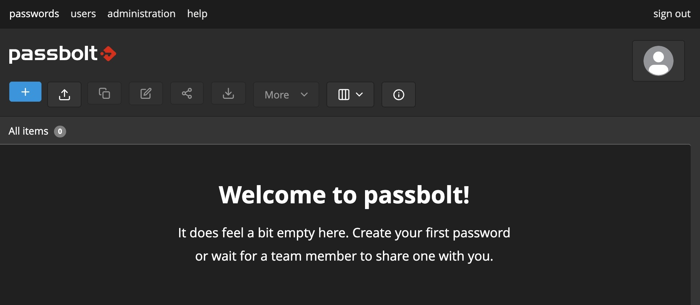

[Passbolt Password Manager](https://github.com/passbolt/passbolt_api) is an open-source password manager designed for teams and businesses. It allows users to securely store, share and manage passwords.

## Deploying a Marketplace App






**Estimated deployment time:** Passbolt should be fully installed within 5-10 minutes after the Compute Instance has finished provisioning.


## Configuration Options

- **Supported distributions:** Ubuntu 22.04 LTS
- **Recommended plan:** We recommend a 4GB Dedicated CPU or Shared Compute instance for Passbolt.

### Passbolt Options



## Getting Started after Deployment

To start registration follow the link provided in `/etc/motd` to visit the DNS you choose during deployment. 
```
cat /etc/motd
*********************************************************
Akamai Connected Cloud passbolt Marketplace App

Registering admin user: https://$DNS_NAME/setup/start/$UUID

App URL: https://$DNS_NAME
Credentials File: /home/$SUDO_USER/.credentials
Documentation: https://www.linode.com/marketplace/apps/linode/passbolt/
*********************************************************
To delete this message of the day: rm /etc/motd
```


Be sure to download the `passbolt-recovery-kit.txt` file and store it in a safe place. This PGP Private Key Block  (and the passphrase you set here) will be required if you ever need to go through account recovery.

You will need to create a passphrase to access Passbolt 

    

Once the passphrase is set you will be able to view the Passbolt main screen. 

    

Please visit [Passbolt Installation Documentation](https://help.passbolt.com/hosting/install/ce/ubuntu/ubuntu.html) for information on how to configure Passbolt.

### Email Configuration

Postfix is installed as part of the Marketplace App, allowing you to send a test email. Unless you've manually configured your own SMTP provider, to send a test email through the SMTP screen (https://<example.com>/app/administration/smtp-settings), use the following (replace `example.com` with your FQDN):
* **Email provider**: Other
* **Authentication method**: None
* **SMTP host**: localhost
* **Use TLS?**: No
* **Port**: 25
* **SMTP client** leave blank
* **Sender name**: root
* **Sender email**: root@<example.com>


To make the most out of Passbolt you need a working email setup for email notifications (e.g. - account registration, password recovery and other critical notifications). For more information on setting this up, see the [Configure Email Providers](https://help.passbolt.com/configure/email/setup) page on Passbolt's website.

Regardless of how you configure your mail server, it is strongly recommended that you follow the best practices to ensure mail deliverability. Please see the [Running a Mail Server](https://www.linode.com/docs/guides/running-a-mail-server/) guide for more information.


### Account Recovery
If you ever need to recover your account, you will be prompted for the PGP private key block you downloaded after entering your passphrase for the first time.

