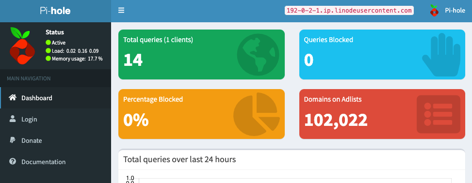

[Pi-hole](https://pi-hole.net/) is a [DNS sinkhole](https://en.wikipedia.org/wikic/DNS_sinkhole) that filters out requests to ad-serving domains, blocking ads and improving network performance. With Pi-hole, you can actively monitor every DNS request made on your network and block requests as they come in.

## Deploying a Marketplace App






**Estimated deployment time:** Pi-hole should be fully installed within 5-10 minutes after the Compute Instance has finished provisioning.


## Configuration Options

- **Supported distributions:** Ubuntu 20.04 LTS
- **Recommended plan:** All plan types and sizes can be used.

### Pi-hole Options

- **Pi-hole user password** *(required)*: This will be the password to get into the Pi-hole dashboard.




- **Email address for the SOA record:** The start of authority (SOA) email address for this server. This is a required field if you want the installer to create DNS records.



## Getting Started after Deployment

### Accessing the Pi-hole App

1.  Open your web browser and navigate to `http://[domain]/admin`, where *[domain]* can be replaced with the custom domain you entered during deployment, your Compute Instance's rDNS domain (such as `192-0-2-1.ip.linodeusercontent.com`), or your IPv4 address. See the [Managing IP Addresses](/docs/products/compute/compute-instances/guides/manage-ip-addresses/) guide for information on viewing IP addresses and rDNS.

    The Pi-Hole dashboard should now be displayed.

    

1.  To log yourself in and access most of Pi-hole's features, click the **Login** link on the left menu. Enter the Pi-hole user password that you created when deploying the Compute Instance.

Now that you’ve accessed your dashboard, check out [the official Pi-hole documentation](https://docs.pi-hole.net/) to learn how to further utilize your Pi-hole instance.

