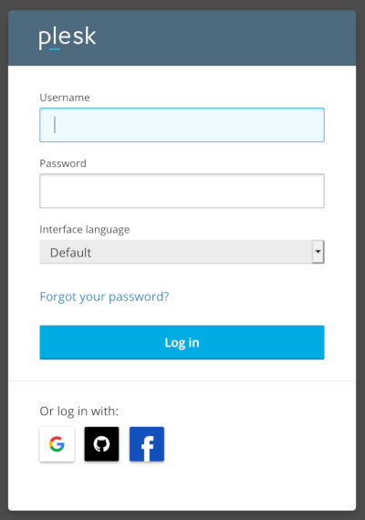

[Plesk](https://www.plesk.com) is a leading WordPress and website management platform and control panel. Plesk lets you build and manage multiple websites from a single dashboard to configure web services, email, and other applications. Plesk features hundreds of extensions, plus a complete WordPress toolkit. Use the Plesk Marketplace App to manage websites hosted on your Linode.

## Deploying a Marketplace App






**Estimated deployment time:** Plesk should be fully installed within 15 minutes after the Compute Instance has finished provisioning.


## Configuration Options

- **Supported distributions:** CentOS 7, Ubuntu 20.04 LTS
- **Recommended minimum plan:** All plan types and sizes can be used.

## Getting Started after Deployment

### Access your Plesk Site

1.  Open a web browser and enter the following URL, where *[domain]* is either your Compute Instance's IP address, its default rDNS domain, or your domain name (if you entered one during deployment). See the [Managing IP Addresses](/docs/products/compute/compute-instances/guides/manage-ip-addresses/) guide for information on viewing the IP address and rDNS value.

        https://[domain]/login_up.php

    
    The Plesk dashboard is only accessible over an *HTTPS* connection (not *HTTP*). When accessing it, your browser may warn you that the connection is not private, is not secure, or that there is a potential security risk. You must accept this risk to continue.
    

1.  Once you navigate to that URL, a login prompt appears. Use the following credentials.

    - **Username:** `root`
    - **Password:** The root password you entered when creating the Compute Instance.

    

1.  After logging in for the first time, you are prompted to create a user and choose your license. Fill out the required fields and select a license type. If desired, you can purchase a license from the [Plesk website](https://www.plesk.com/pricing/).

    

1.  Once your account is created, you are automatically logged in to your dashboard. From here, you can start adding and configuring your websites. See [Getting Started with Plesk](https://docs.plesk.com/en-US/obsidian/quick-start-guide/getting-started-with-plesk.74372/).

    


