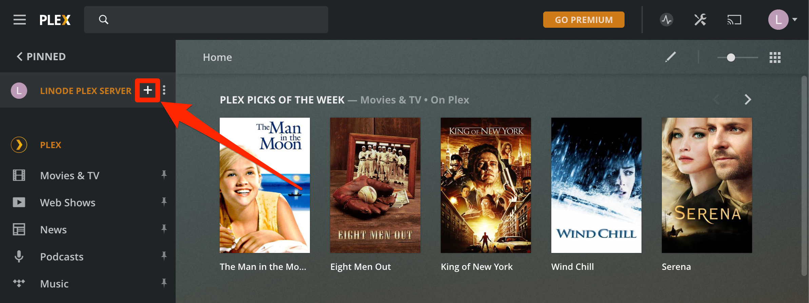

---
author:
  name: Linode
  email: docs@linode.com
description: "Stream your personal media collection to nearly any device with your own Plex Media Server using Linode Marketplace Apps."
keywords: ['streaming','plex','video','media server']
tags: ["debian","docker","marketplace", "web applications","linode platform", "cloud manager"]
license: '[CC BY-ND 4.0](https://creativecommons.org/licenses/by-nd/4.0)'
published: 2020-09-28
modified: 2022-03-08
image: Deploy_Plex_oneclickapps.png
modified_by:
  name: Linode
title: "Deploying Plex Media Server through the Linode Marketplace"
external_resources:
- '[Plex Support Articles](https://support.plex.tv/articles/)'
aliases: ['/platform/marketplace/deploy-plex-with-marketplace-apps/', '/platform/marketplace/deploy-plex-with-one-click-apps/', '/guides/deploy-plex-with-one-click-apps/', '/guides/deploy-plex-with-marketplace-apps/','/platform/one-click/deploy-plex-with-one-click-apps/','/guides/plex-marketplace-app/']
---

[Plex](https://www.plex.tv/) is a feature-rich streaming platform that allows you to organize and stream your own digital video and audio to your devices. This guide shows you how to deploy the [**Plex Media Server**](https://hub.docker.com/r/plexinc/pms-docker/) using Linode's Plex Marketplace App, upload media to your Plex Server, and connect to it from a Plex client application. Your Plex Media Server could benefit from large amounts of disk space, so consider using our [Block Storage](/docs/platform/block-storage/how-to-use-block-storage-with-your-linode) service with this app.

## Why Use Plex Media Server

Owning a Plex Media Server enables you to maintain a personal media library in addition to accessing [Plex's own content](https://mediaverse.plex.tv/), all available to stream to nearly [any device](https://www.plex.tv/apps-devices/). The ability to stream your own media is a unique advantage over other streaming services like [Netflix](https://www.netflix.com/), and comes only at the cost of your Linode services. Additional features, including local downloading, bandwidth limiting, and hardware transcoding are also available through the paid [Plex Pass](https://www.plex.tv/plex-pass/) service.

## Deploying a Marketplace App






**Estimated deployment time:** Plex should be fully installed within 2-5 minutes after the Compute Instance has finished provisioning.


## Configuration Options

- **Supported distributions:** Debian 10
- **Recommended minimum plan:** 4GB Dedicated CPU or Shared Compute Instance

### Plex Options

The following configuration options create a secure [Limited User](/docs/guides/set-up-and-secure/#add-a-limited-user-account) to run your Plex Media Server.


-   As a security measure, [root login over SSH](/docs/guides/set-up-and-secure/#ssh-daemon-options) is disabled for this App. Use your Limited User credentials to access your Linode via SSH instead.
-   The Limited User configurations below are for your Linode's [Linux user](/docs/guides/linux-users-and-groups/), which is distinct from your [Plex account user](https://www.plex.tv/sign-up/).


- **Limited User Name** *(required)*: Enter your preferred username for the limited user. If the username `root` is specified, a limited user is not be created and extra security features are not configured.
- **Limited User Password** *(required)*: Enter a *strong* password for the new user.
- **Limited User SSH Key:** If you wish to login as the limited user through public key authentication (without entering a password), enter your public key here. See [Creating an SSH Key Pair and Configuring Public Key Authentication on a Server](/docs/guides/use-public-key-authentication-with-ssh/) for instructions on generating a key pair.

## Getting Started After Deployment

After your Plex Server has been deployed, you can upload media and configure access to your Plex Server from Plex clients for your media devices.

Before you begin, ensure that you have signed up for a [Plex account](https://www.plex.tv/sign-up/).

### Initial Setup

Administration of your Plex Server is performed from its web interface. Before you can connect to the web interface from your workstation, you first need to create an SSH tunnel to your Linode.


This guide occasionally directs you to substitute variables beginning with `$` in certain commands.

An easy way to make these substitutions is to set the variables in your shell, then simply copy the commands as they are provided in this guide — your shell automatically substitutes the `$` variables in those commands with the values you have set.

For example, you can set configure a substitution for `$IP_ADDRESS` like so:

    IP_ADDRESS=192.0.2.0

Your shell then interprets `$IP_ADDRESS` as the value you have provided in following commands, for example:

    echo $IP_ADDRESS


192.0.2.0



1.  From your workstation [terminal](/docs/guides/using-the-terminal/), enter the following the command, substituting `$USERNAME` with your Linux [Limited User Name](#plex-marketplace-app-options), and `$IP_ADDRESS` with the [IP address](/docs/guides/find-your-linodes-ip-address/) of your Plex Server Linode:

        ssh $USERNAME@$IP_ADDRESS -L 8888:localhost:32400

    You now have an established SSH connection to your Plex Server Linode in your terminal, and can also access the Plex web interface from your workstation browser.

1.  Enter `http://localhost:8888/web` into your workstation browser to access the Plex Server setup web interface. Enter your Plex account username and password to proceed with the setup process.

    

1.  Give your Plex Server a name. Be sure to leave the **Allow me to access my media outside my home** box **checked**, and select **NEXT**.

    

1.  Skip Media Library setup by selecting **NEXT** for now. You will [Upload Media](#upload-media) and [Add Media Libraries](#add-media-libraries) in the sections below.

    

1.  Finish initial setup and reach the Plex home screen by selecting **DONE**.

    

1.  Click on the **Settings** icon in top-right corner of the Plex web interface.

    

1.  On the left side bar, ensure that your new Plex Server is selected and select on **Remote Access** under the **Settings** section.

    

1.  Click the check box next to **Manually specify public port**, keep the default value of `32400`, and select **RETRY** or **APPLY**. You may need to select **SHOW ADVANCED** to see these settings.

    

1.  Wait until you see a message stating that your Plex Server is **Fully accessible outside your network**.

    

You can now access [uploaded media](#upload-media) and manage your Plex Server from any Plex Client, such as the [Plex Web App](https://app.plex.tv). If you are unable to reach your Plex Server remotely, you can repeat the steps in this section to re-establish a direct connection for administrative purposes.

### (Optional) Connect a Linode Block Storage Volume

If your media collection is larger than the space available from your Linode plan, [Block Storage](/docs/platform/block-storage/how-to-use-block-storage-with-your-linode) is a convenient solution. This section outlines the steps for creating and connecting a Block Storage Volume for use with your Plex Server.


For future reference, you can find examples of the instructions provided in this section in Cloud Manager by navigating to [**Volumes**](https://cloud.linode.com/volumes), then selecting **Show Configuration** from the option menu for your Volume.


1.  [View, Create, and Delete Block Storage Volumes](/docs/products/storage/block-storage/guides/manage-volumes/) if you do not already have one prepared.

1.  Establish an SSH connection to your Plex Server Linode as your [Limited User](#plex-marketplace-app-options).

1.  On your Plex Server Linode, create a directory to your Volume's mountpoint:

        mkdir ~/plex/media/linode-volume

1.  Mount your Volume path to the mountpoint you have created, substituting `$FILE_SYSTEM_PATH` with your Volume's file system path (which is viewable from the Cloud Manager [**Volumes**](https://cloud.linode.com/volumes) dashboard):

        sudo mount $FILE_SYSTEM_PATH ~/plex/media/linode-volume

1.  Check available disk space:

        df -BG

    
Filesystem     1G-blocks  Used Available Use% Mounted on
udev                  1G    0G        1G   0% /dev
tmpfs                 1G    1G        1G  11% /run
/dev/sda             49G    3G       45G   5% /
tmpfs                 1G    0G        1G   0% /dev/shm
tmpfs                 1G    0G        1G   0% /run/lock
tmpfs                 1G    0G        1G   0% /sys/fs/cgroup
tmpfs                 1G    0G        1G   0% /run/user/1000
/dev/sdc             20G    1G       19G   1% /home/username/plex/media/linode-volume
    

    Notice that there is some overhead with the Volume due to the file system.

1.  To ensure that your Volume automatically mounts every time your Linode reboots, run the following command to modify your `/etc/fstab` file, substituting `$FILE_SYSTEM_PATH` with your Volume's file system path (the `$HOME` environment variable should already be set as your user's home directory):

        echo "$FILE_SYSTEM_PATH $HOME/plex/media/linode-volume ext4 defaults,noatime,nofail 0 2" | \
        sudo tee -a /etc/fstab

1.  Restart your Plex Server Docker container:

        docker restart plex

Media on your Volume is now accessible through the Plex web interface at the mounted directory on your Linode. Next, follow the instructions below on how to [Upload Media](#upload-media) to your Volume (use your Volume's mountpoint instead of creating a new subdirectory), and [Add Media Libraries](#add-media-libraries) to enable streaming media stored on your Volume.

### Upload Media

Your Plex Server is set up to access media files in the `~/plex/media` directory. You have many options for uploading or downloading media to your Plex Server. This section shows you how to organize and upload files to your Plex Server using the `scp` command.


This section directs you to run commands either on your Plex Server Linode through an SSH connection as your [Limited User](#plex-options), or from the workstation [terminal](/docs/guides/using-the-terminal/) where the media files you wish to upload are stored.


1.  On your Plex Server Linode, create a subdirectory within `~/plex/media` to store your media files. Plex recommends [organizing media by type](https://support.plex.tv/articles/naming-and-organizing-your-movie-media-files/), so pick a subdirectory name that matches the type of media you plan to upload. For example, to create a directory to store movie files, enter the following command:

        mkdir ~/plex/media/movies

1.  From your media workstation, use the `scp` command to move media to your Plex Server's media subdirectory, substituting `$USERNAME` with your Linux [Limited User Name](#plex-marketplace-app-options), and `$IP_ADDRESS` with the [IP address](/docs/guides/find-your-linodes-ip-address/) of your Plex Server Linode:

        scp example_video.mp4 $USERNAME@$IP_ADDRESS:~/plex/media/movies

    Depending on the file size(s), this may take a few minutes.

    
There are other ways to upload files to your Plex Server Linode. See our section in [Linux System Administration Basics](/docs/tools-reference/linux-system-administration-basics/#upload-files-to-a-remote-server) for more information.
    

### Add Media Libraries

1.  Log into a Plex Client, such as the [Plex Web App](https://app.plex.tv), then select the **MORE >** link on the Plex side bar.

    

1.  Hover over your Plex Server's name in the Plex side bar, then select the **+** icon.

    

1.  Select your library type, set the name for your media library, select your language, then select the **NEXT** button.

    

1.  Click **BROWSE FOR MEDIA FOLDER**, navigate to the directory within `/media` where your files are stored, then select the **ADD** button.

    

1.  Once you are satisfied with your selection, select the **ADD LIBRARY** button.

    

1.  Pin your new media library to make it accessible from the Plex home screen.

    

1.  Repeat the steps in this section to add additional media folders.

You now have all the tools you need to create an online media library and stream it to [any device](https://www.plex.tv/apps-devices/) with Plex.

## Software Included

The Plex Marketplace App installs the following required software on your Linode:

| **Software** | **Description** |
|:--------------|:------------|
| [**Docker Engine**](https://docs.docker.com/engine/) | Docker Engine is an open source containerization technology for building and containerizing your applications. This Marketplace App deploys Plex Media Server as a Docker container. |
| [**Plex Media Server**](https://hub.docker.com/r/plexinc/pms-docker/) | The Plex Media Server transmits locally-stored media files, enabling you to stream your personal media collection to any device that can support a [Plex Client](https://www.plex.tv/apps-devices/). |


