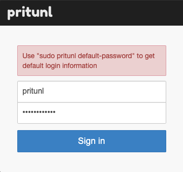
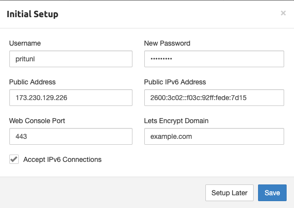

Pritunl is an open source VPN server and management panel. It gives the user the power of the OpenVPN protocol while using an intuitive web interface.

## Deploying a Marketplace App






**Estimated deployment time:** Pritunl should be fully installed within 2-5 minutes after the Compute Instance has finished provisioning.


## Configuration Options

- **Supported distributions:** Ubuntu 20.04 LTS, Debian 10
- **Recommended plan:** All plan types and sizes can be used.

### Pritunl Options




- **Email address for the SOA record:** The start of authority (SOA) email address for this server. This is a required field if you want the installer to create DNS records.



## Getting Started after Deployment

### Accessing the Pritunl App

1.  Log in to your Compute Instance over SSH. See [Connecting to a Remote Server Over SSH](/docs/guides/connect-to-server-over-ssh/) for assistance.

1.  Run the command below to obtain your setup key. This key is used in a later step.

        sudo pritunl setup-key

1.  Run the command below to generate the password:

        sudo pritunl default-password

1.  Open a web browser and navigate to the domain you created in the beginning of your deployment. If you did not enter a custom domain, use the IP address of the server. You may need to access the self-signed certificate before continuing.

    
    In Chrome, you can accept the self-signed certificate by clicking on Advanced and then click Proceed to <ip> (unsafe). In Firefox, click on Advanced, then Add Exception, and then Confirm Security Exception.
    

1.  The Pritunl Database Setup screen appears. Enter the setup key that was generated in a previous step.

    

1.  The login prompt appears. Enter `pritunl` as the username and then use the password generated in a previous step.

    

1.  Once you're logged in, you can change the default password and enter the domain information so Pritunl can setup the SSL certificates automatically:

    

Now that you’ve accessed your dashboard, check out [the official Pritunl documentation](https://docs.pritunl.com/docs/connecting) to learn how to add users and further utilize your Pritunl instance.

