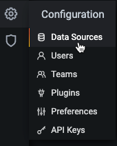
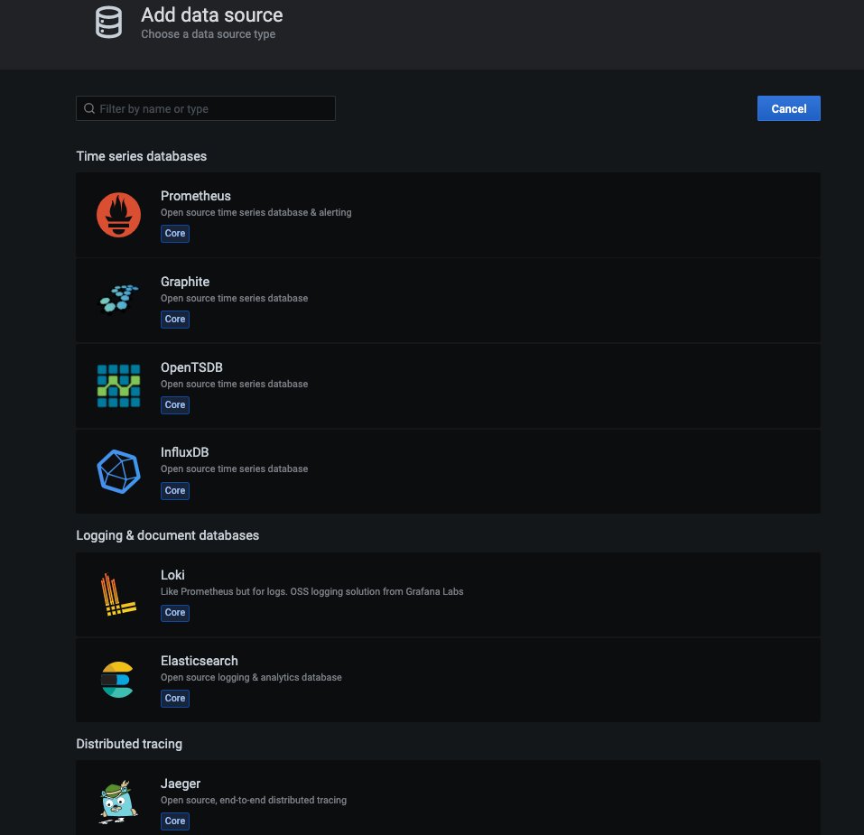
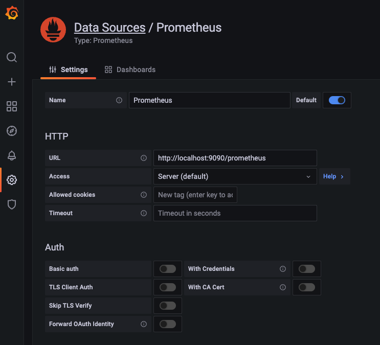

Use Prometheus to collect metrics and receive alerts with this open-source monitoring tool. Prometheus monitors targets that you define at given intervals by scraping their metrics HTTP endpoints. This tool is particularly well-suited for numeric time series data, which makes it ideal for machine-centric monitoring as well as monitoring of highly dynamic service-oriented architectures.

Grafana is an open source analytics and monitoring solution with a focus on accessibility for metric visualization. You can use Grafana to create, monitor, store, and share metrics with your team to keep tabs on your infrastructure. Grafana is very lightweight and does not use a lot of memory and CPU resources.

## Deploying the Prometheus & Grafana Marketplace App



**Software installation should complete within 2-5 minutes after the Linode has finished provisioning.**

## Configuration Options

### Prometheus & Grafana Options

Here are the additional options available for this Marketplace App:

| **Field** | **Description** |
|:--------------|:------------|
| **Let's Encrypt Renewal email** | This email is required to generate the SSL certificates for the Grafana frontend. *Required* |
| **Your Linode API Token** | Your Linode `API Token` is needed to create DNS records. If this is provided along with the `subdomain` and `domain` fields, the installation attempts to create DNS records via the Linode API. If you don't have a token, but you want the installation to create DNS records, you must [create one](/docs/platform/api/getting-started-with-the-linode-api/#get-an-access-token) before continuing. |
| **Subdomain** | The subdomain you wish the installer to create a DNS record for during setup. The suggestion given is `www`. The subdomain should only be provided if you also provide a `domain` and `API Token`. |
| **Domain** | The domain name where you wish to host your instance. The installer creates a DNS record for this domain during setup if you provide this field along with your `API Token`. |
| **The limited sudo user to be created for the Linode** | This is the limited user account to be created for the Linode. This account has sudo user privileges. |
| **The password for the limited sudo user** | Set a password for the limited sudo user. The password must meet the complexity strength validation requirements for a strong password. This password can be used to perform any action on your server, similar to root, so make it long, complex, and unique. |
| **The SSH Public Key that will be used to access the Linode** | If you wish to access [SSH via Public Key](/docs/security/authentication/use-public-key-authentication-with-ssh/) (recommended) rather than by password, enter the public key here. |
| **Disable root access over SSH?** | Select `Yes` to block the root account from logging into the server via SSH. Select `No` to allow the root account to login via SSH. |

### General Options

For advice on filling out the remaining options on the **Create a Linode** form, see [Creating a Compute Instance](/docs/guides/creating-a-compute-instance/). That said, some options may be limited or recommended based on this Marketplace App:

- **Supported distributions:** Ubuntu 20.04 LTS
- **Recommended plan:** All plan types and sizes can be used.

## Getting Started after Deployment

### Accessing Grafana's Frontend

1.  Once the app has been *fully* deployed, you will need to grab the credentials from the server using one of the following messages:

    -   **Lish Console:** Within the Cloud Manager, navigate to **Linodes** from the left menu, select the Compute Instance you just deployed, and click the **Launch LISH Console** button. See [Using the Lish Console](/docs/guides/using-the-lish-console/).
    -   **SSH:** Log in to your Compute Instance over SSH using the `root` user and run the following command. See [Connecting to a Remote Server Over SSH](/docs/guides/connect-to-server-over-ssh/) for assistance.

            cat /root/credentials.txt

1.  The contents of that file contains *Credentials* and the *Endpoint* URL for both Prometheus & Grafana, as shown in the example below.

    
#################
#   Prometheus  #
#################

Location: https://192.0.0.2.ip.linodeusercontent.com/prometheus
Username: prometheus
Password: htyjuykuyhjyrkit648648#$#%^GDGHDHTTNJMYJTJ__grojpoijrpo

##############
#  Grafana   #
##############

Location: https://192.0.0.2.ip.linodeusercontent.com
Username: admin
Password: ewtghwethetrh554y35636#$_0noiuhr09h)
    

### Adding a Data Source to Grafana

1. Once you access the Grafana dashboard using the generated credentials you can being to add [Data Sources](https://grafana.com/docs/grafana/latest/datasources/add-a-data-source/) which in this case, will be Prometheus.

    
    


For the Prometheus Data Source, you will need to input **http://localhost:9090/prometheus** in the URL section as shown in the screenshot below. 


    

Now that the Prometheus Data Source is set, you can browse the [available Grafana dashboards](https://grafana.com/grafana/dashboards/) to see which dashboard fits your needs. 

You can check out the official [Prometheus](https://prometheus.io/docs/introduction/overview/) & [Grafana](https://grafana.com/docs/grafana/latest/) documentation to learn how to further utilize your instance.

