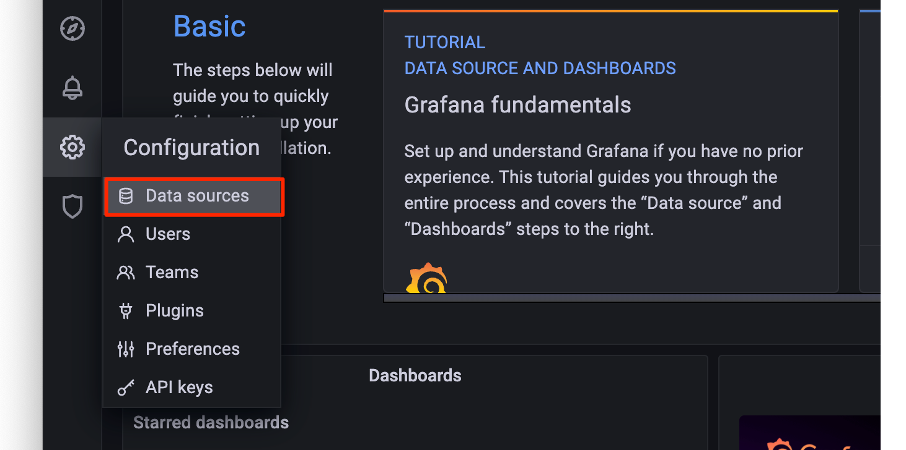
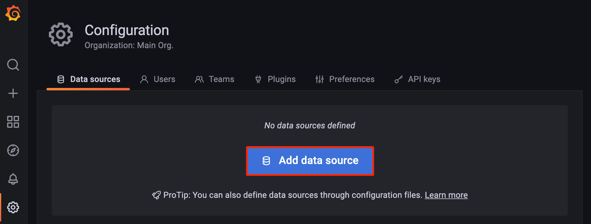
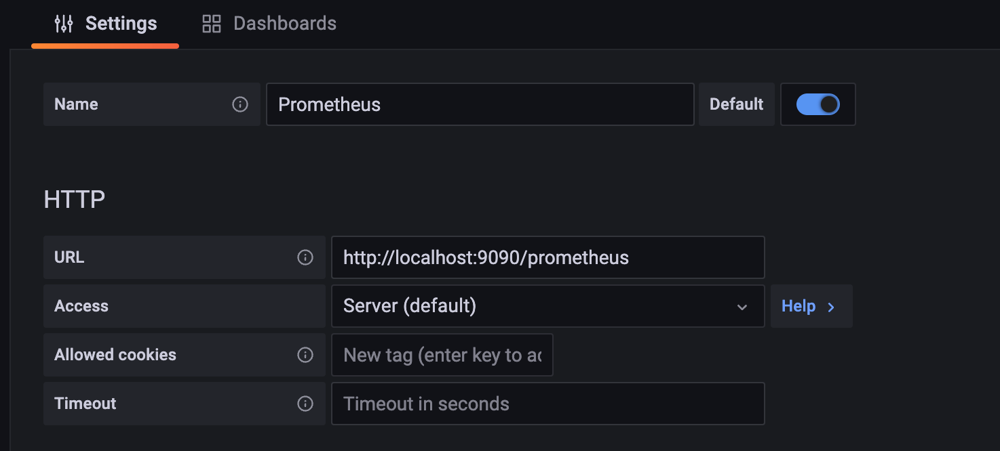

This Marketplace App installs both [Prometheus](https://prometheus.io/) and [Grafana](https://grafana.com/oss/grafana/), two open source tools that are commonly used together to collect and view data.

Use Prometheus to collect metrics and receive alerts. Prometheus monitors targets that you define at given intervals by scraping their metrics HTTP endpoints. This tool is particularly well-suited for numeric time series data, which makes it ideal for machine-centric monitoring as well as monitoring of highly dynamic service-oriented architectures.

Grafana is an analytics and monitoring solution with a focus on accessibility for metric visualization. You can use Grafana to create, monitor, store, and share metrics with your team to keep tabs on your infrastructure. Grafana is very lightweight and does not use a lot of memory and CPU resources.

## Deploying a Marketplace App






**Estimated deployment time:** Prometheus and Grafana should be fully installed within 2-5 minutes after the Compute Instance has finished provisioning.


## Configuration Options

- **Supported distributions:** Ubuntu 22.04 LTS
- **Recommended plan:** All plan types and sizes can be used.

### Prometheus and Grafana Options

- **Email address** *(required)*: Enter the email address to use for generating the SSL certificates.







## Getting Started after Deployment

### Access Grafana and Prometheus

To access the front end interfaces for either Grafana or Prometheus, first [obtain the credentials](#obtain-the-credentials). Then, open your web browser and navigate to the *Location* URL of the app you wish to access. In the login prompt that appears, enter the username and password as shown in the *credentials.txt* file.

### Obtain the Credentials

Once the app has been *fully* deployed, you need to obtain the credentials from the server.

1.  Log in to your new Compute Instance using one of the methods below:

    - **Lish Console:** Within the Cloud Manager, navigate to **Linodes** from the left menu, select the Compute Instance you just deployed, and click the **Launch LISH Console** button. Log in as the `root` user. See [Using the Lish Console](/docs/products/compute/compute-instances/guides/lish/).
    - **SSH:** Log in to your Compute Instance over SSH using the `root` user. See [Connecting to a Remote Server Over SSH](/docs/guides/connect-to-server-over-ssh/) for assistance.

1.  Once logged in, run the following command:

    ```command
    cat /root/credentials.txt
    ```

1. This displays the credentials and endpoint URL for both Prometheus and Grafana, as shown in the example output below.

    ```output
    #################
    #   Prometheus  #
    #################
    Location: https://192-0-2-1.ip.linodeusercontent.com/prometheus
    Username: prometheus
    Password: htyjuykuyhjyrkit648648#$#%^GDGHDHTTNJMYJTJ__gr9jpoijrpo
    ##############
    #  Grafana   #
    ##############
    Location: https://192-0-2-1.ip.linodeusercontent.com
    Username: admin
    Password: ewtghwethetrh554y35636#$_0noiuhr09h)
    ```

### Add Prometheus as a Data Source to Grafana

1. Log in to the Grafana frontend. See [Access Grafana and Prometheus](#access-grafana-and-prometheus).

1. On the main menu, hover over the gear icon to open the *Configuration* menu. Then click **Data Sources**.

    

1. Within the *Data sources* page that appears, click the **Add data source** button.

    

1. Select **Prometheus** from the *Time series database* section of the *Add data source* page.

1. A data source labeled *Prometheus* is automatically created and its configuration settings are now visible. Within the **URL** field, enter `http://localhost:9090/prometheus`. The rest of the settings can be adjusted as needed.

    

Now that the Prometheus Data Source is set, you can browse the [available Grafana dashboards](https://grafana.com/grafana/dashboards/) to see which dashboard fits your needs. Review the official [Prometheus](https://prometheus.io/docs/introduction/overview/) and [Grafana](https://grafana.com/docs/grafana/latest/) documentation to learn how to further utilize your instance.

