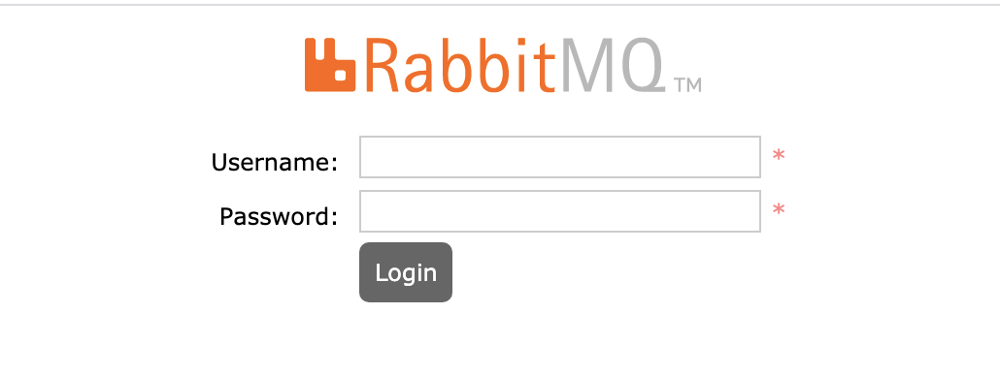
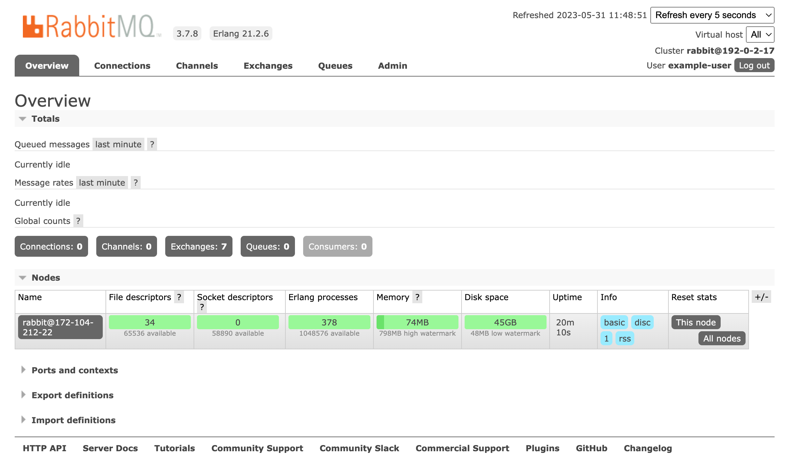

RabbitMQ is a popular open source **message broker**, or a tool that enables and empowers components of a system to communicate from a centralized source or application. By "translating" data from a number of different sources into a unified language, RabbitMQ allows component services to interact with each other through a centralized method.

The RabbitMQ Marketplace App installs a RabbitMQ server and a basic default configuration to assist with messaging tasks. By accessing The RabbitMQ Management console, you can further configure RabbitMQ and view important analytics at any time.

## Deploying a Marketplace App






**Estimated deployment time:** RabbitMQ should be fully installed within 2-5 minutes after the Compute Instance has finished provisioning.


## Configuration Options

- **Supported distributions:** Debian 10
- **Recommended minimum plan:** All plan types and sizes can be used.

### RabbitMQ Options

- **RabbitMQ Username** *(required)*: The username for accessing the rabbitMQ management console.
- **RabbitMQ Password** *(required)*: The user password for SSH access to the Linode.



## Getting Started After Deployment

1.  Open your web browser and navigate to the following URL, replacing *[ip-address]* with your Compute Instance's IPv4 address or default rDNS domain. See the [Managing IP Addresses](/docs/products/compute/compute-instances/guides/manage-ip-addresses/) guide for information on viewing IP addresses.

    ```command
    http://[ip-address]:15672
    ```

1.  In the login form that appears, enter the username and password you created during the deployment. Then, click the **Login** button.

    

1.  After you login successfully, you have full access to the RabbitMQ Management Console. From you, you can start configuring your application. To learn more about using RabbitMQ, visit the official [RabbitMQ Tutorials](https://www.rabbitmq.com/getstarted.html) page.

    

