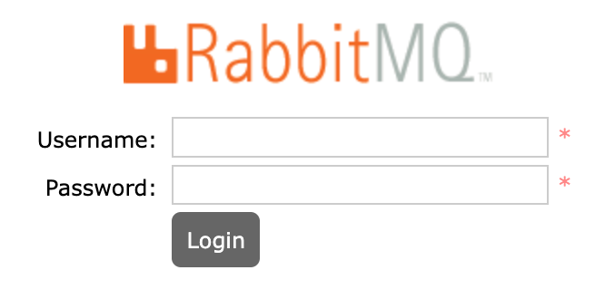

RabbitMQ is a popular open source **message broker**, or a tool that enables and empowers components of a system to communicate from a centralized source or application. By "translating" data from a number of different sources into a unified language, RabbitMQ allows component services to interact with each other through a centralized method.

The RabbitMQ Marketplace App installs a RabbitMQ server and a basic default configuration to assist with messaging tasks. By accessing The RabbitMQ Management console, you can further configure RabbitMQ and view important analytics at any time.

## Deploying a Marketplace App






**Estimated deployment time:** RabbitMQ should be fully installed within 2-5 minutes after the Compute Instance has finished provisioning.


## Configuration Options

- **Supported distributions:** Debian 10
- **Recommended minimum plan:** All plan types and sizes can be used.

### RabbitMQ Options

- **RabbitMQ Username** *(required)*: The username for accessing the rabbitMQ management console.
- **RabbitMQ Password** *(required)*: The user password for SSH access to the Linode.



## Getting Started After Deployment

After the RabbitMQ Server has been deployed, you can access the management console by entering the [public IPv4 address](/docs/guides/find-your-linodes-ip-address/) of the Linode followed by port `15672`:

        https://203.0.113.0:15672

The following login page appears:

To log in, enter the `RabbitMQ username` and `RabbitMQ Password` set as a [configuration option](#RabbitMQ-Marketplace-App-Options) before you created the server. After you login successfully, you have full access to the RabbitMQ Management Console.

## Software Included

The RabbitMQ Marketplace App installs the following required software on the Linode:

| **Software** | **Description** |
|:--------------|:------------|
| [**RabbitMQ Server**](https://www.rabbitmq.com/download.html) | The RabbitMQ server software is an Open Source Message broker, used to assist component services to communicate. |



