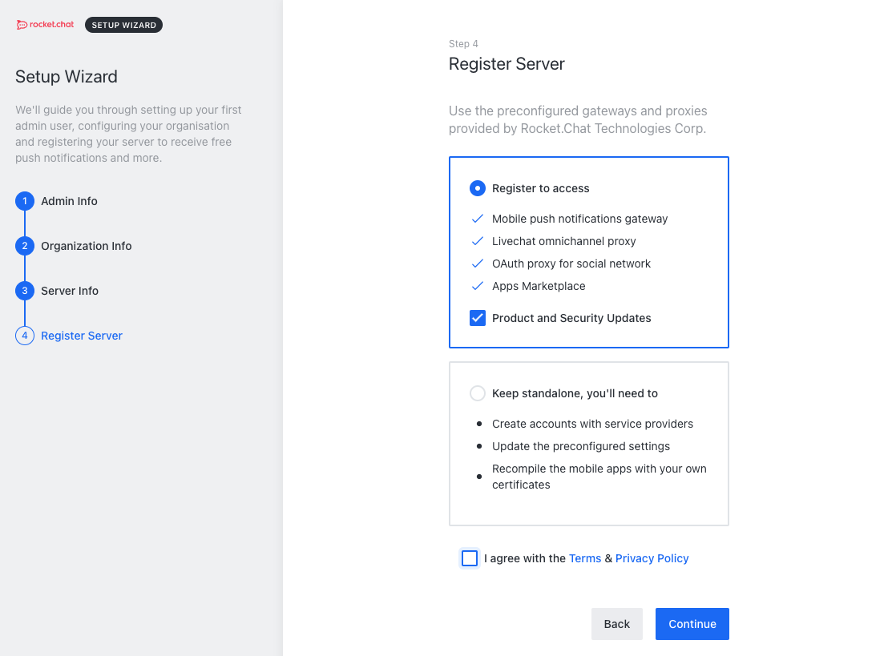

Rocket.Chat is a self-hosted open source chat application that can be used as an alternative to Slack. Rocket.Chat has many key features that you or your business can utilize to improve productivity in the workplace such as video conferencing, group chats, and platform integrations with some of the most popular applications.

## Deploying a Marketplace App






**Estimated deployment time:** Rocket.Chat should be fully installed within 2-5 minutes after the Compute Instance has finished provisioning.


## Configuration Options

- **Supported distributions:** Ubuntu 20.04 LTS
- **Recommended plan:** All plan types and sizes can be used.

### Rocket.Chat Options




- **Email address for the SOA record:** The start of authority (SOA) email address for this server. This is a required field if you want the installer to create DNS records.



## Getting Started after Deployment

### Accessing the Rocket.Chat App

1.  Open a browser and navigate to the domain you created in the beginning of your deployment. You can also use your Compute Instance's rDNS, which will appear like `203-0-113-0.ip.linodeusercontent.com`. See the [Managing IP Addresses](/docs/products/compute/compute-instances/guides/manage-ip-addresses/) guide for information on viewing and setting the rDNS value.

1.  From there, Rocket.Chat prompts you to fill out multiple forms to get your instance created and ready to use:

    
    
    
    

Now that you’ve gone through the setup and accessed your Rocket.Chat instance, check out [the official Rocket.Chat documentation](https://docs.rocket.chat/guides/user-guides) to learn how to further utilize your Rocket.Chat instance.

