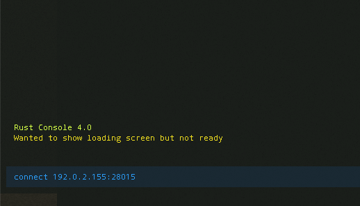

[Rust](https://rust.facepunch.com/) is a multiplayer game where you play as a survivor that must work with or against other players to ensure your own survival. Players are able to steal, lie, cheat, or trick each other. You can build a shelter, hunt animals for food, craft weapons, craft armor, and much more.

Hosting your own Rust server allows you to customize settings and curate the number of players in the world.

## Deploying a Marketplace App






**Estimated deployment time:** Rust should be fully installed within 5-15 minutes after the Compute Instance has finished provisioning.


## Configuration Options

- **Supported distributions:** Ubuntu 20.04 LTS
- **Recommended minimum plan:** 8GB Dedicated CPU or Shared Compute Instance

### Rust Options

- **RCON Password** *(required)*: The password for your remote console, which allows you to issue commands on the Rust server
- **Server Hostname:** The name of your Rust server.
- **Server Description:** Your server's description. Use `\n` to create a new line.
- **Maximum Players:** The maximum number of players allowed on a server at one time. Default is 50, minimum is 10, maximum is 100.
- **World:** Sets the type of map to generate. Options are Procedural Map, Barren, Hapis Island, Savas Island.
- **World Size:** The size of the world map. Default is 3000, minimum is 1000, maximum is 8000.
- **Seed:** A random numeric seed used by the world generation algorithm to create a unique world. The maximum value is 4,294,967,295.
- **Global Chat Enabled:** Enables global chat. Chat messages will be broadcast to all players.
- **PvE Enabled:** Allow player vs. environment combat.



## Getting Started after Deployment

Ensure that you have installed Rust to your computer before getting started with this section. You can install Rust from [Steam's Web Store](https://store.steampowered.com/).

After the Rust Marketplace App has finished deploying to your Linode, you will be able to access your Rust server by copying your Linode's IPv4 address and entering it in to the Rust game installed on your computer. To find your Linode's IPv4 address:

1. Click on the **Linodes** link in the sidebar. You will see a list of all your Linodes.

2. Find the Linode you just created when deploying your app and select it.

3. Navigate to the **Networking** tab.

4. Under the **IPv4** heading, you will find your IPv4 address listed under the **Address** column.

5. Copy the IPv4 address. Open Rust, and then open the developer's console by pressing `f1`.

6. In the console, type `connect 192.0.2.155:28015` and replace 192.0.2.155 with your Linode's IP address. Be sure append the port `28015` to the end of the IP address. Press **enter** when you are done typing.

    <!---->

    You will be logged into the server, and the game will load.

## Software Included

The Rust Marketplace App will install the following required software on your Linode:

| **Software**&nbsp;&nbsp;&nbsp;&nbsp;&nbsp;&nbsp;&nbsp; | **Description** |
|:--------------|:------------|
| [**Rust Server**](https://store.steampowered.com/app/252490/Rust/) | Game server. |
| [**LinuxGSM**](https://linuxgsm.com) | A command line tool for the deployment and management of Linux game servers. |
| [**UFW**](https://wiki.ubuntu.com/UncomplicatedFirewall) | Firewall utility. Ports 28015 and 28016 will allow outgoing and incoming traffic. |
| [**Fail2ban**](https://www.fail2ban.org/wiki/index.php/Main_Page) | Fail2Ban is an intrusion prevention software framework that protects computer servers from brute-force attacks. |


