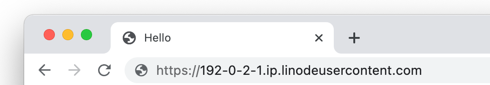
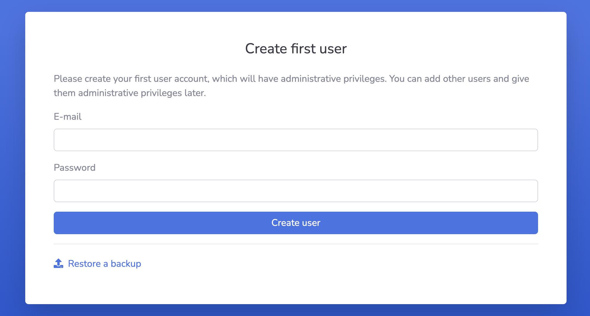
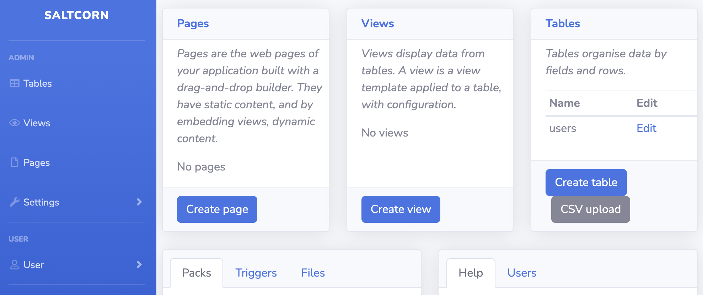

[Saltcorn](https://saltcorn.com/) is an flexible open source no-code database application builder. You can use it to build web applications based on relational data with flexible views, data types, and layouts.

## Deploying a Marketplace App






**Estimated deployment time:** Saltcorn should be fully installed within 5-10 minutes after the Compute Instance has finished provisioning.


## Configuration Options

- **Supported distributions:** Ubuntu 20.04 LTS, Debian 11
- **Recommended plan:** All plan types and sizes can be used.

### Saltcorn Options

- **Email address** *(required)*: Enter the email address to use for generating the SSL certificates.







## Getting Started after Deployment

### Accessing the Saltcorn App

1.  Open your web browser and navigate to `https://[domain]/`, where *[domain]* can be replaced with the custom domain you entered during deployment or your Compute Instance's rDNS domain (such as `192-0-2-1.ip.linodeusercontent.com`). See the [Managing IP Addresses](/docs/products/compute/compute-instances/guides/manage-ip-addresses/) guide for information on viewing rDNS.

    

1.  Within the Saltcorn **Create user** page that appears, create your first user account.

    

1.  After you create the user, you are automatically logged in and the Saltcorn admin dashboard appears.

    

Now that you’ve accessed your dashboard, check out [the official Saltcorn documentation](https://wiki.saltcorn.com/) to learn how to further utilize your Saltcorn instance.

