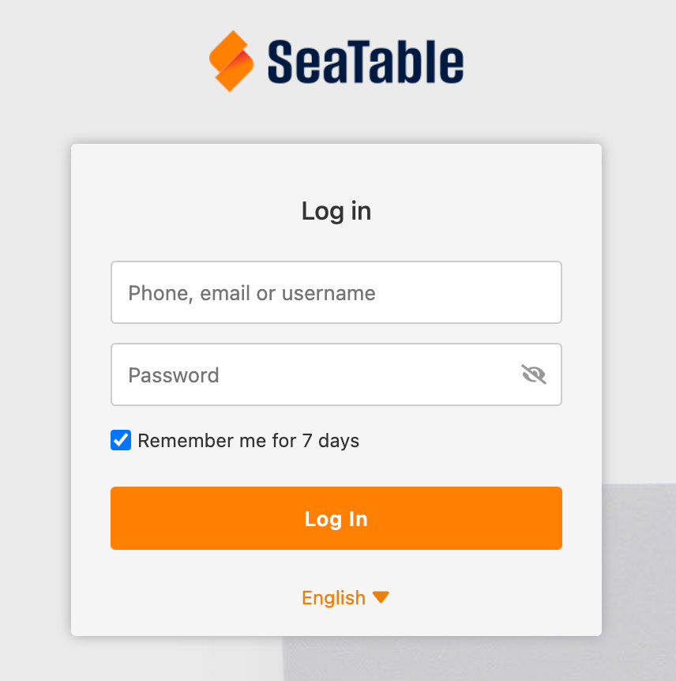
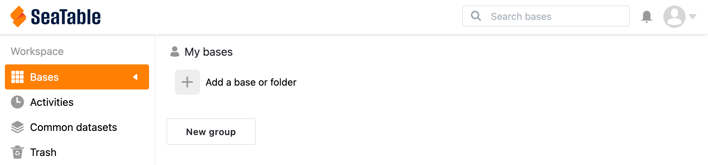
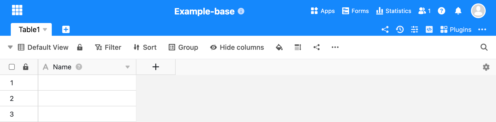

[SeaTable](https://seatable.io/) is a simple and flexible database management interface with native Python automation support. It is designed to mimic the user-friendly interfaces of common spreadsheet software (like Microsoft Excel and Google Sheets). SeaTable offers advanced data linking capabilities and allows for custom data organization and visualization.


The SeaTable Marketplace app requires the use of a custom domain. Please review the [Configure DNS Records](#configure-dns-records) section for information on registering and configuring your domain name.


## Deploying a Marketplace App






**Estimated deployment time:** SeaTable should be fully installed within 5-10 minutes after the Compute Instance has finished provisioning.


## Configuration Options

- **Supported distributions:** Debian 11
- **Recommended plan:** We recommend a 4GB Dedicated CPU or Shared Compute Instance for SeaTable.

### SeaTable Options

- **The domain/subdomain for SeaTable Server** *(required)*: Enter the custom domain name you wish to use. The domain must be registered and, after deployment, you need to update your DNS records with the IP address of the new Compute Instance. See [Configure DNS Records](#configure-dns-records) for next steps.

- **Get a Let's Encrypt certificate:** To deploy your application with a Let's Encrypt certificate (recommended), select *True*.

- **Choose your timezone:** Update this field to match your timezone's identifier. For a list of timezones and their corresponding identifiers, review the [List of tz database time zones](https://en.wikipedia.org/wiki/List_of_tz_database_time_zones) Wikipedia page. Locate your timezone and copy the string under the **TZ Identifier** column (for example: `America/New_York`).





## Getting Started after Deployment

### Configure DNS Records

When deploying the SeaTable app, you are required to enter a custom domain. This domain must be registered and, once your app instance has been deployed, you must configure your DNS records to point to the IP address of the associated Compute Instance.

1.  If you have not already done so, register your domain using your preferred domain registrar.

1.  Within your domain registrar, make sure the authoritative name servers are configured to use your preferred DNS provider (such as Linode's DNS Manager). If you are not yet using a DNS provider, consider Linode's DNS Manager. For instructions on creating a DNS zone and updating your authoritative name servers, review [Get Started with Linode's DNS Manager](/docs/products/networking/dns-manager/get-started/).

1.  After the Compute Instance has been deployed, you need to add an *A record* to your domain within your DNS provider. When prompted, use the IPv4 address of the newly deployed Compute Instance. To locate the public IPv4 address for that instance, see [Managing IP Addresses](/docs/products/compute/compute-instances/guides/manage-ip-addresses/).

### Finish SeaTable Deployment

Once your DNS records have been updated and have propagated, you can complete the final steps to deploy SeaTable. The SeaTable Marketplace App installs docker, downloads the SeaTable Docker image, and configures the docker-compose.yml file according to the fields set during deployment. You will need to manually run Docker and start the SeaTable app.

1.  Log in to your instance through [SSH](/docs/guides/connect-to-server-over-ssh/) or [Lish](/docs/products/compute/compute-instances/guides/lish/).

1.  Navigate to the folder containing the Docker Compose file.

    ```command
    cd /opt/seatable/
    ```

1.  While the Docker Compose file has been updated to include the custom domain and other settings provided during deployment, you can adjust this file as needed. To do that, open the file using your preferred text editor and modify any configuration parameters as needed. *This is an optional step for those that wish to further adjust the configuration for SeaTable*.

    ```command
    sudo nano docker-compose.yml
    ```

1.  Bring up the Docker container to initialize the database.

    ```command
    docker-compose up
    ```

    When you see the following message, press <kbd>Ctrl</kbd> + <kbd>c</kbd> to exit.

    ```output
    This is an idle script (infinite loop) to keep container running.
    ```

1.  Bring up the Docker container again, but this time in the background (detached mode).

    ```command
    docker-compose up -d
    ```

1.  Start the SeaTable service.

    ```command
    docker exec -d seatable /shared/seatable/scripts/seatable.sh start
    ```

1.  Create your admin account. When prompted, enter your email address and a secure password.

    ```command
    docker exec -it seatable /shared/seatable/scripts/seatable.sh superuser
    ```

### Access the SeaTable Web UI

Once you have completed the final steps to deploy SeaTable, you can access it via its web UI.

1.  Open a web browser and navigate to your custom domain.

1.  In the login prompt that appears, enter the admin email and password you created and press the **Log in** button.

    

1.  The SeaTable web UI should appear.

    

    From here, you can create a new *base* (database) and start adding data. For further instructions, review the [SeaTable Quick Start Guide](https://seatable.io/en/kurzanleitung/).

    


