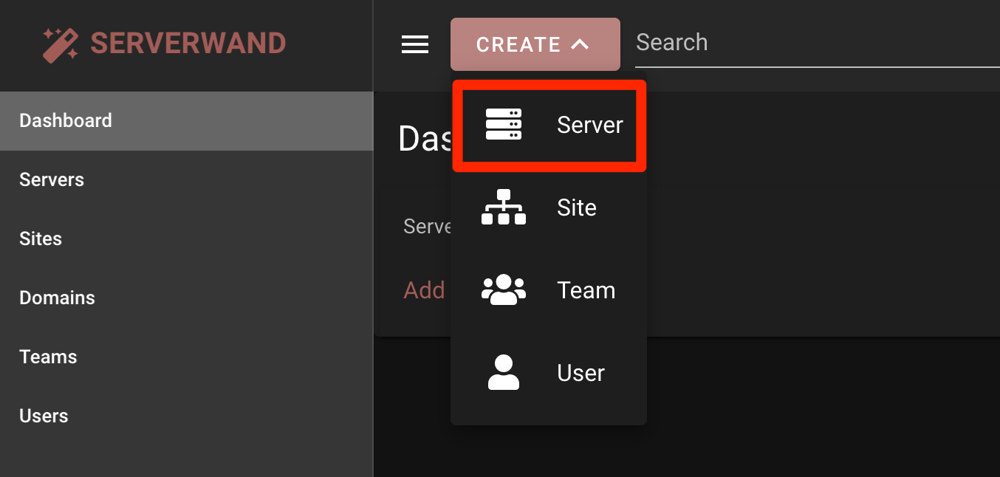
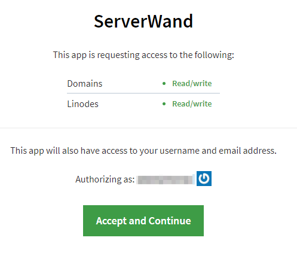

[ServerWand](https://serverwand.com) is a magical control panel for managing websites and servers. Host multiple sites on a single server, manage apps, firewall, databases, backups, system users, cron jobs, SSL, and email with an intuitive interface.

## Deploying a Marketplace App






**Estimated deployment time:** ServerWand should be fully installed within 2-5 minutes after the Compute Instance has finished provisioning.


## Configuration Options

- **Supported distributions:** Ubuntu 22.04 LTS, Ubuntu 20.04 LTS
- **Recommended minimum plan:** All plan types and sizes can be used.

## Getting Started After Deployment

Once your ServerWand is up and running, you can connect it to your ServerWand account and manage it through the ServerWand control panel.

### Connect your Linode to ServerWand

1. Register or Sign in to the [ServerWand Control Panel](https://manage.serverwand.com/).

1. Click the **Create** button and select **Server**.

    

1. On the Server details page, click **Choose** and then select **Linode**.

1. When prompted for access permissions, click **Accept and Continue**.

    

1. After returning to ServerWand, select your Linode from the **Server** dropdown menu.

1. Give your server a name and click **Save**.

1. ServerWand will connect to your Linode and install all the necessary software so that it can then be managed in ServerWand.


