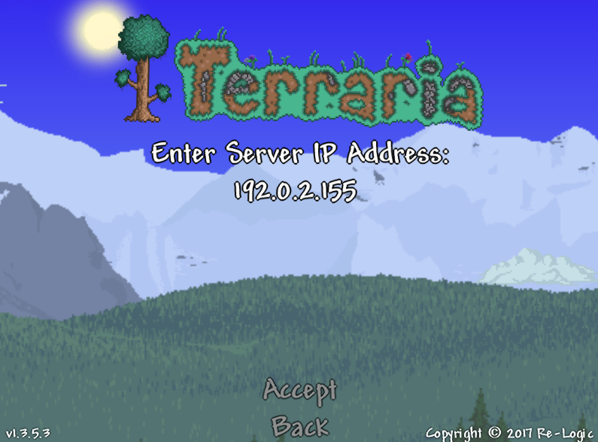
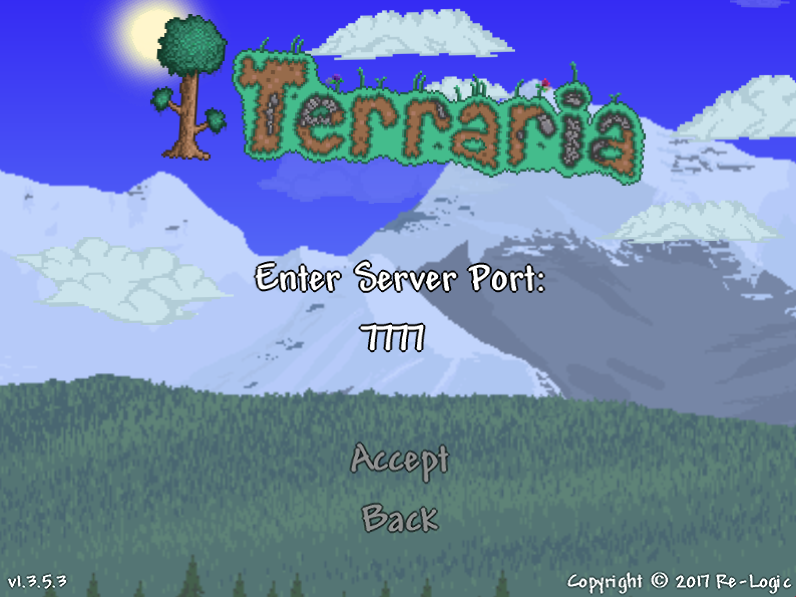

Terraria is a two-dimensional sandbox game in which players explore the world, collect resources, build structures, and battle enemies in procedurally generated environments. In Terraria a player begins by digging for ore, and the further they dig the more adventure they find. Multiplayer mode can be either cooperative or PvP.

Hosting your own Terraria server gives you control over the world, the players, and the objectives. Your world, your rules.

## Deploying a Marketplace App






**Estimated deployment time:** Terraria should be fully installed within 5-15 minutes after the Compute Instance has finished provisioning.


## Configuration Options

- **Supported distributions:** Ubuntu 20.04 LTS
- **Recommended minimum plan:** 8GB Dedicated CPU or Shared Compute Instance

### Terraria Options

-**Steam Username** *(required)*: Your [Steam username](https://store.steampowered.com). [Steam Guard](https://support.steampowered.com/kb_article.php?ref=4020-ALZM-5519) must be turned off.
- **Steam Password** *(required)*: Your Steam password.
- **World Name:** The name of the Terraria virtual [world](https://terraria.gamepedia.com/World).
- **Server Password:** The server's password, if you would like to make the server password protected.
- **Message of the Day:** The message of the day text that is displayed whenever a player logs on to the server.
- **Difficulty Level:** The world difficulty level.
- **Maximum Players:** The maximum amount of players allowed on the server. A number from 1-255.
- **Port:** The port number that the game server listens on.
- **Seed:** A [random seed](https://terraria.gamepedia.com/World_Seed) used by the world generation algorithm to create a unique world. For example: `qazwsx123`.



## Getting Started after Deployment

After Terraria has finished installing, you will be able to access your server by copying your Linode's IPv4 address from the [Linode Cloud Manager](https://cloud.linode.com) and then connecting to it within the game.


You must disable Steam Guard to connect to your Terraria server. If you don't disable Steam Guard, you may be locked out of your account and will need to reset your password. To disable Steam Guard, navigate to the Steam Preferences menu, then open the **Account** pane. Click on **Manage Steam Guard Account Security**, then click on **Turn Steam Guard off**.


To find your Linode's IPv4 address and connect to it:

1. Click on the **Linodes** link in the sidebar. You will see a list of all your Linodes.

2. Find the Linode you just created when deploying your app and select it.

3. Navigate to the **Networking** tab.

4. Your IPv4 address will be listed under the **Address** column in the **IPv4** table.

5. Copy the IPv4 address.

6. Open Terraria, then click **Multiplayer**.

7. Click on **Join via IP**.

8. You will be prompted to select a character, or create a new one if you don't have any characters. Select or create a character.

9. Type in your IP address, then click **Accept**.

    

10. You will be prompted to enter in your Terraria Marketplace App's port. If you did not specify a different port in the advanced configuration section, use port 7777. Click **Accept**.

    

    You will be connected to the server.

## Software Included

The Terraria Marketplace App will install the following required software on your Linode:

| **Software** | **Description** |
|--------------|-----------------|
| [**Terraria**](https://terraria.org) | Game server. |
| [**LinuxGSM**](https://linuxgsm.com) | A command line tool for the deployment and management of Linux game servers. |
| [**UFW**](https://wiki.ubuntu.com/UncomplicatedFirewall) | Firewall utility. Port 7777, unless otherwise specified, will allow outgoing and incoming tcp and udp traffic. |
| [**Fail2ban**](https://www.fail2ban.org/wiki/index.php/Main_Page) | Fail2Ban is an intrusion prevention software framework that protects computer servers from brute-force attacks. |


