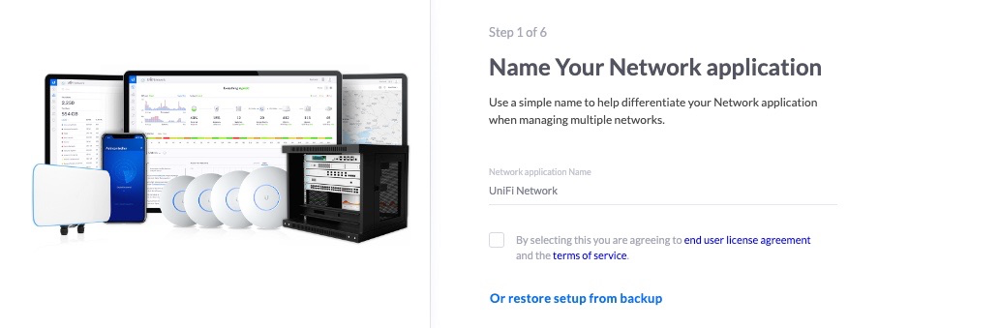
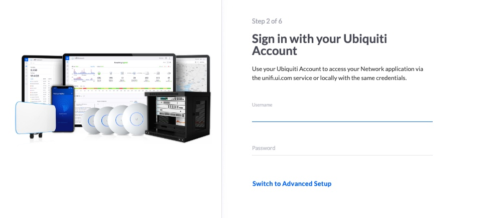

---
author:
  name: Linode
  email: docs@linode.com
description: "Deploy UniFi Network Controller, a multi-use networking control panel with a powerful application suite designed to optimize home and business networks with ease, on a Linode Compute Instance."
keywords: ['UniFi','Network','gateway', 'routing']
tags: ["marketplace", "linode platform", "cloud manager"]
license: '[CC BY-ND 4.0](https://creativecommons.org/licenses/by-nd/4.0)'
published: 2022-09-06
modified_by:
  name: Linode
title: "Deploying the UniFi Network Application through the Linode Marketplace"
---

The [UniFi Network Application](https://help.ui.com/hc/en-us/articles/1500012237441-UniFi-Network-Use-the-UniFi-Network-Application) is a versatile control panel developed by [Ubiquiti](https://www.ui.com/). It simplifies network management across regions, customizes access to Wi-Fi networks, and more. Manage and apply updates to UniFi networking devices to ensure your networks are performant and secure.


When self-hosting the UniFi Network Application, you are responsible for the security of your server. Follow best practices for securing, updating, and backing up the software on your Compute Instance. See [Setting Up and Securing a Compute Instance](https://www.linode.com/docs/guides/set-up-and-secure/).


## Deploying a Marketplace App






**Estimated deployment time:** The UniFi Network Application should be fully installed within 5-10 minutes after the Compute Instance has finished provisioning.


## Configuration Options

- **Supported distributions:** Debian 9
- **Recommended plan:** All plan types can be used.

## Getting Started after Deployment

### Accessing the UniFi Network Application

1. Open your web browser and navigate to `http://[ip-address]`, where *[ip-address]* can be replaced with your Compute Instance's IP address or rDNS domain. See the [Managing IP Addresses](/docs/guides/managing-ip-addresses/) guide for information on viewing IP addresses and rDNS.

2. First, enter a name for the Network Application. This is primarily used for managing multiple networks.

    

3. After the network has been named, create a username and password and click **Next**. This login will be used from the UniFi Network Application panel and unifi.ui.com

    

4. Once you are logged in to the UniFi Network Application, you can create and manage your UniFi Network. For more information on using UniFi Network Application, see the [official documentation](https://help.ui.com/hc/en-us/articles/1500012237441-UniFi-Network-Use-the-UniFi-Network-Application).


