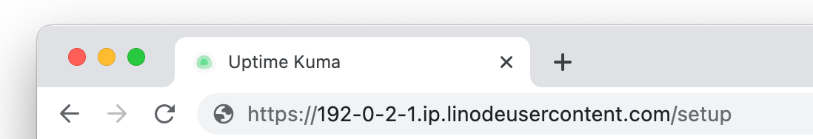
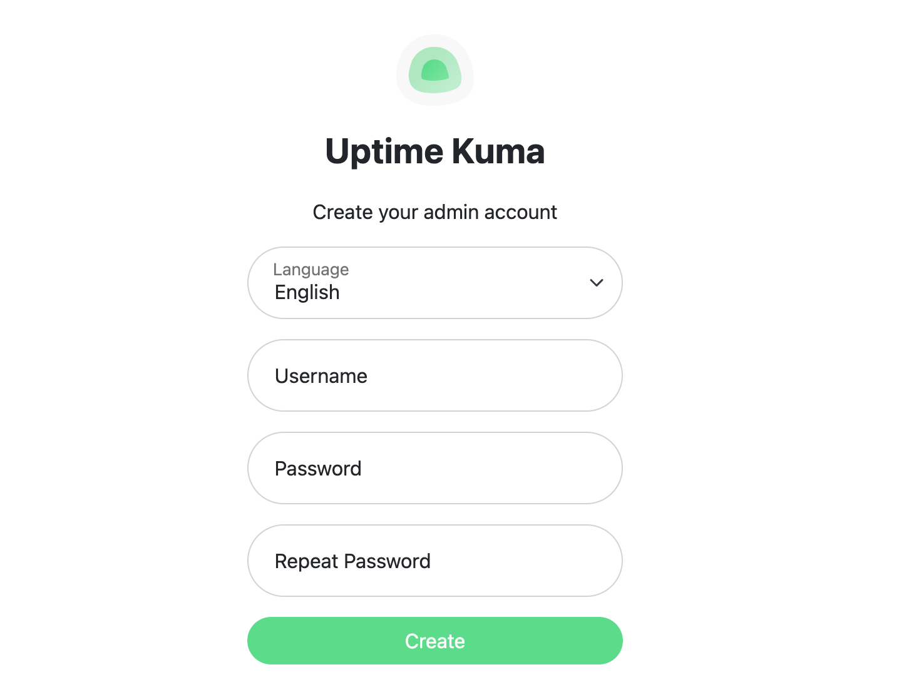
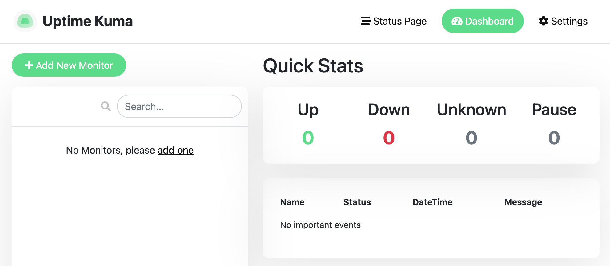

[Uptime Kuma](https://github.com/louislam/uptime-kuma) is an open source monitoring tool. It enables you to monitor services over HTTP/S, TCP, DNS, and other protocols. You can receive notification alerts of downtime and even create custom status pages for your users.

## Deploying a Marketplace App






**Estimated deployment time:** Uptime Kuma should be fully installed within 5-10 minutes after the Compute Instance has finished provisioning.


## Configuration Options

- **Supported distributions:** Ubuntu 20.04 LTS, Debian 11
- **Recommended plan:** All plan types and sizes can be used.

### Uptime Kuma Options

- **Email address** *(required)*: Enter the email address to use for generating the SSL certificates.







## Getting Started after Deployment

### Accessing the Uptime Kuma App

1.  Open your web browser and navigate to `http://[domain]/`, where *[domain]* can be replaced with the custom domain you entered during deployment or your Compute Instance's rDNS domain (such as `192-0-2-1.ip.linodeusercontent.com`). See the [Managing IP Addresses](/docs/products/compute/compute-instances/guides/manage-ip-addresses/) guide for information on viewing rDNS.

    

1.  If this is your first time logging in, the account creation page appears. Complete the form and click the **Create** button.

    

1.  After creating a user, you are automatically logged in and the Uptime Kuma dashboard is displayed.

    

Now that you’ve accessed your dashboard, check out [the official Uptime Kuma Repository](https://github.com/louislam/uptime-kuma) to learn how to further utilize your Uptime Kuma instance.

