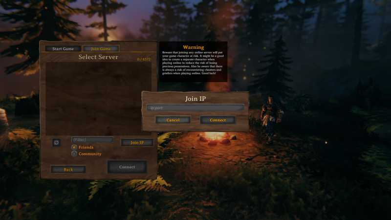

Valheim is an open-world Viking-themed survival and sandbox game developed by [Iron Gate Studio](https://irongatestudio.se/). Play solo in single player mode, or invite your friends for player vs. environment multiplayer mode. With challenging combat, numerous boss battles, and a creative building system that lets you craft things like halls, forts, and even imposing Viking warships, there's always something to do. Explore, build, conquer, and survive. The further you travel the more challenging adventures await.

Install Valheim on Linode with the Valheim Game Server Marketplace App to maximize your gaming experience.

## Deploying a Marketplace App






**Estimated deployment time:** Valheim should be fully installed within 5-10 minutes after the Compute Instance has finished provisioning.


## Configuration Options

- **Supported distributions:** Debian 10
- **Recommended minimum plan:** 4GB Dedicated CPU Compute Instance

### Valheim Options

- **The username to be used with Valheim** *(required)*: Your Valheim Username. This is used to log in to Valheim.
- **The server name to be used with Valheim** *(required)*: Your Valheim server name. This is used to log in to Valheim
- **Limited sudo user** *(required)*: Enter your preferred username for the limited user.
- **Password for the limited user** *(required)*: Enter a *strong* password for the new user.

#### SSH Options (Optional)

- **SSH public key for the limited user:** If you wish to login as the limited user through public key authentication (without entering a password), enter your public key here. See [Creating an SSH Key Pair and Configuring Public Key Authentication on a Server](/docs/guides/use-public-key-authentication-with-ssh/) for instructions on generating a key pair.
- **Disable root access over SSH:** To block the root user from logging in over SSH, select *Yes* (recommended). You can still switch to the root user once logged in and you can also log in as root through [Lish](/docs/products/compute/compute-instances/guides/lish/).



## Getting Started after Deployment

### Access your Valheim Game Server

After Valheim has finished installing, you can access your server with your Linode's IPv4 address. Copy your Linode’s IPv4 address from the [Linode Cloud Manager](https://cloud.linode.com), and then connect to the server within the game using your Linode's IPv4 address and port `2456`(for example `192.0.2.0:2456`).

For more on Valheim, check out the following resources:

- [LinuxGSM Valheim Documentation](https://linuxgsm.com/lgsm/vhserver/)
- [Valheim official website](https://www.valheimgame.com/)

