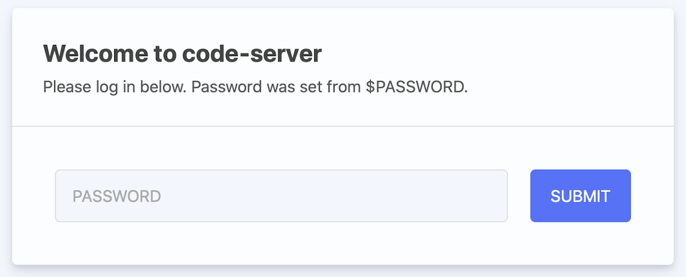
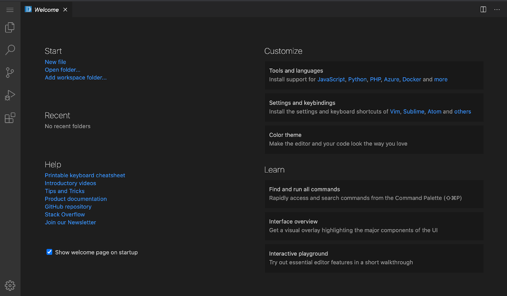

Run a [Visual Studio Code Server](https://github.com/cdr/code-server) in the browser with the Visual Studio (VS) Code Marketplace App. Code Server uses the open source code to provide a web interface for VS Code.

## Deploying a Marketplace App






**Estimated deployment time:** Visual Studio Code Server should be fully installed within 2-5 minutes after the Compute Instance has finished provisioning.


## Configuration Options

- **Supported distributions:** Debian 10
- **Recommended minimum plan:** All plan types and sizes can be used.

### VS Code Options

- **The password to login to the VS Code Web UI** *(required)*: Enter a *strong* password that can be used to access VS Code.
- **Email address** *(required)*: Enter the email address to use for generating the SSL certificates as well as configuring the server and DNS records.
- **The version of VS Code Server you'd like installed** *(required)*: This is the version of VS Code Server that is installed during setup. The default at the time that this guide was written is 3.10.2. This field is filled in and it is recommended that you use this value. If you do not fill in this field, the latest version is used.




- **Would you like to use a free Let's Encrypt SSL certificate?** Select `Yes` if you want the install to create an SSL certificate for you, or `No` if you do not. If `No` is selected, the VS Code app triggers security warnings in most web browsers. If you create a certificate and do not create a domain, the installer uses the Linode rDNS assigned name for the certificate.



## Getting Started after Deployment

VS Code is now installed and ready to use.

1.  Before you go to the app, if you filled out the optional VS Code configuration fields for domain:

    - In the Cloud Manager [DNS Manager](/docs/products/networking/dns-manager/guides/create-domain/) there is now an entry for the domain with possible subdomain records pointing to the new server.
    - [Configure the rDNS](/docs/products/compute/compute-instances/guides/configure-rdns/) on the Linode server.

1.  VS Code is accessed via the domain name if you entered one, or by the rDNS name if you did not. For example, `http://example.com` or `http://203-0-113-0.ip.linodeusercontent.com`, replacing the domain name or rDNS name with values for the server.

1.  At the login screen, login using the password you entered during installation.

    

1.  After logging in, the VS Code Welcome screen appears in the browser and ready to code.

    

## Software Included

The VS Code Marketplace App installs the following software on the Linode:

| **Software** | **Description** |
|:--------------|:------------|
| [**Code Server**](https://github.com/cdr/code-server) | Code Server which hosts the open source web interface of VS Code.|
| [**NGINX**](https://www.nginx.com) | An open source web server. |
| [**ufw**](https://wiki.ubuntu.com/UncomplicatedFirewall) | ufw is the uncomplicated firewall, a frontend for iptables. |


