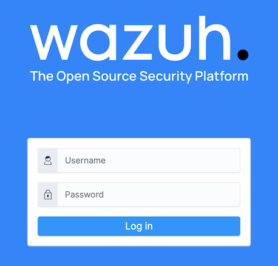

[Wazuh](https://wazuh.com/) provides a security solution for monitoring your infrastructure and detecting threats, intrusion attempts, system anomalies, poorly configured applications, and unauthorized user actions. It also provides a framework for incident response and regulatory compliance.

## Deploying a Marketplace App

{}

{}


**Estimated deployment time:** Wazuh should be fully installed within 10-15 minutes after the Compute Instance has finished provisioning.


## Configuration Options

- **Supported distributions:** Ubuntu 22.04 LTS
- **Suggested plan:** Wazuh suggests a minimum of a 4GB Linode, though an 8-core plan (32GB and up) is recommended for production.

### Wazuh Options

- **SOA Email Address** *(required)*: Enter the email address to use for generating the SSL certificates.

{}

{}

{}

## Getting Started after Deployment

### View Credentials

1.  Log into your new Compute Instance through [LISH](/docs/products/compute/compute-instances/guides/lish/) or [SSH](/docs/products/compute/compute-instances/guides/set-up-and-secure/#connect-to-the-instance) using, `root` user and the password you entered when creating the instance, or the generated sudo user and supplied SSH key.

1.  The usernames and passwords have been saved in the `/home/$SUDO_USER/.credentials` file, where sudo user is the user created during deployment. You can view this file in your preferred text editor or through the `cat` command.

    ```command
    cat /home/$SUDO_USER/.credentials
    ```

    This file contains all of your Wazuh credentials. The admin user and its associated password are needed when following the [Access the Wazuh App](#access-the-wazuh-app) section below.

    ```file {title="/root/.deployment-secrets.txt"}
    # Admin user for the web user interface and Wazuh indexer. Use this user to log in to Wazuh dashboard
      indexer_username: 'admin'
      indexer_password: '3O*NRpS5B5*sohufTz?TuM.Vef6zoN5d'

    # Wazuh dashboard user for establishing the connection with Wazuh indexer
      indexer_username: 'kibanaserver'
      indexer_password: 'Z.0M8rorxRS+DQfefe96N?.Cb+?byn7k'

    # Regular Dashboard user, only has read permissions to all indices and all permissions on the .kibana index
      indexer_username: 'kibanaro'
      indexer_password: 'W?PVE08Pk2AYE8*brrg4Ni+LXAbBKJl++2II'

    # Filebeat user for CRUD operations on Wazuh indices
      indexer_username: 'logstash'
      indexer_password: 'FGH6rDIgrg.zvXz?qZfQ1dv?2QAAQuiX7'

    # User with READ access to all indices
      indexer_username: 'readall'
      indexer_password: 'jVVugegfB0ldF+fNN?0bS0iMviFe8RnY'

    # User with permissions to perform snapshot and restore operations
      indexer_username: 'snapshotrestore'
      indexer_password: 'YN17mfegnWy*efeL30KC1Zz.7yrhCma7'

    # Password for wazuh API user
      api_username: 'wazuh'
      api_password: 'PtE5y+esjMmB74g4ttjY+ds0lGfP??uk'

    # Password for wazuh-wui API user
      api_username: 'wazuh-wui'
      api_password: '6?PPR1o0fwfgefLiBjbYxBz+icG0rGojT'
    ```

### Access the Wazuh App

1.  Open a web browser and navigate to the domain you entered when creating the instance: `https://domain.tld`. If you did not enter a domain, use your Compute Instance's default rDNS domain (`192-0-2-1.ip.linodeusercontent.com`). See the [Managing IP Addresses](/docs/products/compute/compute-instances/guides/manage-ip-addresses/) guide for information on viewing the rDNS value. Ensure that you are securely accessing the website by prefixing `https` to the URL.

1.  In the login screen that appears, enter `admin` as the username and enter its corresponding password (which can be found by following the [View Credentials](#view-credentials) section).

    

Now that you’ve accessed your Wazuh instance, you need to configure a [Wazuh Agent](https://documentation.wazuh.com/current/installation-guide/wazuh-agent/index.html) on the server you'd like to monitor with Wazuh.

For more documentation on Wazuh, check out [the official Wazuh documentation](https://documentation.wazuh.com/current/installation-guide/index.html) to learn how to further utilize your instance.

{}
