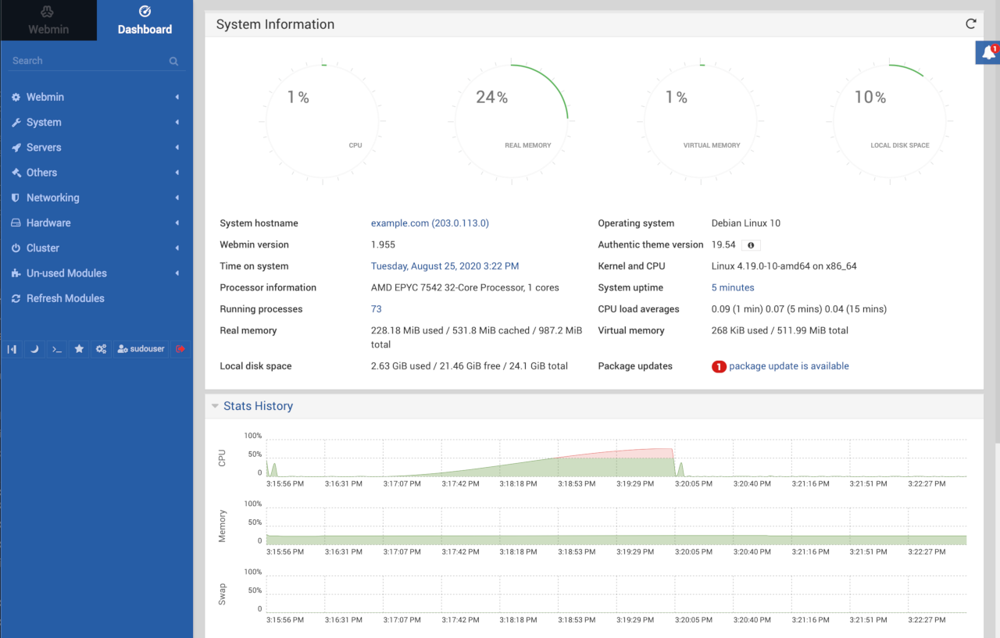

---
author:
  name: Linode Community
  email: docs@linode.com
description: "Webmin is an open source interface for Unix system administration. Deploy Webmin using Linode''s Marketplace Apps."
keywords: ['webmin','system administration','marketplace']
tags: ["debian","marketplace", "web applications","linode platform", "cloud manager", "cms", "email"]
license: '[CC BY-ND 4.0](https://creativecommons.org/licenses/by-nd/4.0)'
published: 2020-09-28
modified: 2022-03-08
image: Deploy_Webmin_oneclickapps.png
modified_by:
  name: Linode
title: "Deploying Webmin through the Linode Marketplace"
contributor:
  name: Linode
external_resources:
- '[Webmin Documentation](https://doxfer.webmin.com/Webmin/Main_Page)'
- '[Webmin on GitHub](https://github.com/webmin/webmin/commits/master)'
- '[Webmin Tutorials](https://doxfer.webmin.com/Webmin/Tutorials)'
aliases: ['/platform/marketplace/how-to-deploy-webmin-with-marketplace-apps/', '/platform/one-click/how-to-deploy-webmin-with-one-click-apps/','/guides/how-to-deploy-webmin-with-one-click-apps/','/guides/how-to-deploy-webmin-with-marketplace-apps/','/platform/one-click/deploy-webmin-with-one-click-apps/','/guides/webmin-marketplace-app/']
---

[Webmin](http://www.webmin.com) is an open source interface for Unix system administration that offers an easy to use graphical interface for managing user accounts, DNS, file sharing, and more. Webmin alleviates the need to use the command line to edit Unix system configuration files and allows you to configure your system easily from a simple web interface.

## Deploying a Marketplace App






**Estimated deployment time:** Webmin should be fully installed within 2-5 minutes after the Compute Instance has finished provisioning.


## Configuration Options

- **Supported distributions:** Debian 10
- **Recommended minimum plan:** All plan types and sizes can be used.

### Webmin Options


- **Enable passwordless sudo access for the limited user?** Select **Yes** to [disable SSH password authentication](/docs/guides/set-up-and-secure/#ssh-daemon-options) for your limited sudo user as an additional security measure. Requires an **SSH Public Key** for SSH access to your Linode.

#### Additional Security Configuration

- **Configure automatic security updates?** Select **Yes** to enable [automatic security updates](/docs/guides/set-up-and-secure/#automatic-security-updates) for your Linode.
- **Use fail2ban to prevent automated instrusion attempts?** Select **Yes** to enable [SSH login protection with Fail2Ban](/docs/guides/using-fail2ban-to-secure-your-server-a-tutorial/) as an additional security measure.


- **SOA Email for your domain** The email address to register as your Start of Authority (SOA). This field is required for creating DNS records for a new domain.
- **Do you need an MX record for this domain?** Select **Yes** to automatically configure an [MX record](/docs/guides/dns-records-an-introduction/#mx) for the purpose of sending emails from your instance.
- **Do you need an SPF record for this domain?** Select **Yes** to automatically configure an [SPF record](/docs/guides/dns-records-an-introduction/#spf) for the purpose of sending emails from your instance.

## Getting Started after Deployment

Webmin is now installed and ready to use.

1.  If you filled out the optional Webmin configuration fields:

    - In the Cloud Manager [DNS Manager](/docs/guides/dns-manager/#add-a-domain), confirm that there is now an entry for your domain with possible subdomain, MX, and SPF records pointing to your new server.
    - [Configure rDNS](/docs/guides/configure-your-linode-for-reverse-dns/) on your Linode to point to your new domain name.

1.  Webmin is served on port 10000. To access Webmin, navigate to either the IP address of your server, or to your domain name followed by port 10000. For example, entering `http://example.com:10000` or `http://203.0.113.0:10000` while replacing the domain name or IP address with values for your server will allow you to reach the Webmin login screen.

    

1.  At the login screen, login using either:

    - The system root username and password
    - The sudo username and password if you set that up in the Webmin optional configuration during installation.

1.  Once logged in, you will be taken to the Webmin dashboard, where you can see various statistics and controls for your server.

    


