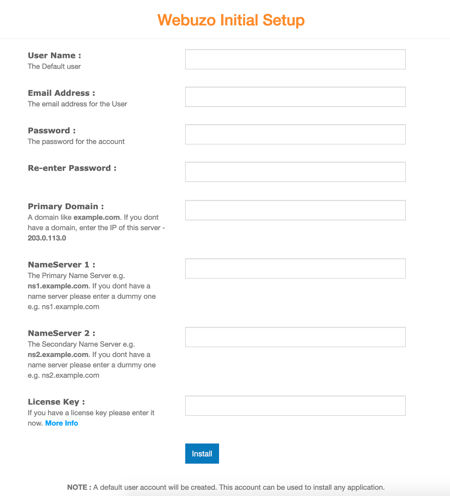

---
author:
  name: Linode Community
  email: docs@linode.com
description: "This guide shows you how to deploy Webuzo from Softaculous, a LAMP stack control panel that allows you to deploy a growing number of applications and scripts."
keywords: ['webuzo','control panel','dashboard','marketplace']
tags: ["ubuntu","marketplace", "web applications","linode platform", "cloud manager"]
license: '[CC BY-ND 4.0](https://creativecommons.org/licenses/by-nd/4.0)'
published: 2020-12-02
modified: 2022-03-08
modified_by:
  name: Linode
title: "Deploying Webuzo through the Linode Marketplace"
contributor:
  name: Linode
external_resources:
- '[Webuzo Documentation](http://www.webuzo.com/docs)'
- '[Softaculous Support](https://softaculous.deskuss.com)'
aliases: ['/platform/marketplace/how-to-deploy-webuzo-with-marketplace-apps/', '/platform/one-click/how-to-deploy-webuzo-with-one-click-apps/','/guides/how-to-deploy-webuzo-with-one-click-apps/','/guides/deploy-webuzo-with-marketplace-apps/','/guides/webuzo-marketplace-app/']
---

Softaculous [Webuzo](https://www.webuzo.com) is a single user LAMP stack control panel that allows you to deploy a growing number of applications and scripts on your server with a single click.

## Deploying a Marketplace App






**Estimated deployment time:** Webuzo should be fully installed within 15-20 minutes after the Compute Instance has finished provisioning. During this time, the instance is rebooted once. This time frame depends on a variety of factors, including which data center has been selected.


## Configuration Options

- **Supported distributions:** Ubuntu 20.04 LTS
- **Recommended minimum plan:** All plan types and sizes can be used.

### Webuzo Options



## Getting Started after Deployment

After the deployment process has finished and your Compute Instance has rebooted, you need to complete the initial setup for Webuzo. This includes adding a user, setting the domain (or IP), and optionally including a license key.

1.  Access the Webuzo Initial Setup page by opening a web browser and navigating to the following URL: `http://[ip-address]:2004`, replacing *[ip-address]* with the IPv4 address assigned to your new Compute Instance. If you do not see the initial setup screen (shown below), the deployment process may not yet be complete.

    

1.  At the setup screen, fill in the fields and click the **Install** button. The installation may take a few minutes to fully complete.

1.  Once installation is completed, Webuzo displays the following confirmation screen:

    

## Accessing the Dashboards

Once Webuzo is fully installed, you can start using it by accessing both the Admin dashboard and Enduser dashboard. Both require you to login using the username and password you just created on the setup screen.

- **Admin Dashboard** (`http://[ip-address]:2004`): Modify the core configuration and manage the apps that are able to be installed.

    

- **Enduser Dashboard** (`http://[ip-address]:2002`): Install individual applications and manage domains, emails, databases, and more.

    


