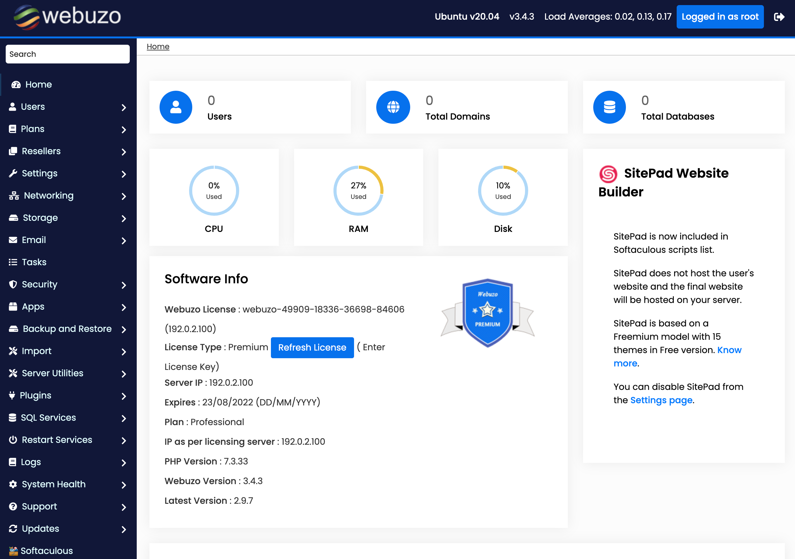

---
author:
  name: Linode Community
  email: docs@linode.com
description: "This guide shows you how to deploy Webuzo from Softaculous, a LAMP stack control panel that allows you to deploy a growing number of applications and scripts."
keywords: ['webuzo','control panel','dashboard','marketplace']
tags: ["ubuntu","marketplace", "web applications","linode platform", "cloud manager"]
license: '[CC BY-ND 4.0](https://creativecommons.org/licenses/by-nd/4.0)'
published: 2020-12-02
modified: 2022-08-08
modified_by:
  name: Linode
title: "Deploying Webuzo through the Linode Marketplace"
contributor:
  name: Linode
external_resources:
- '[Webuzo Documentation](http://www.webuzo.com/docs)'
- '[Softaculous Support](https://softaculous.deskuss.com)'
aliases: ['/platform/marketplace/how-to-deploy-webuzo-with-marketplace-apps/', '/platform/one-click/how-to-deploy-webuzo-with-one-click-apps/','/guides/how-to-deploy-webuzo-with-one-click-apps/','/guides/deploy-webuzo-with-marketplace-apps/','/guides/webuzo-marketplace-app/']
---

Softaculous [Webuzo](https://www.webuzo.com) is a single user LAMP stack control panel that allows you to deploy a growing number of applications and scripts on your server with a single click.

## Deploying a Marketplace App






**Estimated deployment time:** Webuzo should be fully installed within 15-20 minutes after the Compute Instance has finished provisioning. During this time, the instance is rebooted once. This time frame depends on a variety of factors, including which data center has been selected.


## Configuration Options

- **Supported distributions:** Ubuntu 20.04 LTS
- **Recommended minimum plan:** All plan types and sizes can be used.

### Webuzo Options



## Getting Started after Deployment

After the deployment process has finished and your Compute Instance has rebooted, log in to the Webuzo Admin panel and complete a few post-installation steps. This includes adding a user, setting the domain (or IP), and optionally including a license key.

1.  Access the Webuzo Admin panel by opening a web browser and navigating to the following URL: `http://[ip-address]:2004`, replacing *[ip-address]* with the IPv4 address or rDNS domain assigned to your new Compute Instance. See the [Managing IP Addresses](/docs/guides/managing-ip-addresses/) guide for information on viewing IP addresses.

1. In the login screen that appears, enter your root user credentials and click **Login**.

    

    
If you do not see the login screen, the deployment process may not yet be complete.


1.  Once logged in, the Admin panel should appear.

    

1.  **Configure the Hostname and Nameservers.** You can optionally set a custom hostname and custom nameservers. If you skip this step, you won't be able to use the DNS functionality of Webuzo and will instead need to manually manage your DNS on external nameservers.

    To set your hostname and name servers, navigate to **Settings** > **Panel Config** and make any needed adjustments to the *Hostname (Panel domain)* and nameserver (*NS1* and *NS2*) fields. If you registered the domain name *example.com*, you may want to configure your *Hostname* as `server.example.com` and your name servers as `ns1.example.com` and `ns2.example.com`. Before doing so, you need log in to your DNS provider and add an A record from `server.example.com` to the IPv4 address of your Compute Instance. You also need to register the name servers through your domain's registrar. For further instructions, consult your domain registrar's documentation.

1.  **Create a user.** Webuzo allows you to have multiple users, each with their own website(s), resource allowances, and dedicated backend panels. To create your first user, navigate to **Users** > **Add User**. In the **Add user** page that appears, fill out the desired username, password, domain, and email address for the new user. You can also set custom resource allotments and additional settings as needed.

1.  **Log in as the user.** You can log in to the user panel (also called the enduser panel) by navigating to the following URL: `http://[ip-address]:2002`. At the login prompt, enter the user credentials that you just created and press **Login**. The user panel should appear:

    

### Accessing the Dashboards

Once Webuzo is fully installed, you can start using it by accessing both the Admin dashboard and Enduser dashboard. Both require you to login using the username and password you just created on the setup screen.

- **Admin Dashboard** (`http://[ip-address]:2004`): Modify the core configuration and manage the apps that are able to be installed.

    

- **Enduser Dashboard** (`http://[ip-address]:2002`): Install individual applications and manage domains, emails, databases, and more.

    


