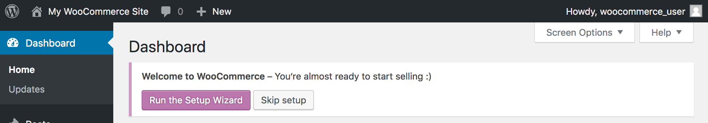

---
author:
  name: Linode Community
  email: docs@linode.com
description: "Learn how to deploy WooCommerce, the most popular ecommerce plugin, on Wordpress through the Linode Marketplace."
keywords: ['woocommerce','wordpress','marketplace apps','ecommerce','e-commerce','cms']
tags: ["cloud-manager","linode platform","cms","wordpress","marketplace"]
license: '[CC BY-ND 4.0](https://creativecommons.org/licenses/by-nd/4.0)'
published: 2019-04-02
modified: 2022-03-08
modified_by:
  name: Linode
title: "Deploying WooCommerce through the Linode Marketplace"
aliases: ['/platform/marketplace/marketplace-woocommerce/','/platform/marketplace/how-to-deploy-woocommerce-with-marketplace-apps/', '/platform/one-click/how-to-deploy-woocommerce-with-one-click-apps/','/platform/one-click/one-click-woocommerce/','/guides/how-to-deploy-woocommerce-with-one-click-apps/','/guides/how-to-deploy-woocommerce-with-marketplace-apps/','/guides/woocommerce-marketplace-app/']
contributor:
  name: Linode
external_resources:
- '[WooCommerce Docs](https://docs.woocommerce.com/)'
- '[Introduction to eCommerce for WordPress](https://woocommerce.com/guides/ecommerce-for-wordpress-intro/)'
- '[New Store Owners Guide](https://woocommerce.com/guides/new-store/)'
- '[WooCommerce Storefront Theme](https://woocommerce.com/storefront/)'
- '[WooCommerce Themes by Industry](https://woocommerce.com/product-category/themes/storefront-child-theme-themes/)'
- '[WooCommerce Extensions](https://woocommerce.com/product-category/woocommerce-extensions/)'
---

[WooCommerce](https://woocommerce.com/) is a popular open source eCommerce plugin for WordPress that can power online storefronts to sell both digital and physical products for small-to-large businesses. A variety of [themes for WooCommerce](https://woocommerce.com/product-category/themes/storefront-child-theme-themes/) are available so you can create a store that looks the way you want it to.  WooCommerce takes payments via major credit cards, bank transfers, [PayPal](https://woocommerce.com/products/woocommerce-gateway-paypal-checkout/), and other providers like [Stripe](https://woocommerce.com/products/stripe/). The WooCommerce plugin is free, but some themes and extensions have a cost.

## Deploying a Marketplace App






**Estimated deployment time:** WooCommerce should be fully installed within 2-5 minutes after the Compute Instance has finished provisioning.


## Configuration Options

- **Supported distributions:** Debian 10
- **Recommended minimum plan:** All plan types and sizes can be used, though a minimum of a 4GB Dedicated CPU Compute Instance is recommended for production websites.

### WooCommerce Options

- **Email address** *(required)*: Enter the email address you wish to use when configuring the WordPress admin user, generating SSL certificates, and optionally creating DNS records for a custom domain.
- **Admin Username** *(required)*: Username for your WordPress admin user account.
- **Admin Password** *(required)*: Password for your WordPress admin user account.
- **MySQL `root` password** *(required)*: The root password for your MySQL database.
- **WordPress Database Password** *(required)*: The root password for your WordPress database.
- **Website Title:** Enter a title for your WordPress site.




- **Would you like to be able to send password reset emails for WordPress?** Creates the required DNS records and configures the server so you can send emails from WordPress, such as for resetting a password.
- **Would you like to use a free Let's Encrypt SSL certificate?** If you would like to use the free Let's Encrypt CA to generate TLS/SSL certificates, select *Yes*.

## Getting Started After Deployment

After WooCommerce has finished installing, a confirmation email will be sent to the email address you provided during configuration, at which point you will be able to [access your site](#getting-started-after-your-deployment).

### Access Your WooCommerce Site

After WooCommerce and WordPress have finished installing, you will be able to access your site by copying your Linode's IPv4 address and entering it in the browser of your choice. To find your Linode's IPv4 address:

1. Click on the **Linodes** link in the sidebar. You will see a list of all your Linodes.

1. Find the Linode you just created when deploying your app and select it.

1. Navigate to the **Networking** tab.

1. Your IPv4 address will be listed under the **Address** column in the **IPv4** table.

1. Copy and paste the IPv4 address into a browser window. You should see your WooCommerce site's home page.

1.  Once you have accessed your site via the browser, you can log in to the WordPress administrative interface and [start configuring your store](#complete-the-woocommerce-setup-wizard).

    The address of the WordPress login page is `http://< your IP address >/wp-login.php`. Or, you can click on the log in link that's visible on your site's home page, as highlighted below. Enter the credentials you previously specified in the **Admin Username** and **Admin Password** fields when you deployed the app.

    

### Complete the WooCommerce Setup Wizard

When you first log in to the WordPress admin interface, you will be presented with a banner that asks you to complete the WooCommerce setup wizard:

Click on the **Run the Setup Wizard** button to visit this form and start your store configuration.

## Software Included

| **Software** | **Description** |
|:--------------|:------------|
| [**MySQL Server**](https://www.mysql.com/) | Relational database. |
| [**PHP 7**](https://www.php.net/) | WordPress is written in PHP and requires PHP to operate. |
| [**Apache HTTP Server**](https://httpd.apache.org/) | Web server used to serve the WordPress site. |
| [**WordPress**](https://wordpress.org/) | Content management system. |
| [**WP CLI**](https://wp-cli.org/) | The command line interface for WordPress. |
| [**WooCommerce**](https://woocommerce.com/) | An online storefront plugin for WordPress. |




