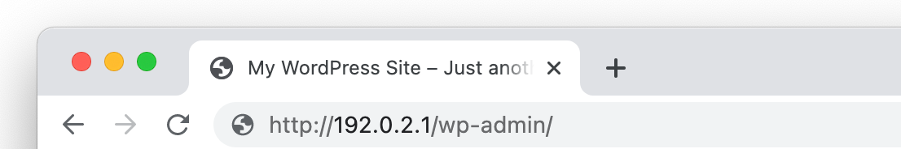
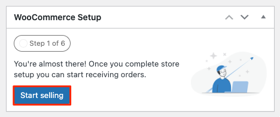

[WooCommerce](https://woocommerce.com/) is a popular open source eCommerce plugin for WordPress that can power online storefronts to sell both digital and physical products for small-to-large businesses. A variety of [themes for WooCommerce](https://woocommerce.com/product-category/themes/storefront-child-theme-themes/) are available so you can create a store that looks the way you want it to.  WooCommerce takes payments via major credit cards, bank transfers, [PayPal](https://woocommerce.com/products/woocommerce-gateway-paypal-checkout/), and other providers like [Stripe](https://woocommerce.com/products/stripe/). The WooCommerce plugin is free, but some themes and extensions have a cost.

## Deploying a Marketplace App






**Estimated deployment time:** WooCommerce should be fully installed within 2-5 minutes after the Compute Instance has finished provisioning.


## Configuration Options

- **Supported distributions:** Debian 10
- **Recommended minimum plan:** All plan types and sizes can be used, though a minimum of a 4GB Dedicated CPU Compute Instance is recommended for production websites.

### WooCommerce Options

- **Email address** *(required)*: Enter the email address you wish to use when configuring the WordPress admin user, generating SSL certificates, and optionally creating DNS records for a custom domain.
- **Admin Username** *(required)*: Username for your WordPress admin user account.
- **Admin Password** *(required)*: Password for your WordPress admin user account.
- **MySQL `root` password** *(required)*: The root password for your MySQL database.
- **WordPress Database Password** *(required)*: The root password for your WordPress database.
- **Website Title:** Enter a title for your WordPress site.




- **Would you like to be able to send password reset emails for WordPress?** Creates the required DNS records and configures the server so you can send emails from WordPress, such as for resetting a password.
- **Would you like to use a free Let's Encrypt SSL certificate?** If you would like to use the free Let's Encrypt CA to generate TLS/SSL certificates, select *Yes*.



## Getting Started After Deployment

### Accessing the WordPress Admin Dashboard

1.  Open your web browser and navigate to `http://[domain]/wp-admin/`, where *[domain]* can be replaced with the custom domain you entered during deployment or your Compute Instance's IPv4 address or rDNS domain (such as `192-0-2-1.ip.linodeusercontent.com`). See the [Managing IP Addresses](/docs/products/compute/compute-instances/guides/manage-ip-addresses/) guide for information on viewing IP addresses and rDNS.

    

1.  Within the login page that appears, enter the username (*admin username*) and password (*admin password*) that you created when you deployed this instance. Then click the **Log In** button.

    

1.  Once logged in, the WordPress Admin Dashboard appears. From here, you can create new posts, add users, modify the theme, and adjust any settings.

    

### Viewing Your Website

Open a web browser and navigate to `http://[domain]`, replacing *[domain]* with the custom domain you entered during deployment or your Compute Instance's IPv4 address or rDNS domain. See the [Managing IP Addresses](/docs/products/compute/compute-instances/guides/manage-ip-addresses/) guide for information on viewing IP addresses and rDNS. Your WordPress site should now be displayed.

### Complete the WooCommerce Setup Wizard

1. After logging in to the WordPress Admin interface, initiate the WooCommerce Setup Wizard by clicking the **Start Selling** button within the WooCommerce Setup banner that appears on the dashboard. You can also initiate the Setup Wizard by hovering over *WooCommerce* on the left menu and selecting **Home**.

    

1. Follow each step of the Setup Wizard by entering in your store address details, selecting the industry, selecting the types of products that you intend on selling, entering additional business details, and selecting a theme.

    
    Some WooCommerce features and themes require a monthly or yearly paid subscription or otherwise cost money. When going through the Setup Wizard, be aware of the cost of each optional feature you select.
    

1. Depending on the options you select, you may be asked to create a [Jetpack](https://jetpack.com/) account or connect your existing account. This enables you to use Jetpack's suite of tools within WordPress. Jetpack offers a free tier as well as multiple paid tiers. See [Jetpack Pricing](https://cloud.jetpack.com/pricing). You can safely ignore this screen if you do not wish to use Jetpack services.

1. Once the Setup Wizard has finished, you are taken to *WooCommerce* > *Home* within your WordPress Admin dashboard. From here, you are presented with a checklist of tasks you may need to complete before selling products. This includes adding products, setting up a payment processor, creating tax rules, and more. See the [WooCommerce Documentation site](https://woocommerce.com/documentation/) to get help completing these steps and using your WooCommerce store.




