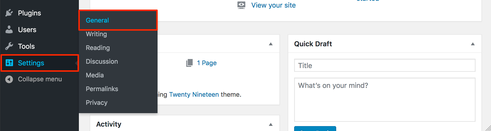

---
author:
  name: Linode
  email: docs@linode.com
description: "WordPress is an industry standard CMS. Follow this guide to deploy WordPress on Linode using Marketplace Apps."
keywords: ['wordpress','wp cli','marketplace apps', 'cms', 'deploy wordpress with marketplace', 'easy install wordpress']
tags: ["debian","cloud manager","linode platform","cms","wordpress","marketplace","ssl","web applications"]
license: '[CC BY-ND 4.0](https://creativecommons.org/licenses/by-nd/4.0)'
published: 2020-09-28
modified: 2022-03-08
modified_by:
  name: Linode
title: "Deploying WordPress through the Linode Marketplace"
contributor:
  name: Linode
external_resources:
- '[WordPress Codex (Documentation)](https://codex.wordpress.org/)'
aliases: ['/platform/marketplace/deploying-wordpress-with-marketplace-apps/', '/platform/one-click/deploying-wordpress-with-one-click-apps/','/guides/deploying-wordpress-with-one-click-apps/','/guides/deploying-wordpress-with-marketplace-apps/','/guides/wordpress-marketplace-app/']
---

With 60 million users around the globe, WordPress provides an industry standard for content-focused websites such as blogs, news sites, and personal websites. Its focus on best-in-class usability and flexibility, makes it possible to have a customized website up and running in minutes.

## Deploying a Marketplace App






**Estimated deployment time:** WordPress should be fully installed within 2-5 minutes after the Compute Instance has finished provisioning.


## Configuration Options

- **Supported distributions:**  Debian 10
- **Recommended minimum plan:** All plan types and sizes can be used, though a minimum of a 4GB Dedicated CPU Compute Instance is recommended for production websites.

### WordPress Options

- **Email address** *(required)*: Enter the email address you wish to use when configuring the WordPress admin user, generating SSL certificates, and optionally creating DNS records for a custom domain.
- **Admin Username** *(required)*: Username for your WordPress admin user account.
- **Admin Password** *(required)*: Password for your WordPress admin user account.
- **MySQL `root` password** *(required)*: The root password for your MySQL database.
- **WordPress Database Password** *(required)*: The root password for your WordPress database.
- **Website Title:** Enter a title for your WordPress site.




- **Would you like to be able to send password reset emails for WordPress?** Creates the required DNS records and configures the server so you can send emails from WordPress, such as for resetting a password.
- **Would you like to use a free Let's Encrypt SSL certificate?** If you would like to use the free Let's Encrypt CA to generate TLS/SSL certificates, select *Yes*.

## Getting Started After Deployment

### Access Your WordPress Site

After WordPress has finished installing, you can access your WordPress site by copying your Linode's IPv4 address and entering it in the browser of your choice. If you've set up DNS during installation, you can go to your domain name in the browser. To find your Linode's IPv4 address:

1. Click on the **Linodes** link in the sidebar to see a list of all your Linodes.

1. Find the Linode you just created when deploying your app and select it.

1. Navigate to the **Networking** tab.

1. Your IPv4 address is listed under the **Address** column in the **IPv4** table.

1. Copy and paste the IPv4 address into a browser window. You should see your WordPress site's home page.

1.  Once you have accessed your WordPress site via the browser, you can log in to the WordPress administrative interface and start personalizing your theme, creating posts, and configuring other parts of your site.

    - The address of the WordPress login page is `http://< your IP address >/wp-login.php`.
    - If you set up a domain during installation, you can access the login page at `http://< your domain >/wp-login.php`.
    - You can also click on the log in link that's visible on your site's home page, as highlighted below.

    Enter the credentials you previously specified in the **Admin Username** and **Admin Password** fields when you deployed the app.

    

### Set up a Domain for your Site

If you didn't set up a domain during the installation process, you can add it manually following the instructions in this section.

If you own a domain name, you can assign it (or a subdomain) to your WordPress site. Specifically, you need to set up an [*A record*](/docs/networking/dns/dns-records-an-introduction/#a-and-aaaa) that's associated with your Linode's IP address. To learn how to set up DNS records in the Cloud Manager, review the [DNS Manager](/docs/guides/dns-manager/) guide. For more general information about how DNS works, review the [DNS Records: An Introduction](/docs/networking/dns/dns-records-an-introduction/) guide.

Once you have set up DNS for your site, you can visit it by entering your domain or subdomain in your browser. At this point, you should also update the [WordPress Address and Site URL settings](https://codex.wordpress.org/Changing_The_Site_URL) for your site:

1.  Log in to your WordPress site's admin interface as described in the previous section.

1.  Click on the **Settings** link in the sidebar, then click on the **General** option from the dropdown menu that appears.

    

1.  The **General Settings** form appears. Update the **WordPress Address (URL)** and **Site Address (URL)** fields with the domain or subdomain you assigned to your site. Specifically, the value for both fields should be `http://example.com`, where `example.com` is replaced by your domain or subdomain.

1.  Click the **Save Changes** button at the bottom of the form.

## Software Included

The WordPress Marketplace App installs the following required software on your Linode:

| **Software** | **Description** |
|:--------------|:------------|
| [**MySQL Server**](https://www.mysql.com/) | Relational database. |
| [**PHP 7**](https://www.php.net/) | WordPress is written in PHP and requires PHP to operate. |
| [**Apache HTTP Server**](https://httpd.apache.org/) | Web server used to serve the WordPress site. |
| [**WordPress**](https://wordpress.org/) | Content management system. |
| [**WP CLI**](https://wp-cli.org/) | The command line interface for WordPress. |




