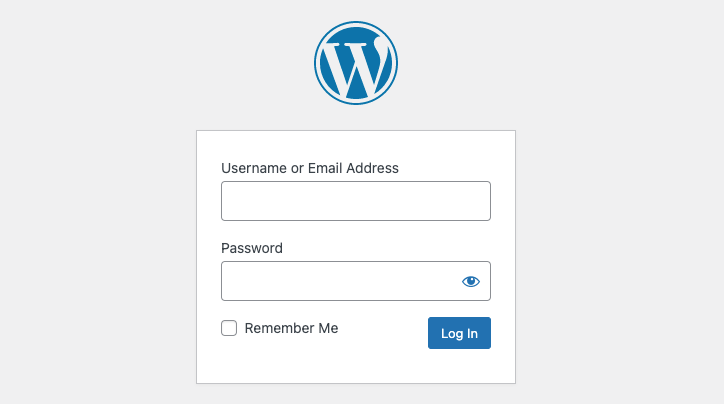
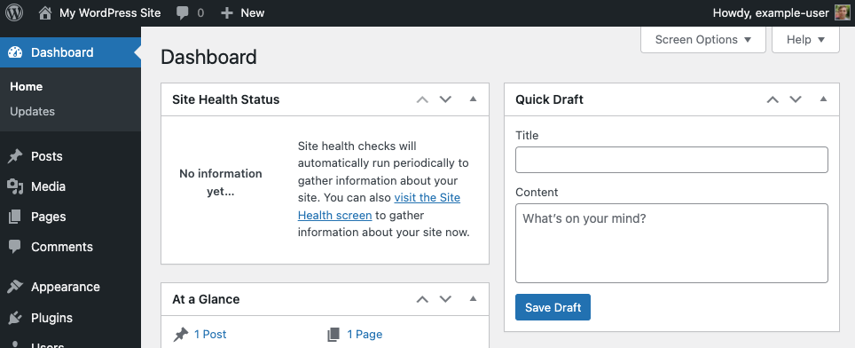
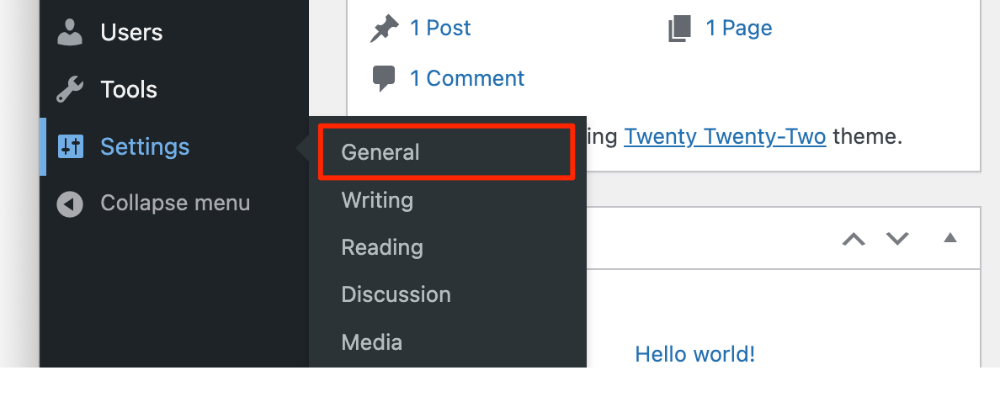
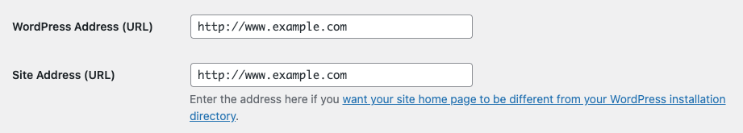

---
author:
  name: Linode
  email: docs@linode.com
description: "WordPress is an industry standard CMS. Follow this guide to deploy WordPress on Linode using Marketplace Apps."
keywords: ['wordpress','wp cli','marketplace apps', 'cms', 'deploy wordpress with marketplace', 'easy install wordpress']
tags: ["debian","cloud manager","linode platform","cms","wordpress","marketplace","ssl","web applications"]
license: '[CC BY-ND 4.0](https://creativecommons.org/licenses/by-nd/4.0)'
published: 2020-09-28
modified: 2022-07-28
modified_by:
  name: Linode
title: "Deploying WordPress through the Linode Marketplace"
contributor:
  name: Linode
external_resources:
- '[WordPress Codex (Documentation)](https://codex.wordpress.org/)'
aliases: ['/platform/marketplace/deploying-wordpress-with-marketplace-apps/', '/platform/one-click/deploying-wordpress-with-one-click-apps/','/guides/deploying-wordpress-with-one-click-apps/','/guides/deploying-wordpress-with-marketplace-apps/','/guides/wordpress-marketplace-app/']
---

[WordPress](https://wordpress.org/) is an industry standard open source CMS (content management system) used by the majority of the web. With 60 million users around the globe, WordPress provides an intuitive platform for content-focused websites for both personal and business use. Its focus on best-in-class usability and flexibility makes it possible to have a customized website up and running in minutes.

## Deploying a Marketplace App






**Estimated deployment time:** WordPress should be fully installed within 2-5 minutes after the Compute Instance has finished provisioning.


## Configuration Options

- **Supported distributions:**  Debian 11, Ubuntu 22.04 LTS
- **Recommended minimum plan:** All plan types and sizes can be used, though a minimum of a 4GB Dedicated CPU Compute Instance is recommended for production websites.

### WordPress Options

- **Email address** *(required)*: Enter the email address you wish to use when configuring the WordPress admin user, generating SSL certificates, and optionally creating DNS records for a custom domain.
- **Admin Username** *(required)*: Username for your WordPress admin user account.
- **Admin Password** *(required)*: Password for your WordPress admin user account.
- **MySQL `root` password** *(required)*: The root password for your MySQL database.
- **WordPress Database Password** *(required)*: The root password for your WordPress database.
- **Website Title:** Enter a title for your WordPress site.





## Getting Started After Deployment

### Accessing the WordPress Admin Dashboard

1.  Open your web browser and navigate to `http://[domain]/wp-admin/`, where *[domain]* can be replaced with the custom domain you entered during deployment or your Compute Instance's rDNS domain (such as `192-0-2-1.ip.linodeusercontent.com`). You can also use your IPv4 address, though the connection will not be secure. See the [Managing IP Addresses](/docs/guides/managing-ip-addresses/) guide for information on viewing IP addresses and rDNS.

    

    
A TLS/SSL certificate is automatically generated for your custom domain, enabling you to connect to the site over the `https` protocol. If you did not enter a custom domain, a TLS/SSL certificate is configured on the rDNS domain instead. Connections using your IP address are not secured and will use the `http` protocol.


1.  Within the login page that appears, enter the username (*admin username*) and password (*admin password*) that you created when you deployed this instance. Then click the **Log In** button.

    

1.  Once logged in, the WordPress Admin Dashboard appears. From here, you can create new posts, add users, modify the theme, and adjust any settings.

    

### Viewing Your Website

Open a web browser and navigate to `http://[domain]`, replacing *[domain]* with the custom domain you entered during deployment or your Compute Instance's IPv4 address or rDNS domain. See the [Managing IP Addresses](/docs/guides/managing-ip-addresses/) guide for information on viewing IP addresses and rDNS. Your WordPress site should now be displayed.

### Manually Configure a Domain

If you didn't set up a domain during the deployment process, you can add it manually following the instructions in this section. Before beginning, make sure you have a registered domain name.

1. Within the *name servers* for your domain name, create an [*A record*](/docs/networking/dns/dns-records-an-introduction/#a-and-aaaa). The *hostname* / *name* field should be *@* for a bare domain (`example.tld`) or should specify the subdomain you wish to use, such as *app* for `app.example.tld`. It's common to create two A records, one using *@* and one using *www*. The IP address should be the IPv4 address of your new Compute Instance. If you do not have a name server, consider using Linode's [DNS Manager](/docs/guides/dns-manager/).

1. Update WordPress so that it uses your new domain name. This can be done directly in the WordPress Admin panel or through the command line. See [Changing The Site URL](https://wordpress.org/support/article/changing-the-site-url/) to learn more.

    1. Log in to Admin dashboard. See [Accessing the WordPress Admin Dashboard](#accessing-the-wordpress-admin-dashboard).

    1. Click on the **Settings** link in the sidebar and then click on the **General** option from the dropdown menu that appears.

        

    1. Within the *General Settings* form, update the **WordPress Address (URL)** and **Site Address (URL)** fields with the full domain you assigned to your site (such as `http://example.com` or `http://www.example.com`)

        

    1. Click the **Save Changes** button at the bottom of the form.

### Resetting Your Admin Password or Email Address

If you need to reset your admin user's password and you aren't receiving the password reset request email, you can update the password from command line. This method also allows you to update the email address for your admin account without needing an email confirmation.

1. Log in to the Compute Instance using [SSH](/docs/guides/connect-to-server-over-ssh/) or [Lish](/docs/guides/using-the-lish-console/).

1.  Navigate to the directory of your WordPress installation:.

        cd /var/www/wordpress

1.  Using the WP-CLI, update either the password or email address. You can also update other values as needed. See [WP-CLI wp user update command](https://developer.wordpress.org/cli/commands/user/update/).

    **Update password** (replace *[user]* with the username of the user you want to update and *[password]* with the password you wish to use):

        wp user update [user] --user_pass="[password]" --allow-root

    **Update email** (replace *[user]* with the username of the user you want to update and *[email]* with the email address you wish to use):

        wp user update [user] --user_email="[email]" --allow-root

## Going Further

Now that your WordPress installation is deployed, you can start adding content and modifying it to suit your needs. Here are a few links to help get you started:

- [WordPress Support](https://wordpress.org/support/): Learn the basic workflows for using WordPress.
- [Securing WordPress](/docs/guides/how-to-secure-wordpress/): Advice on securing WordPress through HTTPS, using a secure password, changing the admin username, and more.
- [WordPress Themes](https://wordpress.org/themes/#): A collection of *thousands* of WordPress themes.


