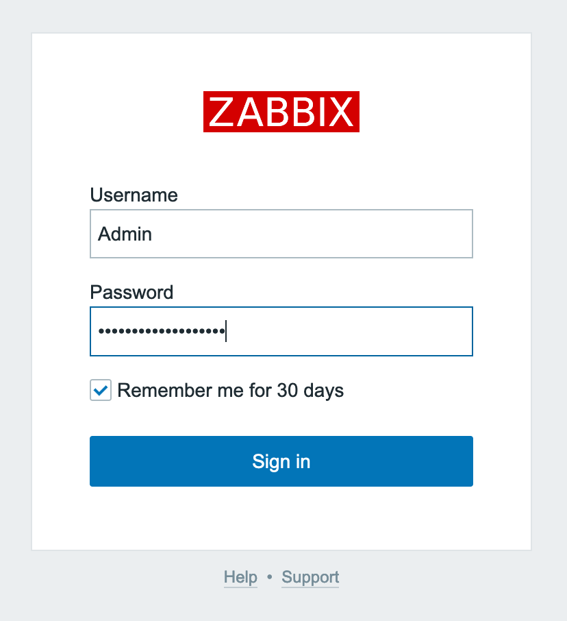
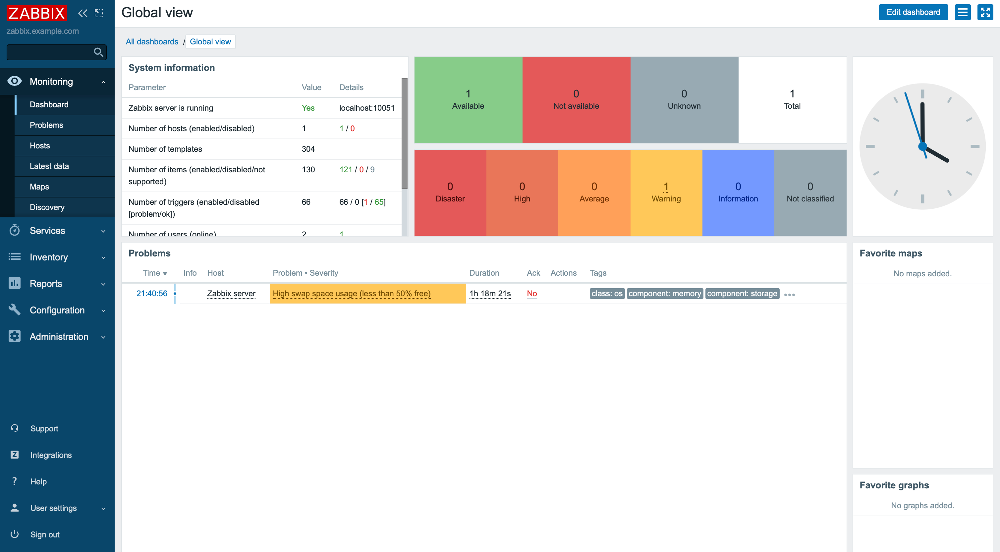

---
author:
  name: Linode Community
  email: docs@linode.com
description: "Zabbix is an enterprise-class, open source, distributed monitoring solution. Learn how to deploy Zabbix on Linode using Marketplace Apps."
keywords: ['monitoring','networking','incident response']
tags: ["marketplace", "networking", "linode platform", "cloud manager", "monitoring"]
license: '[CC BY-ND 4.0](https://creativecommons.org/licenses/by-nd/4.0)'
published: 2021-02-23
modified: 2022-08-23
image: DeployZabbix_marketplaceapps.png
modified_by:
  name: Linode
title: "Deploying Zabbix through the Linode Marketplace"
external_resources:
- '[Learn from documentation](https://www.zabbix.com/documentation/5.0/manual)'
- '[Purchase Technical Support contract](https://www.zabbix.com/support)'
- '[Zabbix official Forum](https://www.zabbix.com/forum)'
aliases: ['/platform/marketplace/deploy-zabbix-with-marketplace-apps/', '/platform/one-click/deploy-zabbix-with-marketplace-apps/', '/guides/deploy-zabbix-with-marketplace-apps/','/guides/zabbix-marketplace-app/']
---

[Zabbix](https://www.zabbix.com/) is an enterprise-class, open-source, distributed monitoring solution. Designed as an all-in-one monitoring solution, Zabbix can track performance and availability of network servers, devices, services, and other IT resources. Zabbix empowers administrators to quickly respond to incidents with on-screen display capabilities and alerts by email, SMS, or Jabber. Users can also collect, store, manage, and analyze information received from IT infrastructure. Actively used by SMBs and large enterprises across all industries and in almost every country, Zabbix has a robust community driving its continued development.

## Deploying a Marketplace App






**Estimated deployment time:** Zabbix should be fully installed within 5-10 minutes after the Compute Instance has finished provisioning.


## Configuration Options

- **Supported distributions:** CentOS 8 Stream
- **Recommended minimum plan:** All plan types and sizes can be used.

### Zabbix Options

- **Hostname** *(required)*: Enter a hostname for your new instance. See [Configure a Custom Hostname](/docs/guides/set-up-and-secure/#configure-a-custom-hostname) for examples.

## Getting Started after Deployment

### Access your Zabbix App

After Zabbix has finished installing, you must first obtain the login credentials for Zabbix. You can then use these credentials to log in to your Zabbix App via a web browser.

1.  From your terminal, log into your new Compute Instance as the `root` user with the following command, replacing `192.0.2.1` with your instance's [IPv4 address](/docs/guides/managing-ip-addresses/):

        ssh root@192.0.2.1

1. The Zabbix welome banner should appear immediately after logging in. Make a note of the username and password as these are used in a later step.

    
********************************************************************************
Zabbix frontend credentials:
Username: Admin
Password: abcdef0123456789
To learn about available professional services, including technical suppport and training, please visit https://www.zabbix.com/services
Official Zabbix documentation available at https://www.zabbix.com/documentation/current/
Note! Do not forget to change timezone PHP variable in /etc/php.d/99-zabbix.ini file.
********************************************************************************


1.  Access the Zabbix Admin panel by opening a web browser and navigating to the following URL: `http://[ip-address]`, replacing *[ip-address]* with the IPv4 address or rDNS domain assigned to your new Compute Instance. See the [Managing IP Addresses](/docs/guides/managing-ip-addresses/) guide for information on viewing IP addresses.

    
Zabbix uses a self-signed certificate. Because it is not signed by a common Certificate Authority, your browser may warn you about the security of the connection and require you to add a security exception.


    

1. Enter the username and password you obtained in a previous step and then click **Sign in** to access the Zabbix control panel.

    

## Next Steps

For more on Zabbix, check out the following resources:

- [Learn from Zabbix Documentation](https://www.zabbix.com/documentation/5.0/manual)
- [Purchase Technical Support Contract](https://www.zabbix.com/support)
- [Visit the Zabbix Official Forum](https://www.zabbix.com/forum)

<!-- the following shortcode informs the user that Linode does not provide automatic updates
     to the Marketplace app, and that the user is responsible for the security and longevity
     of the installation. -->

