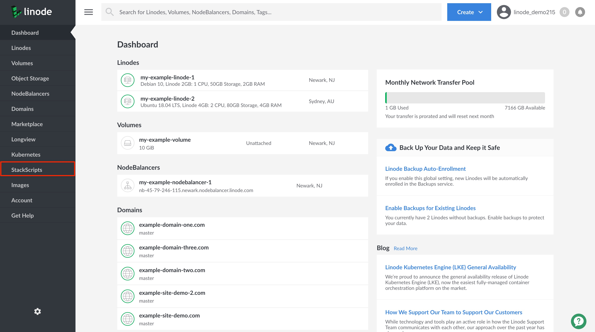

After you've created an Account StackScript, you can go back and edit it as required. These instructions show you how to access a StackScript for editing.

1. Log into the [Linode Cloud Manager](https://cloud.linode.com/).

1. Click on the **StackScripts** link in the left-hand navigation menu. You are brought to the *StackScripts* page.

      

1. A list of all of your account's StackScripts appears under the **Account StackScripts** tab. This includes both private and public StackScripts. Click on the **more options ellipsis** corresponding to the StackScript you'd like to modify and select **Edit** from the dropdown menu.

      

1. On your StackScript's *Edit page*, modify it as needed and click **Save** to keep your changes.
