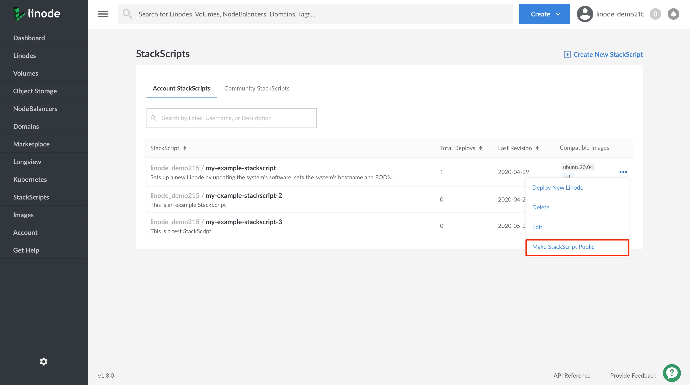

You can make any of your Account StackScripts public. When an account StackScript is public it becomes available to the rest of the Linode Community in the Cloud Manager as a Community StackScript.


Once you make an Account StackScript public, you are not be able to make it private again or to delete it. You can, however, edit your public StackScript, if needed.


1. Log into the [Linode Cloud Manager](https://cloud.linode.com/).

1. Click on the **StackScripts** link in the left-hand navigation menu. You are brought to the *StackScripts* page.

      

1.  A list of all of your account's StackScripts appears under the **Account StackScripts** tab. This includes both private and public StackScripts. Click on the **more options ellipsis** corresponding to the StackScript you'd like to make public and select **Make StackScript Public** from the dropdown menu.

      

    A dialog box appears asking you to confirm the action. Click on **Yes, make me a star!** if you would like to proceed. You are brought back to the Account StackScripts page.

    
Your public [Account StackScript](/docs/platform/stackscripts/how-to-deploy-a-new-linode-using-a-stackscript/#account-stackscripts) is available to you for use on the Account StackScripts page. For Linode Community members, your StackScript is available to them from the [Community StackScripts](/docs/platform/stackscripts/how-to-deploy-a-new-linode-using-a-stackscript/#community-stackscripts) page.
    
