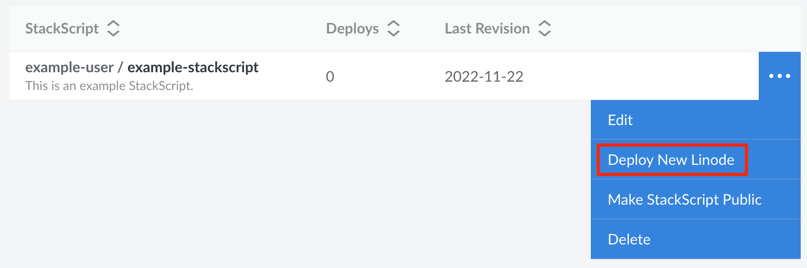

StackScripts allow you to reproduce specific software configurations when deploying Compute Instances, with more user control than static system images. This guide covers how to get started with StackScripts, including writing your custom script, creating the StackScript, and deploying a Compute Instance.

## Write the Script

When creating a StackScript, most of the time is spent writing the deployment script itself. This script runs the first time a Compute Instance boots up and allows you to configure the system to fit your precise needs and requirements. Before you write the script, consider the following:

- **What is the purpose of your script?** The first question you should ask is *what purpose will your script serve*. Do you want to build a web server? Are you building a script to take care of securing new servers? Consider each task you want your script to perform.

- **Which scripting language should be used for your script?** You can write the StackScript in any language that the distribution supports out of the box. Specifically, you need to specify the interpreter that is used to execute the script. Common scripting languages are bash and python.

- **Which Linux distributions should the script support?** Since each distribution bundles different core software, the commands needed to install applications or configure networking vary between distributions. You need to determine which distributions you want to have available when deploying the Compute Instance. Then, you can customize your script to include commands for those distributions.

- **Which dynamic variables do you want the user to set when deploying a Compute Instance?** Determine what information you wish to collect during deployment. These user variables can be defined through the use of UDF fields within the script. All UDF fields are visible in the Cloud Manager when creating a Compute Instance based on the StackScript.

For more details on the components of a StackScript, see [Write a Custom Script for Use with StackScripts](/docs/products/tools/stackscripts/guides/write-a-custom-script/) guide.

## Create the StackScript

After your script has been written, you are ready to create the StackScript. See [Create a StackScript](/docs/products/tools/stackscripts/guides/create/) for complete instructions.

1. Log into the [Cloud Manager](https://cloud.linode.com/) and select **StackScripts** from the left navigation menu. Click the **Create StackScript** button on the top right of the page.

1. Enter a **Label** and **Description** for your StackScript.

1. Use the **Target Images** field to select each distribution your StackScript can support. When deploying a new Compute Instance based on this StackScript, only images selected here can be used.

1. Enter your custom script within the **Script** field.

1. Type in a **Revision Note** and click the **Create StackScript** button.

## Deploy a Compute Instance

When creating a new Compute Instance, you can use one of your Account StackScripts or a Community StackScript. For full instructions, see [Deploy a Compute Instance Using a StackScript](/docs/products/tools/stackscripts/guides/deploy-a-compute-instance/).

1. Log into the [Cloud Manager](https://cloud.linode.com/) and select **StackScripts** from the left navigation menu.

1. Navigate to either the **Account StackScript** tab (to deploy your own StackScript) or the **Community StackScript** tab (to deploy a public StackScript).

1. Locate the StackScript you wish to deploy and click the corresponding **Deploy New Linode** button.

    

1. This opens the **Create Linode** form with the StackScript pre-selected. From here, you can follow the instructions outlined in the [Creating a Compute Instance](/docs/products/compute/compute-instances/guides/create/) guide. If there are any UDF fields defined in the StackScript, they are displayed in the **StackScript Options** section.

1. Click on the **Create Linode** button to complete the creation of your new Compute Instance. The StackScript is executed when the instance first boots up.