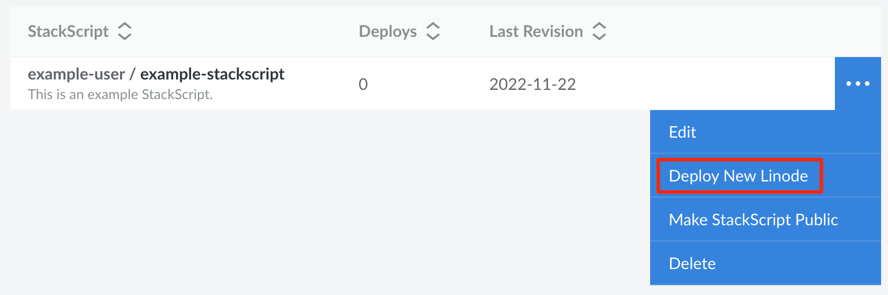

When deploying a Compute Instance, you can choose to select a StackScript. This causes the StackScript to run the first time the instance boots up. The StackScript can be from your own account or one that a member of the community has publicly shared.


Linode does not verify the accuracy of any community submitted StackScripts. Before deploying a Compute Instance using a Community StackScript, you should review the script so that you understand what changes it will make on your new instance.


1. Log into [Cloud Manager](https://cloud.linode.com/) and select **StackScripts** from the left navigation menu.

1. Navigate to either the *Account StackScripts* tab (for StackScripts on your own customer account) or *Community StackScripts* tab (for StackScripts publicly shared by other members of the community).

1. Locate the StackScript you wish to deploy and click the corresponding **Deploy New Linode** button.

    

    
    To find a StackScript, you can scroll through the list or you can use the **Search** field. For advanced searches, you search a specific field for a search term by entering `[field]:[search-term]`. This field can be `label`,`description`, or `username`. The example below searches the label field for the search term "nginx".

    ```command
    label:nginx
    ```
    

1. This opens the **Create Linode** form with the StackScript pre-selected. If there are any UDF fields defined in the StackScript, they are displayed in the **StackScript Options** section. UDFs that *do not have* a default value are marked as required. UDFs that *do have* a default value are optional and are listed under the **Advanced Options** section.

    
    Do not use a double quotation mark character (`"`) within any of the StackScript-specific configuration fields, including user and database password fields. This special character may cause issues during deployment.
    

1. Next, select the Linux distribution you'd like to use within the **Select an Image** field. This list is limited to only images that the StackScript has targeted.

1. Complete the remainder of the form by follow the instructions outlined in the [Creating a Compute Instance](/docs/products/compute/compute-instances/guides/create/) guide.

1. Click on the **Create Linode** button to complete the creation of your new Compute Instance. The StackScript is executed when the instance first boots up.


Depending on the contents of your StackScript, it may take a few minutes for the script to finish executing.
