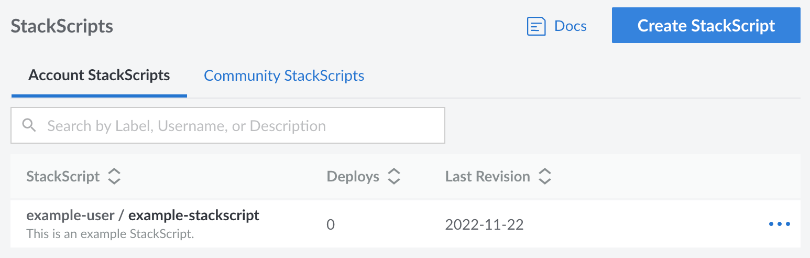
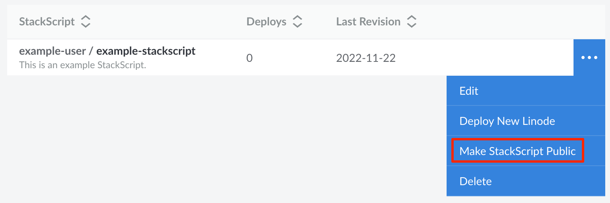
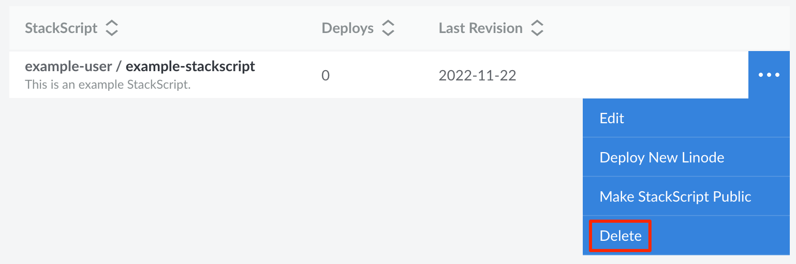

## View StackScripts

Log in to the [Cloud Manager](https://cloud.linode.com) and select **StackScripts** from the left menu. If any StackScripts exist on your account, they are listed on this page.

The **Account StackScripts** tab includes all of your account StackScripts, including those that are public. The **Community StackScripts** tab lists all StackScripts that are public, including those from other users.

Each StackScript is displayed along with the username of user that created it, its label, and a brief description. There is also a corresponding table row for the last revision and the number of Compute Instances that have been deployed using the StackScript.

## Create a New StackScript

See [Create a StackScript](/docs/products/tools/stackscripts/guides/create/) for instructions.

## Edit a StackScript

1. Navigate to the **StackScripts** page in the Cloud Manager. See [View StackScripts](#view-stackscripts).

1. Locate the StackScript you wish to view or edit. Click on the corresponding **Edit** link, which may appear within the ellipsis menu.

    

1. The **Edit StackScript** page appears, which is similar to the **Create StackScript** form that's discussed within the [Create a StackScript](/docs/products/tools/stackscripts/guides/create/) guide. From here, you can update any field - including the script.

1. Add a brief description of your changes to the **Revision Note** field and click the **Save Changes** button.

## Make a StackScript Public

Making an Account StackScript public allows the rest of the Linode community to access your script as a *Community StackScript*.

1. Navigate to the **StackScripts** page in the Cloud Manager. See [View StackScripts](#view-stackscripts).

1. Locate the StackScript you wish to view or edit. Click on the corresponding **Make StackScript Public** link, which may appear within the ellipsis menu.

    

1. A dialog box appears asking you to confirm that you wish to make the StackScript public.

    
    While you can edit a public *Community StackScript*, you cannot delete it or make it private again.
    


Your public StackScript is available to you for use on the Account StackScripts tab. For users on other accounts, your StackScript is available to them from the Community StackScripts tab.


## Delete a StackScript


You cannot delete Account StackScripts that have been made public.


1. Navigate to the **StackScripts** page in the Cloud Manager. See [View StackScripts](#view-stackscripts).

1. Locate the StackScript you wish to delete. Click on the corresponding **Delete** link, which may appear within the ellipsis menu.

    

1. A dialog box appears asking you to confirm the action. Click the **Delete StackScript** button if you would like to continue with the deletion.