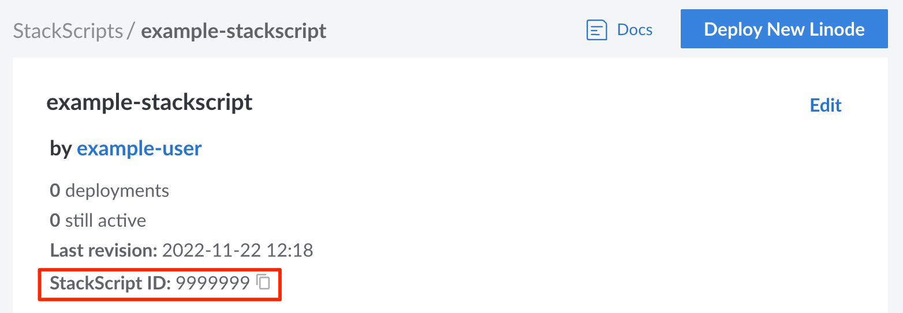

At the core of all StackScripts is a custom script that is written to perform a certain task (or collection of tasks). These custom scripts are written in a language that's supported by the targeted Linux distributions. Writing a custom script for a StackScript is largely the same as writing a custom script that you would execute from the command line or another program. This guide explains some important considerations as well as the special features that StackScripts support.

## Before You Begin

When creating a StackScript, most of the time is spent writing the deployment script itself. This script runs the first time a Compute Instance boots up and allows you to configure the system to fit your precise needs and requirements. Before you write the script, consider the following:

- **What is the purpose of your script?** The first question you should ask is *what purpose will your script serve*. Do you want to build a web server? Are you building a script to take care of securing new servers? Consider each task you want your script to perform.

- **Which scripting language should be used for your script?** You can write the StackScript in any language that the distribution supports out of the box. Specifically, you need to specify the interpreter that is used to execute the script. Common scripting languages are bash and python.

- **Which Linux distributions should the script support?** Since each distribution bundles different core software, the commands needed to install applications or configure networking vary between distributions. You need to determine which distributions you want to have available when deploying the Compute Instance. Then, you can customize your script to include commands for those distributions.

- **Which dynamic variables do you want the user to set when deploying a Compute Instance?** Determine what information you wish to collect during deployment. These user variables can be defined through the use of UDF fields within the script. All UDF fields are visible in the Cloud Manager when creating a Compute Instance based on the StackScript.

## Components of a StackScript

- **Interpreter** *(required)*: The scripting language and interpreter needed to execute the script. In the example below,  the bash interpreter is used. See [Set the Language and Interpreter](#set-the-language-and-interpreter).

    ```file
    #!/bin/bash
    ```

- **Declaration of user-defined fields** *(optional)*: These fields are presented to the user in the Cloud Manager during the deployment process. See [Declare User-Defined Fields (UDFs)](#declare-user-defined-fields-udfs).

    ```file {linenostart="2"}
    # <UDF name="example-variable" Label="Example Variable" example="This is an example UDF variable for a StackScript" />
    ```

- **Import external StackScripts** *(optional)*: You can optionally import other StackScripts to reuse code. See [Import a StackScript](#import-a-stackscript).

    ```file {linenostart="3"}
    source <ssinclude StackScriptID="1">
    ```

- **Script:** The rest of the StackScript should your deployment script. This preforms the tasks that you've outlined in the [Before You Begin](#before-you-begin) section. For example, the script below updates the system and installs PHP, NGINX, and MariaDB.

    ```file {linenostart="4"}
    apt-get update && apt-get upgrade -y
    apt-get install -y php nginx mariadb-server
    ```

## Set the Language and Interpreter

The primary requirement for your scripts is that the interpreter needed to execute your script should exist in each Linux distribution you are targeting. While bash is an obvious choice that's support by all of Linode's distribution images, you may choose another scripting language.

The first line of the script must include a [*shebang*](https://en.wikipedia.org/wiki/Shebang_(Unix)) followed by the path to the interpreter that should be use.

- **Bash:** `#!/bin/bash`
- **Python:** `#!/usr/bin/env python`
- **Python 3:** `#!/usr/bin/python3`

## Declare User-Defined Fields (UDFs)

The StackScript system provides a basic markup specification that interfaces with the Linode deployment process. This syntax allows users to customize the behavior of a StackScript on a per-deployment basis. When a StackScript contains a *user-defined field (UDF)*, the Cloud Manager presents the UDF as a form field. The user can then insert a corresponding custom value into the field. The values and their related variables are inserted into the script's environment when used to deploy a new Compute Instance.


UDF fields are only usable by scripts written in bash.


Use the following format to insert a UDF tag into a StackScript.

```command {lang="text"}
# <UDF name="[variable-name]" label="[field-label]" default="[default-value]" example="[helper-text]" />
```


The UDF tags are commented out to prevent execution errors, as the StackScript system parses the tags without removing them.


### UDF Attributes

A UDF tag accepts the following attributes:

- **Variable name** (*required*):

    `name="[variable-name]"`

    The variable name is the string you wish to use to reference this variable within the StackScript. The string must be alphanumeric (can include underscores), less than 64 characters in length, and be unique within the StackScript.

    
    If you would like to create a masked password input field, use the word `password` anywhere in the UDF `name` attribute.
    

- **Field label** (*required*):

    `label="[field-label]"`

    The label attribute is used when displaying the field to the user in the Cloud Manager. This should be a short string that clearly indicates what the field is used for. If needed, you can also enter helper text using the `example` attribute.

- **Helper text** (*optional*):

    `example="[helper-text]"`

    This text is displayed in the Cloud Manager underneath the field. It should be used to further explain to the user what the field is used for.

- **Select one** (*optional*):

    `oneOf="[value1],[value2],..."`

    A comma separated list of acceptable values for the field. These values are displayed either as radio boxes (if just 2 values are provided) or within a dropdown menu (if 3 or more values are provided). Only one value can be selected by the user. This cannot be used within the *manyOf* attribute (discussed below) within the same UDF tag.

- **Select multiple** (*optional*):

    `manyOf="[value1],[value2],..."`

    A comma separated list of acceptable values for the field in any quantity, combination, or order. These values are displayed within a dropdown menu in the Cloud Manager.  Multiple values can be selected by the user. This cannot be used within the *oneOf* attribute (discussed above) within the same UDF tag.

- **Default value** (*optional*):

    `default="[default-value]"`

    This defines the default value for this UDF. If no value is specified by the user during deployment, this default value is used. The default value is displayed to the user within the Cloud Manager.

    - **String** (neither `oneOf` or `manyOf` are used): The default value can be any string and is displayed as plain text within the form field in the Cloud Manager.
    - **Select one** (`oneOf` attribute is defined): The default value needs to correspond with a single value defined in the `oneOf` attribute. This value is pre-selected in the radio field or dropdown box in the Cloud Manager.
    - **Select multiple** (`manOf` attribute is defined): The default value needs to correspond with one or more values defined in the `manyOf` attribute. If setting multiple values as the default, delimit them with a comma. These values are pre-selected in the dropdown box in the Cloud Manager.

## Default Environment Variables

Linode StackScripts provide a set of default environment variables that you can use to provide your script with information about the Linode it has deployed.

| Environment Variable | Description |
| -- | -- |
| `LINODE_ID` | The deployed Linode's ID number. |
| `LINODE_LISHUSERNAME` | The deployed Linode's full [Linode Shell (LISH)](/docs/guides/using-the-lish-console/) accessible name. |
| `LINODE_RAM` | The [RAM available on this Linode's plan](/docs/products/compute/compute-instances/plans/choosing-a-plan/#compute-resources). |
| `LINODE_DATACENTERID` | The ID number of the data center containing the Linode. You can use the [Linode API](/docs/api/regions/#regions-list) to see a list of all data center IDs. |

### Set your Environment Variables Using an External File

It is possible to set your script's environment variables using externally hosted files. The example Bash script uses the wget utility to download two files named `base.env` and `$IPADDR.env` from the external site `http://example.com/`. The `source` command loads the downloaded files into the script.

```file {title="Example StackScript" lang="bash"}
...
IPADDR=$(/sbin/ifconfig eth0 | awk '/inet / { print $2 }' | sed 's/addr://')

wget http://example.com/base.env --output-document=/tmp/base.env
wget http://example.com/$IPADDR.env --output-document=/tmp/system.env

source /tmp/base.env
source /tmp/system.env
...
```


The files you reference within your script must exist and be accessible via `HTTP`. Also, ensure that the files you host externally do not contain any sensitive information.


## Import a StackScript

Your scripts can import any other StackScript, including those from within your own account or those shared with the community. This allows you to reuse code between StackScripts, minimizing the amount of new code you might need to write.

- **Bash:**

    ```file
    source <ssinclude StackScriptID="[ID]">
    ```

- **Other scripting languages:**

    ```file
    <ssinclude StackScriptID="[ID]">
    ./ssinclude-[ID]
    ```

In the example syntax above, replace *[ID]* with the ID corresponding to the StackScript you wish to use. You can find the ID by viewing the StackScript in the Cloud Manager and copying the value within the **StackScript ID** field, as shown below:



### Using the Linode StackScript Bash Library

Linode provides a [StackScript Bash Library](https://cloud.linode.com/stackscripts/1) that includes a set of functions that perform various common tasks users might wish to execute on their Linodes. This script creates the functions, but does not run them. A new StackScript can import the Bash Library and then execute functions from it.


Linode's [StackScript Bash Library's](https://cloud.linode.com/stackscripts/1) ID number is `1`.



```file {title="Example StackScript using the Linode Bash Library"}
#!/bin/bash
source <ssinclude StackScriptID="1">
system_update
system_install_package php wget nginx
```

## Example StackScript

The file below displays an example of a simple script that executes some basic set up steps on a Linode. Review the example's comments for details on what each line of the script does.

```file {title="Example Script" lang="bash"}
#!/bin/bash
# This block defines the variables the user of the script needs to provide
# when deploying using this script.
#
#
#<UDF name="hostname" label="The hostname for the new Linode.">
# HOSTNAME=
#
#<UDF name="fqdn" label="The new Linode's Fully Qualified Domain Name">
# FQDN=

# This sets the variable $IPADDR to the IP address the new Linode receives.
IPADDR=$(/sbin/ifconfig eth0 | awk '/inet / { print $2 }' | sed 's/addr://')

# This updates the packages on the system from the distribution repositories.
apt-get update
apt-get upgrade -y

# This section sets the hostname.
echo $HOSTNAME > /etc/hostname
hostname -F /etc/hostname

# This section sets the Fully Qualified Domain Name (FQDN) in the hosts file.
echo $IPADDR $FQDN $HOSTNAME >> /etc/hosts
```