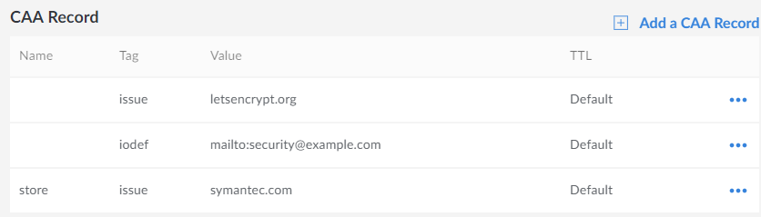

---
author:
  name: Linode
  email: docs@linode.com
description: 'This quick answer shows how to create CAA records for domains and subdomains.'
og_description: 'This quick answer will show you how to create a CAA record for domains and subdomains'
keywords: ["caa", "dns", "records", "subdomain", "domain"]
license: '[CC BY-ND 4.0](https://creativecommons.org/licenses/by-nd/4.0)'
modified_by:
  name: Linode
published: 2019-07-31
title: Add CAA Records in the Linode Cloud Manager
external_resources:
 - '[CAA Records, DNSimple](https://support.dnsimple.com/articles/caa-record/)'
 - '[RFC 6844: DNS Certification Authority Authorization (CAA) Resource Record](https://tools.ietf.org/html/rfc6844)'
classic_manager_link: quick-answers/linode-platform/add-caa-dns-records-classic-manager/
---

Certification Authority Authorization (CAA) is a type of DNS record that allows the owner of a domain to specify which certificate authority (or authorities) are allowed to issue SSL/TLS certificates for their domain(s). This quick answer shows you how to set up CAA records on your Linode.

## Add a Single CAA Record

1.  Log in to the [Linode Cloud Manager](https://cloud.linode.com)

1.  Select the **Domains** link in the sidebar.

1.  Select the domain you want to add the record to, or [add a domain](/docs/platform/manager/dns-manager/#add-a-domain) if you don't already have one listed.

1.  Under the **CAA Record** section, select **Add a CAA record**. A form with the following fields will appear:

    **Name**: The subdomain you want the CAA record to cover. To apply it to your entire website (for example: `example.com`), leave this field blank. To limit the record's application to a subdomain on your site, (for example: `subdomain.example.com`), enter the subdomain's name into the form field (for example: `subdomain`).

    **Tag**:

     -  **issue** - Authorize the certificate authority entered in the *Value* field further below to issue TLS certificates for your site.

     -  **issuewild** - Same as above, with the exception that you were issued a wildcard certificate.

     -  **iodef** - URL where your CA can report security policy violations to you concerning certificate issue requests.

    **Value**: If the **issue** or **issuewild** tag was selected above, then the **Value** field takes the domain of your certificate issuer (for example: `letsencrypt.org`). If the **iodef** tag was selected, the **Value** field takes a contact or submission URL (`http` or `mailto`).

    **TTL (Time to Live)**: Time in seconds that your new CAA record will be cached by Linode's name servers before being refreshed. The *Default* selection's TTL is 300 seconds, which is fine for most cases. You can use the [`dig` command](/docs/networking/dns/use-dig-to-perform-manual-dns-queries/)  to view the remaining time your DNS records will be cached until refreshed. Replace *linode.com* with your site's domain or subdomain in the command below:

        root@debian:~# dig +nocmd +noall +answer example.com
        example.com.     167 IN  A   203.0.113.1

1.  Click the **Save** button when finished. The CAA record should be fully propagated within the TTL duration.

## Add Multiple CAA Records

Multiple CAA records must be added individually. If your site `example.com` was issued a TLS certificate by Let's Encrypt, but your subdomain `store.example.com` uses a Symantec certificate, you would need two different CAA records. A reporting URL for the *iodef* tag would also need its own record. Those three would look something like this:

