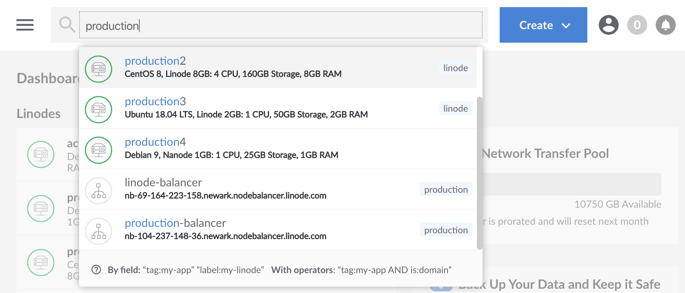

---
author:
  name: Linode
  email: docs@linode.com
description: 'How to Leverage the Advanced Search Function of the Linode Cloud Manager.'
keywords: ['search','advanced search','keywords','cloud manager']
license: '[CC BY-ND 4.0](https://creativecommons.org/licenses/by-nd/4.0)'
published: 2020-01-08
modified_by:
  name: Linode
title: "Searching in the Cloud Manager"
contributor:
  name: Linode
---

The Linode Cloud Manager now includes a new search tool at the top of the dashboard which can be used to search for a large number of active services on your account, including Linodes, Volumes, NodeBalancers, Domains, Tags, and more.

In this guide, we'll go over some of the more advanced capabilities of this search tool that you and your team can leverage to find and access your resources in the best way possible for a number of  use cases.

## Standard Search

A standard search without the use of any keywords or operators will default to searching for active labels, tags, and IP addresses, all at once. For example, in the following image, we search for the string "production" which pulls up all of my resources which match this keyword, including both tags and labels.

While this kind of search is fine if you only have a few resources, when a higher number of resources are available the returned values can become difficult to parse.

## Keywords

The search tool can also be used to search for specific keywords. A list of common keywords and their definitions can be seen below:

| Keyword   | Definition   |
|:--------------|:------------|
| type | Type of resource. Linode, image, NodeBalancer etc...  |
| tag  | Tag applied to your resources. See [here](/docs/quick-answers/linode-platform/tags-and-groups/) |
| label | The label or identifier for your Linode  |
| region | The region for your resources, such as `us-east`. For a full list, see the return values for our [API or CLI](https://developers.linode.com/api/v4/regions)  |
| IP | The IP address of your resource  |
| created | The date of your resource's creation |
| status | Same values as the `status` field in our API. See our (API Documentation)[https://developers.linode.com/api/v4/linode-instances-linode-id] for all possible inputs. |

Syntax for using keywords will always be the keyword itself, appended by a colon, and then a string defined by the keyword to limit your search. For example, to search for all images on your account, you would enter the following:

    type:image

And to find all applicable resources created in the year 2020:

    created:2020

## Standard Boolean Operators

The Cloud Manager includes support for standard boolean operators `OR` and `AND` which can help to filter the results of your search further. `OR` can be used to search for multiple different keywords in a single query  and `AND` will allow you to narrow your search more precisely for additional qualifiers. For example, in the following query, we'd like to search for ALL of the Linodes and Images on our account:

    type:linode OR type:image

And in the following we'll try to find all of our Linodes which ALSO match our `production` tag:

    type:linode AND tag:production

## Negate Operators

A negate operator can be used to return all values that are **NOT** defined by the negate operator. This will always be preceded by the `-` symbol. For example, see the following query:

    -type:linode

When used, you will see all Linodes excluded from your query.

## Nested Queries

Nested Queries can also be performed for an even higher level of control. If you want to search for all of your domains, as well as all of your Linodes that match the tag `my-tag`for example, you can use the following Nested Query:

    type:domain OR (type:linode AND tag:my-tag)

## Aliases

In addition most operators include a number of aliases that you can use as an alternative to standard usage. All aliases and their standard equivalent can be seen in the chart below.

| Standard | Aliases |
|:--------------|:------------|
| **AND** | **&&** |
|   **OR**  |  **&#124;****&#124;** |
|  **tags**   | **tag** and **group** |
|   **label** | **name** and **title** |

## Combining it All

The more robust functionality of the search tool can be used in combination with other features. For example, you can see all of the advanced features outlined in this guide in a single query:

    type:linode AND -group:production || (type:NodeBalancer && tag:mytag)

